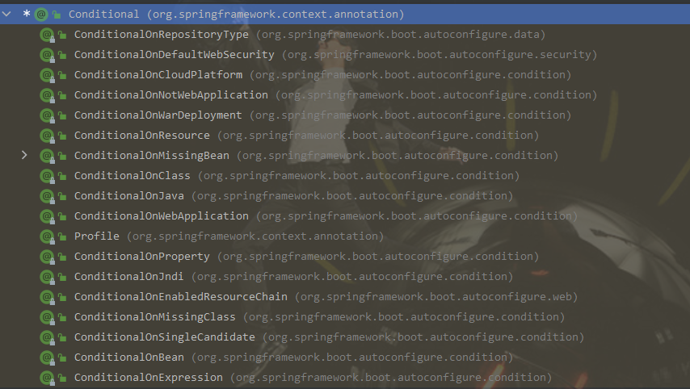
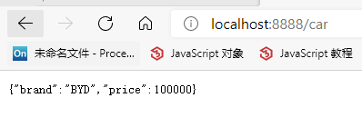
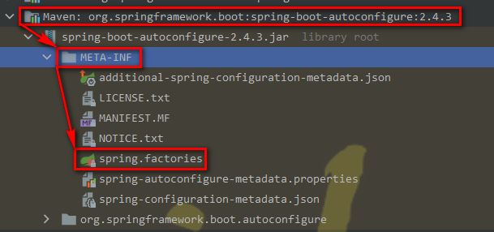

## SpringBoot 容器功能
### 1. 组件添加
- 之前Spring添加组件需要在xml中进行配置
beans.xml
```xml
<?xml version="1.0" encoding="UTF-8"?>
<beans xmlns="http://www.springframework.org/schema/beans"
       xmlns:xsi="http://www.w3.org/2001/XMLSchema-instance"
       xsi:schemaLocation="http://www.springframework.org/schema/beans http://www.springframework.org/schema/beans/spring-beans.xsd">

    <!-- spring 给容器添加组件的方式 -->
    <bean id="user01" class="com.zichen.boot.bean.User">
        <property name="name" value="zhangsan"></property>
        <property name="age" value="18"></property>
    </bean>

    <bean id="cat" class="com.zichen.boot.bean.Pet">
        <property name="name" value="tomcat"></property>
    </bean>

</beans>
```
- 现在给springboot容器添加组件，是需要写一个类，给这个类标注@Configuration注解
#### 1.1. @Configuration
```java
/**
 * @name: MyConfig
 * @description:
 * @author: zichen
 * @date: 2021/5/2  22:11
 */
/**
 * 1. 配置类里面使用@Bean标注在方法上给容器注册组件，默认是单例的
 * 2. 配置类本身也是一个组件
 * 3. proxyBeanMethods：代理bean的方法
 *      Full(proxyBeanMethods = true) 每一次调用都会使用代理对象
 *      Lite(proxyBeanMethods = false) 每一次调用不会使用代理对象，都会是一个新的对象
 */
@Configuration(proxyBeanMethods = true)  //告诉springboot，这是一个配置类
public class MyConfig {

    /**
     * 外部无论对配置类中的这个组件注册方法调用多少次获取的都是之前注册容器中的单实例
     * @return
     */
    @Bean  //给容器中添加组件，以方法名作为组件的id，返回类型就是组件类型。返回的值，就是组件在容器中的实例
    public User user01() {
        return new User("zhangsan", 18);
    }

    @Bean("tom")//也可以自定义一个组件的名字，如 “tom”
    public Pet tomcatPet() {
        return new Pet("tomcat");
    }
}
```
    > 测试组件，参见启动类中的打印
    > 配置类本身也是一个组件，也可以使用 run.getBean(MyConfig.class);来获取

#### 1.2. @Configuration注解的两种模式
    - Full模式    @Configuration(proxyBeanMethods = true)
    - Lite模式    @Configuration(proxyBeanMethods = false)
    - 配置类组件之间无依赖关系用Lite模式，加速容器启动过程，减少判断
    - 配置类组件之间有依赖关系，方法会被调用得到之前单实例组件，用Full模式
#### 1.3. @Bean、@Component、@Controller、@Service、@Repository
    - @Bean - 表示该方法是一个bean
    - @Component - 在类上表示该类是一个组件
    - @Controller - 表示是一个控制器
    - @Service - 表示是一个业务逻辑组件
    - @Repository - 表示是一个数据库层组件
#### 1.4. @ComponentScan、@Import
    - @ComponentScan - 指定包扫描规则
    - @Import - 给容器导入一个组件，写在任意一个配置类中或者组件中都可以
        - 将指定类型的组件导入进来
```java
@Import({User.class, DBHelper.class})
@Configuration(proxyBeanMethods = true)  //告诉springboot，这是一个配置类
public class MyConfig {
    
}       
```
-
    -
        - 作用是调用导入的组建的无惨构造器，创建导入的组件
        - 验证导入的组件
```java
class MainApplication{
    public static void main(String[] args) {
        ConfigurableApplicationContext run = SpringApplication.run(MainApplication.class, args);

        String[] beanNamesForType = run.getBeanNamesForType(User.class);
        System.out.println("=============");
        for (String s : beanNamesForType) {
            System.out.println(s);
        }
        DBHelper bean = run.getBean(DBHelper.class);
        System.out.println("DBHelper组件 = " + beanNamesForType);
    }
}
```
```properties
# 运行结果
com.zichen.boot.bean.User
user01
DBHelper组件 = [Ljava.lang.String;@62515a47
```
#### 1.5. @Conditional
**条件装配：满足Condition指定的条件，则进行组件注入**


**ConditionalOnBean** - 当容器中有Bean，才去注入组件
**ConditionalOnMissingBean** - 当容器中没有Bean，才去注入组件
**ConditionalOnClass** - 当容器中有class，才去注入组件
**ConditionalOnMissingClass** - 当容器中没有class，才去注入组件
**ConditionalOnResource** - 当项目中的类路径存在某个资源的时候，才去注入组件
**ConditionalOnJava** - 当是指定的java版本号的时候，才去注入组件
**ConditionalOnWebApplication** - 当我们的应用是一个web应用的时候，才去注入组件
**ConditionalOnNotWebApplication** - 当我们的应用不是一个web应用的时候，才去注入组件
**ConditionalOnProperty** - 当配置文件中配置了某个属性的时候，才去注入组件
- 以ConditionOnBean为例：
````java
/**
 * 告诉springboot，这是一个springboot应用
 */
@SpringBootApplication
public class MainApplication {
    public static void main(String[] args) {
        // 1. 返回IOC容器
        ConfigurableApplicationContext run = SpringApplication.run(MainApplication.class, args);

        boolean tom = run.containsBean("tom");
        System.out.println("容器中Tom组件：" + tom);
        boolean user01 = run.containsBean("user01");
        System.out.println("容器中user01组件：" + user01);
    }
}
````
```properties
# 测试结果
容器中Tom组件：false
容器中user01组件：true
```
```java
@Import({User.class, DBHelper.class})
@Configuration(proxyBeanMethods = true)  //告诉springboot，这是一个配置类
public class MyConfig {

    /**
     * 外部无论对配置类中的这个组件注册方法调用多少次获取的都是之前注册容器中的单实例
     * @return
     */
    @ConditionalOnBean(DataSource.class)//表示，在容器中存在DataSource组件，就注入user01这个组件，没有则不注入
    @Bean  //给容器中添加组件，以方法名作为组件的id，返回类型就是组件类型。返回的值，就是组件在容器中的实例
    public User user01() {
        User zhangsan = new User("zhangsan", 18);
        zhangsan.setPet(tomcatPet());
        return zhangsan;
    }

    @Bean("tom")
    public Pet tomcatPet() {
        return new Pet("tomcat");
    }
}
```
```properties
# 再次启动启动类，执行结果是：
容器中Tom组件：true
容器中user01组件：false

# 如果将@ConditionalOnBean(DataSource.class)改成@ConditionalOnBean(MyConfig.class)，再次启动启动类，执行结果是：
容器中Tom组件：true
容器中user01组件：true
```

**根据上面的测试，给user01组件加上@ConditionalOnBean(MyConfig.class)注解，表明，如果容器中有MyConfig组件，则注入user01组件，如果没有DataSource组件，则不注入user01组件**
**使用@ConditionalOnBean(name="tom")测试结果是，只要方法上加了该注解，就不会将该方法注入，不管tom组件是否存在，都不会注入**
**也可以将@ConditionalOnBean注解加到配置类上，表示，满足条件的时候，配置类中的所有组件都注入，不满足条件的时候，配置类中的所有组件都不注入**
### 2. 原生配置文件引入
#### 2.1. @ImportResource - 导入资源
    当我们需要将beans.xml中的bean引入的时候，我们可以使用@ImportResource注解来导入
```java
@ImportResource("classpath:beans.xml")
public class MyConfig {
    ...
}
```
```xml
<?xml version="1.0" encoding="UTF-8"?>
<beans xmlns="http://www.springframework.org/schema/beans"
       xmlns:xsi="http://www.w3.org/2001/XMLSchema-instance"
       xsi:schemaLocation="http://www.springframework.org/schema/beans http://www.springframework.org/schema/beans/spring-beans.xsd">
    
    <bean id="haha" class="com.zichen.boot.bean.User">
        <property name="name" value="zhangsan"></property>
        <property name="age" value="18"></property>
    </bean>
    <bean id="hehe" class="com.zichen.boot.bean.Pet">
        <property name="name" value="tomcat"></property>
    </bean>
</beans>
```
```java
//测试
/**
 * 告诉springboot，这是一个springboot应用
 */
@SpringBootApplication
public class MainApplication {
    public static void main(String[] args) {
        // 1. 返回IOC容器
        ConfigurableApplicationContext run = SpringApplication.run(MainApplication.class, args);

        boolean haha = run.containsBean("haha");
        boolean hehe = run.containsBean("hehe");
        System.out.println("容器中haha组件：" + haha);
        System.out.println("容器中hehe组件：" + hehe);
    }
}
```
```properties
# 测试结果：
容器中haha组件：true
容器中hehe组件：true

# 当我们不使用@ImportResource注解的时候，测试结果：
容器中haha组件：false
容器中hehe组件：false
```

### 3. 配置绑定
使用java读取到properties文件中的内容，并且把它封装到javaBean中，以供随时使用

```java
import java.io.FileInputStream;
import java.util.Enumeration;
import java.util.Properties;

public class getProperties {
    public static void main(String[] args) {
        Properties pps = new Properties();
        pps.load(new FileInputStream("a.properties"));
        Enumeration enumeration = pps.propertyNames();//得到配置文件的名字
        while (enumeration.hasMoreElements()) {
            String strKey = (String) enumeration.nextElement();
            String strValue = pps.getProperty(strKey);
            System.out.println(strKey + " = " + strValue);
        }
    }
}
```
#### 3.1. @ConfigurationProperties
- @EnableConfigurationProperties + @ConfigurationProperties
    - @EnableConfigurationProperties
        - 开启实体类配置绑定功能
        - 把实体类自动注册到容器中
    - @ConfigurationProperties
        - 给实体类添加，没有它会报错，找不到Car，配置类中的@Autowired编译博爱错
> 给一个实体类赋初始值
 
**第二种方法：在配置类中操作**
- 对配置类操作，添加@EnableConfigurationProperties
```java
@EnableConfigurationProperties(Car.class)
public class MyConfig {
    ...
}
```
```java
@ConfigurationProperties(prefix = "mycar")
public class Car {

    private String brand;
    private Integer price;
    //getter、setter、toString
}
```
```properties
mycar.brand=BYD
mycar.price=100000
```
- 启动主方法，测试结果



- @Component + @ConfigurationProperties
> 给一个实体类赋初始值

**第一种方法：在实体方法中操作**
- 创建一个实体类Car.java
```java
/**
 * 只有在容器中的组件才会拥有SpringBoot提供的功能
 */
@Component
@ConfigurationProperties(prefix = "mycar")
public class Car {

    private String brand;
    private Integer price;

    @Override
    public String toString() {
        return "Car{" +
                "brand='" + brand + '\'' +
                ", price=" + price +
                '}';
    }

    public String getBrand() {
        return brand;
    }

    public void setBrand(String brand) {
        this.brand = brand;
    }

    public Integer getPrice() {
        return price;
    }

    public void setPrice(Integer price) {
        this.price = price;
    }
}
```
- 在application.properties中将Car类中的属性写到配置文件中
```properties
mycar.brand=BYD
mycar.price=100000
```
- 启动主类方法，测试结果


### 4. 自动配置原理入门
#### 4.1. 引导加载自动配置类
```java
@SpringBootConfiguration
@EnableAutoConfiguration
@ComponentScan(excludeFilters = { @Filter(type = FilterType.CUSTOM, classes = TypeExcludeFilter.class),
		@Filter(type = FilterType.CUSTOM, classes = AutoConfigurationExcludeFilter.class) })
public @interface SpringBootApplication {
    ...
}
```
- @SpringBootConfiguration
```integrationperformancetest
@Target({ElementType.TYPE})
@Retention(RetentionPolicy.RUNTIME)
@Documented
@Configuration
public @interface SpringBootConfiguration {
    @AliasFor(
        annotation = Configuration.class
    )
    boolean proxyBeanMethods() default true;
}
```
**发现@SpringBootConfiguration注解中，其实就是一个@Configuration修饰，说明该注解就是标注一个配置类**

- @ComponentScan
**指定扫描那些包**

- @EnableAutoConfiguration
```java
@AutoConfigurationPackage
@Import(AutoConfigurationImportSelector.class)
public @interface EnableAutoConfiguration {
    
}
```
**可见@EnableAutoConfiguration注解是由两个注解修饰的**
> @AutoConfigurationPackage

> 自动配置包
```java
@Import(AutoConfigurationPackages.Registrar.class)
public @interface AutoConfigurationPackage {
    
}
/**
 * 利用AutoConfigurationPackages.Registrar.class给容器中导入一系列组件
 */
static class Registrar implements ImportBeanDefinitionRegistrar, DeterminableImports {

    //批量导入组件
    //new PackageImports(metadata).getPackageNames() 会拿到主方法的包名，并将报下的左右组件打包成一个数组
    //然后将这些组件注册到register中，相当于批量注册组件咯
    @Override
    public void registerBeanDefinitions(AnnotationMetadata metadata, BeanDefinitionRegistry registry) {
        register(registry, new PackageImports(metadata).getPackageNames().toArray(new String[0]));
    }

    @Override
    public Set<Object> determineImports(AnnotationMetadata metadata) {
        return Collections.singleton(new PackageImports(metadata));
    }

}
```
*@Import*：导入一个组件

[@Import高级用法](https://www.bilibili.com/video/BV1gW411W7wy?p=8)
>@Import(AutoConfigurationImportSelector.class)
```java
public class AutoConfigurationImportSelector implements DeferredImportSelector, BeanClassLoaderAware,
		ResourceLoaderAware, BeanFactoryAware, EnvironmentAware, Ordered {
    
    //...
    
    @Override
    public String[] selectImports(AnnotationMetadata annotationMetadata) {
        if (!isEnabled(annotationMetadata)) {
            return NO_IMPORTS;
        }
        AutoConfigurationEntry autoConfigurationEntry = getAutoConfigurationEntry(annotationMetadata);
        return StringUtils.toStringArray(autoConfigurationEntry.getConfigurations());
    }
    
    //...
    
}
/**
 * 重点是 getAutoConfigurationEntry(annotationMetadata);这一句代码
 *
 */

protected AutoConfigurationEntry getAutoConfigurationEntry(AnnotationMetadata annotationMetadata) {
    if (!isEnabled(annotationMetadata)) {
        return EMPTY_ENTRY;
    }
    AnnotationAttributes attributes = getAttributes(annotationMetadata);
    //获取到所有需要导入的组件
    List<String> configurations = getCandidateConfigurations(annotationMetadata, attributes);
    configurations = removeDuplicates(configurations);
    Set<String> exclusions = getExclusions(annotationMetadata, attributes);
    checkExcludedClasses(configurations, exclusions);
    configurations.removeAll(exclusions);
    configurations = getConfigurationClassFilter().filter(configurations);
    fireAutoConfigurationImportEvents(configurations, exclusions);
    return new AutoConfigurationEntry(configurations, exclusions);
}

    protected List<String> getCandidateConfigurations(AnnotationMetadata metadata, AnnotationAttributes attributes) {
        //利用工厂加载器，加载所有的组件
        List<String> configurations = SpringFactoriesLoader.loadFactoryNames(getSpringFactoriesLoaderFactoryClass(),
                getBeanClassLoader());
        Assert.notEmpty(configurations, "No auto configuration classes found in META-INF/spring.factories. If you "
                + "are using a custom packaging, make sure that file is correct.");
        return configurations;
    }

    public static List<String> loadFactoryNames(Class<?> factoryType, @Nullable ClassLoader classLoader) {
        ClassLoader classLoaderToUse = classLoader;
        if (classLoader == null) {
            classLoaderToUse = SpringFactoriesLoader.class.getClassLoader();
        }

        String factoryTypeName = factoryType.getName();
        return (List)loadSpringFactories(classLoaderToUse).getOrDefault(factoryTypeName, Collections.emptyList());
    }

    private static Map<String, List<String>> loadSpringFactories(ClassLoader classLoader) {
        Map<String, List<String>> result = (Map) cache.get(classLoader);
        
        //...
        //从META-INF/spring.factories这个位置加载一个文件的
        //默认扫描所有META-INF/spring.factories位置的文件
        Enumeration urls = classLoader.getResources("META-INF/spring.factories");
        //...
        
        return result;
    }
```


> SpringBoot加载的所有组件，都是在文件中配置好的

```properties

# ...
# Auto Configure
org.springframework.boot.autoconfigure.EnableAutoConfiguration=\
org.springframework.boot.autoconfigure.admin.SpringApplicationAdminJmxAutoConfiguration,\
org.springframework.boot.autoconfigure.aop.AopAutoConfiguration,\
org.springframework.boot.autoconfigure.amqp.RabbitAutoConfiguration,\
org.springframework.boot.autoconfigure.batch.BatchAutoConfiguration,\
org.springframework.boot.autoconfigure.cache.CacheAutoConfiguration,\
org.springframework.boot.autoconfigure.cassandra.CassandraAutoConfiguration,\
org.springframework.boot.autoconfigure.context.ConfigurationPropertiesAutoConfiguration,\
org.springframework.boot.autoconfigure.context.LifecycleAutoConfiguration,\
org.springframework.boot.autoconfigure.context.MessageSourceAutoConfiguration,\
org.springframework.boot.autoconfigure.context.PropertyPlaceholderAutoConfiguration,\
org.springframework.boot.autoconfigure.couchbase.CouchbaseAutoConfiguration,\
org.springframework.boot.autoconfigure.dao.PersistenceExceptionTranslationAutoConfiguration,\
org.springframework.boot.autoconfigure.data.cassandra.CassandraDataAutoConfiguration,\
org.springframework.boot.autoconfigure.data.cassandra.CassandraReactiveDataAutoConfiguration,\
org.springframework.boot.autoconfigure.data.cassandra.CassandraReactiveRepositoriesAutoConfiguration,\
org.springframework.boot.autoconfigure.data.cassandra.CassandraRepositoriesAutoConfiguration,\
org.springframework.boot.autoconfigure.data.couchbase.CouchbaseDataAutoConfiguration,\
org.springframework.boot.autoconfigure.data.couchbase.CouchbaseReactiveDataAutoConfiguration,\
org.springframework.boot.autoconfigure.data.couchbase.CouchbaseReactiveRepositoriesAutoConfiguration,\
org.springframework.boot.autoconfigure.data.couchbase.CouchbaseRepositoriesAutoConfiguration,\
org.springframework.boot.autoconfigure.data.elasticsearch.ElasticsearchDataAutoConfiguration,\
org.springframework.boot.autoconfigure.data.elasticsearch.ElasticsearchRepositoriesAutoConfiguration,\
org.springframework.boot.autoconfigure.data.elasticsearch.ReactiveElasticsearchRepositoriesAutoConfiguration,\
org.springframework.boot.autoconfigure.data.elasticsearch.ReactiveElasticsearchRestClientAutoConfiguration,\
org.springframework.boot.autoconfigure.data.jdbc.JdbcRepositoriesAutoConfiguration,\
org.springframework.boot.autoconfigure.data.jpa.JpaRepositoriesAutoConfiguration,\
org.springframework.boot.autoconfigure.data.ldap.LdapRepositoriesAutoConfiguration,\
org.springframework.boot.autoconfigure.data.mongo.MongoDataAutoConfiguration,\
org.springframework.boot.autoconfigure.data.mongo.MongoReactiveDataAutoConfiguration,\
org.springframework.boot.autoconfigure.data.mongo.MongoReactiveRepositoriesAutoConfiguration,\
org.springframework.boot.autoconfigure.data.mongo.MongoRepositoriesAutoConfiguration,\
org.springframework.boot.autoconfigure.data.neo4j.Neo4jDataAutoConfiguration,\
org.springframework.boot.autoconfigure.data.neo4j.Neo4jReactiveDataAutoConfiguration,\
org.springframework.boot.autoconfigure.data.neo4j.Neo4jReactiveRepositoriesAutoConfiguration,\
org.springframework.boot.autoconfigure.data.neo4j.Neo4jRepositoriesAutoConfiguration,\
org.springframework.boot.autoconfigure.data.solr.SolrRepositoriesAutoConfiguration,\
org.springframework.boot.autoconfigure.data.r2dbc.R2dbcDataAutoConfiguration,\
org.springframework.boot.autoconfigure.data.r2dbc.R2dbcRepositoriesAutoConfiguration,\
org.springframework.boot.autoconfigure.data.redis.RedisAutoConfiguration,\
org.springframework.boot.autoconfigure.data.redis.RedisReactiveAutoConfiguration,\
org.springframework.boot.autoconfigure.data.redis.RedisRepositoriesAutoConfiguration,\
org.springframework.boot.autoconfigure.data.rest.RepositoryRestMvcAutoConfiguration,\
org.springframework.boot.autoconfigure.data.web.SpringDataWebAutoConfiguration,\
org.springframework.boot.autoconfigure.elasticsearch.ElasticsearchRestClientAutoConfiguration,\
org.springframework.boot.autoconfigure.flyway.FlywayAutoConfiguration,\
org.springframework.boot.autoconfigure.freemarker.FreeMarkerAutoConfiguration,\
org.springframework.boot.autoconfigure.groovy.template.GroovyTemplateAutoConfiguration,\
org.springframework.boot.autoconfigure.gson.GsonAutoConfiguration,\
org.springframework.boot.autoconfigure.h2.H2ConsoleAutoConfiguration,\
org.springframework.boot.autoconfigure.hateoas.HypermediaAutoConfiguration,\
org.springframework.boot.autoconfigure.hazelcast.HazelcastAutoConfiguration,\
org.springframework.boot.autoconfigure.hazelcast.HazelcastJpaDependencyAutoConfiguration,\
org.springframework.boot.autoconfigure.http.HttpMessageConvertersAutoConfiguration,\
org.springframework.boot.autoconfigure.http.codec.CodecsAutoConfiguration,\
org.springframework.boot.autoconfigure.influx.InfluxDbAutoConfiguration,\
org.springframework.boot.autoconfigure.info.ProjectInfoAutoConfiguration,\
org.springframework.boot.autoconfigure.integration.IntegrationAutoConfiguration,\
org.springframework.boot.autoconfigure.jackson.JacksonAutoConfiguration,\
org.springframework.boot.autoconfigure.jdbc.DataSourceAutoConfiguration,\
org.springframework.boot.autoconfigure.jdbc.JdbcTemplateAutoConfiguration,\
org.springframework.boot.autoconfigure.jdbc.JndiDataSourceAutoConfiguration,\
org.springframework.boot.autoconfigure.jdbc.XADataSourceAutoConfiguration,\
org.springframework.boot.autoconfigure.jdbc.DataSourceTransactionManagerAutoConfiguration,\
org.springframework.boot.autoconfigure.jms.JmsAutoConfiguration,\
org.springframework.boot.autoconfigure.jmx.JmxAutoConfiguration,\
org.springframework.boot.autoconfigure.jms.JndiConnectionFactoryAutoConfiguration,\
org.springframework.boot.autoconfigure.jms.activemq.ActiveMQAutoConfiguration,\
org.springframework.boot.autoconfigure.jms.artemis.ArtemisAutoConfiguration,\
org.springframework.boot.autoconfigure.jersey.JerseyAutoConfiguration,\
org.springframework.boot.autoconfigure.jooq.JooqAutoConfiguration,\
org.springframework.boot.autoconfigure.jsonb.JsonbAutoConfiguration,\
org.springframework.boot.autoconfigure.kafka.KafkaAutoConfiguration,\
org.springframework.boot.autoconfigure.availability.ApplicationAvailabilityAutoConfiguration,\
org.springframework.boot.autoconfigure.ldap.embedded.EmbeddedLdapAutoConfiguration,\
org.springframework.boot.autoconfigure.ldap.LdapAutoConfiguration,\
org.springframework.boot.autoconfigure.liquibase.LiquibaseAutoConfiguration,\
org.springframework.boot.autoconfigure.mail.MailSenderAutoConfiguration,\
org.springframework.boot.autoconfigure.mail.MailSenderValidatorAutoConfiguration,\
org.springframework.boot.autoconfigure.mongo.embedded.EmbeddedMongoAutoConfiguration,\
org.springframework.boot.autoconfigure.mongo.MongoAutoConfiguration,\
org.springframework.boot.autoconfigure.mongo.MongoReactiveAutoConfiguration,\
org.springframework.boot.autoconfigure.mustache.MustacheAutoConfiguration,\
org.springframework.boot.autoconfigure.neo4j.Neo4jAutoConfiguration,\
org.springframework.boot.autoconfigure.orm.jpa.HibernateJpaAutoConfiguration,\
org.springframework.boot.autoconfigure.quartz.QuartzAutoConfiguration,\
org.springframework.boot.autoconfigure.r2dbc.R2dbcAutoConfiguration,\
org.springframework.boot.autoconfigure.r2dbc.R2dbcTransactionManagerAutoConfiguration,\
org.springframework.boot.autoconfigure.rsocket.RSocketMessagingAutoConfiguration,\
org.springframework.boot.autoconfigure.rsocket.RSocketRequesterAutoConfiguration,\
org.springframework.boot.autoconfigure.rsocket.RSocketServerAutoConfiguration,\
org.springframework.boot.autoconfigure.rsocket.RSocketStrategiesAutoConfiguration,\
org.springframework.boot.autoconfigure.security.servlet.SecurityAutoConfiguration,\
org.springframework.boot.autoconfigure.security.servlet.UserDetailsServiceAutoConfiguration,\
org.springframework.boot.autoconfigure.security.servlet.SecurityFilterAutoConfiguration,\
org.springframework.boot.autoconfigure.security.reactive.ReactiveSecurityAutoConfiguration,\
org.springframework.boot.autoconfigure.security.reactive.ReactiveUserDetailsServiceAutoConfiguration,\
org.springframework.boot.autoconfigure.security.rsocket.RSocketSecurityAutoConfiguration,\
org.springframework.boot.autoconfigure.security.saml2.Saml2RelyingPartyAutoConfiguration,\
org.springframework.boot.autoconfigure.sendgrid.SendGridAutoConfiguration,\
org.springframework.boot.autoconfigure.session.SessionAutoConfiguration,\
org.springframework.boot.autoconfigure.security.oauth2.client.servlet.OAuth2ClientAutoConfiguration,\
org.springframework.boot.autoconfigure.security.oauth2.client.reactive.ReactiveOAuth2ClientAutoConfiguration,\
org.springframework.boot.autoconfigure.security.oauth2.resource.servlet.OAuth2ResourceServerAutoConfiguration,\
org.springframework.boot.autoconfigure.security.oauth2.resource.reactive.ReactiveOAuth2ResourceServerAutoConfiguration,\
org.springframework.boot.autoconfigure.solr.SolrAutoConfiguration,\
org.springframework.boot.autoconfigure.task.TaskExecutionAutoConfiguration,\
org.springframework.boot.autoconfigure.task.TaskSchedulingAutoConfiguration,\
org.springframework.boot.autoconfigure.thymeleaf.ThymeleafAutoConfiguration,\
org.springframework.boot.autoconfigure.transaction.TransactionAutoConfiguration,\
org.springframework.boot.autoconfigure.transaction.jta.JtaAutoConfiguration,\
org.springframework.boot.autoconfigure.validation.ValidationAutoConfiguration,\
org.springframework.boot.autoconfigure.web.client.RestTemplateAutoConfiguration,\
org.springframework.boot.autoconfigure.web.embedded.EmbeddedWebServerFactoryCustomizerAutoConfiguration,\
org.springframework.boot.autoconfigure.web.reactive.HttpHandlerAutoConfiguration,\
org.springframework.boot.autoconfigure.web.reactive.ReactiveWebServerFactoryAutoConfiguration,\
org.springframework.boot.autoconfigure.web.reactive.WebFluxAutoConfiguration,\
org.springframework.boot.autoconfigure.web.reactive.error.ErrorWebFluxAutoConfiguration,\
org.springframework.boot.autoconfigure.web.reactive.function.client.ClientHttpConnectorAutoConfiguration,\
org.springframework.boot.autoconfigure.web.reactive.function.client.WebClientAutoConfiguration,\
org.springframework.boot.autoconfigure.web.servlet.DispatcherServletAutoConfiguration,\
org.springframework.boot.autoconfigure.web.servlet.ServletWebServerFactoryAutoConfiguration,\
org.springframework.boot.autoconfigure.web.servlet.error.ErrorMvcAutoConfiguration,\
org.springframework.boot.autoconfigure.web.servlet.HttpEncodingAutoConfiguration,\
org.springframework.boot.autoconfigure.web.servlet.MultipartAutoConfiguration,\
org.springframework.boot.autoconfigure.web.servlet.WebMvcAutoConfiguration,\
org.springframework.boot.autoconfigure.websocket.reactive.WebSocketReactiveAutoConfiguration,\
org.springframework.boot.autoconfigure.websocket.servlet.WebSocketServletAutoConfiguration,\
org.springframework.boot.autoconfigure.websocket.servlet.WebSocketMessagingAutoConfiguration,\
org.springframework.boot.autoconfigure.webservices.WebServicesAutoConfiguration,\
org.springframework.boot.autoconfigure.webservices.client.WebServiceTemplateAutoConfiguration
# ...
```

> 但是这么多组件全部加载进来也不合适，有些使我们不需要的

> 此时就有了按需开启自动配置项

#### 4.2. 按需开启自动配置项
> 虽然SpringBoot启动的时候都会将所有的组件加载进来，但是最终会按照条件装配规则，按需开启自动配置
```java
@ConditionalOnClass(Advice.class)
@ConditionalOnClass(LocalContainerEntityManagerFactoryBean.class)
@ConditionalOnBean(AbstractEntityManagerFactoryBean.class)
```

> SpringBoot默认配置了所有的组件，如果用户配置了，则以用户的优先，如果用户没有配置，则以SpringBoot默认配置

```java
@Configuration(proxyBeanMethods = false)
@EnableConfigurationProperties(ServerProperties.class)
@ConditionalOnWebApplication(type = ConditionalOnWebApplication.Type.SERVLET)
@ConditionalOnClass(CharacterEncodingFilter.class)
@ConditionalOnProperty(prefix = "server.servlet.encoding", value = "enabled", matchIfMissing = true)
public class HttpEncodingAutoConfiguration {

    private final Encoding properties;

    public HttpEncodingAutoConfiguration(ServerProperties properties) {
        this.properties = properties.getServlet().getEncoding();
    }

    @Bean
    @ConditionalOnMissingBean//用户配置优先
    public CharacterEncodingFilter characterEncodingFilter() {
        CharacterEncodingFilter filter = new OrderedCharacterEncodingFilter();
        filter.setEncoding(this.properties.getCharset().name());
        filter.setForceRequestEncoding(this.properties.shouldForce(Encoding.Type.REQUEST));
        filter.setForceResponseEncoding(this.properties.shouldForce(Encoding.Type.RESPONSE));
        return filter;
    }
}
```

#### 4.3. 定制化修改自动配置
> 定制化如果不用SpringBoot默认的编码过滤器，我们可以自己在配置文件中写自己的过滤器
```java
@Import({User.class, DBHelper.class})
@Configuration(proxyBeanMethods = true)  //告诉springboot，这是一个配置类
/**
 * - 开启Car自动绑定功能
 * - 把Car自动注册到容器中
 */
@ImportResource("classpath:beans.xml")
@EnableConfigurationProperties(Car.class)
public class MyConfig {
    /*
     * 自定义过滤器
     */
    @Bean
    public CharacterEncodingFilter filter() {
        return null;
    }
}
```
**总结：**
- SpringBoot先加载所有的自动配置类     xxxxxAutoConfiguration
- 每个自动配置类，按照条件进行生效，默认都会绑定配置文件指定的值。(@EnableConfigurationProperties(xxxxPeoperties.class))，xxxxPeoperties和配置文件进行了绑定
- 生效的配置类给容器中装配很多组件
- 只要容器中有这些组件，相当于这些功能就有了
- 定制化配置
    - 用户直接自己@Bean替换底层组件
    - 用户去看这个组件是获取配置文件什么值，就去修改即可
- 只要用户有自己配置的，就以用户的优先
xxxxPeoperties ----> 组件 ----> xxxxPeoperties里面拿值 ----> application.properties

#### 4.4. 最佳实践
- 引入场景依赖（spring-boot-starter-*）
    - [SpringBoot所有场景依赖](https://docs.spring.io/spring-boot/docs/current/reference/html/using-spring-boot.html#using-boot-starter)
    - [Spring Boot Reference Documentation](https://docs.spring.io/spring-boot/docs/current/reference/html/index.html)
- 查看自动配置了哪些
    - 自己分析，引入尝尽对应的自动配置一般都生效了
    - 配置文件中开启自动配置报告  debug=true
        - Negative(不生效的)
        - Positive(生效的)
- 是否需要修改
    - 参照文档修改配置项
        - [官方文档配置项](https://docs.spring.io/spring-boot/docs/current/reference/html/appendix-application-properties.html#common-application-properties)
    - 自定义加入或者替换组件
        - 自己分析，xxxxProperties绑定了配置文件是什么
        - 使用 @Bean   @Component ...来设置自定义配置（组件）
    - 自定义器  xxxxCustonmizer;
    - ...
> 修改banner图

- 配置 spring.banner.image.location=classpath:banner-image.jpg

### 5. 开发小技巧
#### 5.1. Lombok
- 简化JavaBean开发
    - 引入Lombak插件
        <dependency>
            <groupId>org.projectlombok</groupId>
            <artifactId>lombok</artifactId>
        </dependency>
    - 安装插件
        - 搜索安装 lombok
    - 使用：
        - 配置类中的 getter、setter、toString都不需要写了，只需要在类上添加一个 @Data 注解即可
        - 配置类中的全参构造器可以使用注解 @AllArgsConstructor
            - 如果配置类中构造器只是用了部分参数，那么我们需要手动添加需要的构造器类即可，没有对应的注解(可能以后会出现)
        - 配置类中的无参构造器可以使用注解 @NoArgsConstructor
        - 配置类中的get、set、toString可以使用注解 @Data
#### 5.2. Spring Initailizer

#### 5.3. dev-tools


