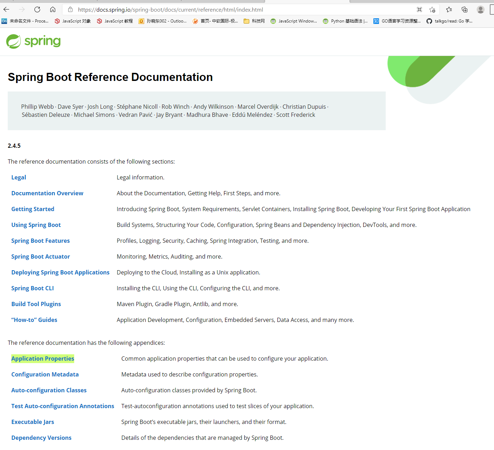
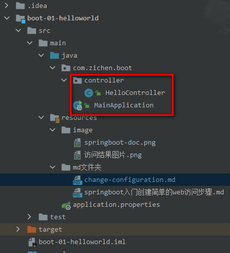

## 更改SpringBoot配置

- 配置文件固定名字 application.properties

- 更改端口号

```properties
server.port=8888
```

#### 1. 我们可以更改哪些配置，需要参考官方文档

https://docs.spring.io/spring-boot/docs/current/reference/html/index.html
该链接找到 Application Properties



#### 2. 使用插件打jar包

```xml
<build>
    <plugins>
        <plugin>
            <groupId>org.springframework.boot</groupId>
            <artifactId>spring-boot-maven-plugin</artifactId>
        </plugin>
    </plugins>
</build>
```

- 在jar包目录使用cmd可以直接启动 java -jar boot-01-helloworld-1.0-SNAPSHOT.jar
- 启动中会出现 ``boot-01-helloworld-1.0-SNAPSHOT.jar中没有主清单属性`` 问题
- 在pom文件中的插件中加入配置节课

```xml
<...>
<executions>
    <execution>
        <goals>
            <goal>repackage</goal>
        </goals>
    </execution>
</executions>
<...>
```

注意点：取消cmd的快速编辑模式（可能会影响启动）

#### 3. 修改依赖的版本号

- 可以在pom.xml中添加属性，来覆盖父工程自动仲裁的版本号

```xml
<properties>
    <mysql.version>5.1.43</mysql.version>
    <!-- 注意这里的mysql.version名称要和父工程中的名称一致 -->
</properties>
```

#### 4. 开发导入starter场景启动器

- springboot官方提供的启动器都是以 spring-boot-starter-* 的方式命名，* 代表某种场景
- 只要引入starter，这个成精的所有常规需要的依赖，springboot就会自动帮助我们导入
-
springboot所支持的场景，见网址：https://docs.spring.io/spring-boot/docs/current/reference/html/using-spring-boot.html#using-boot-starter
- 我们还可以使用第三方starter，命名一般都为：*-spring-boot-starter。

#### 5. 自动配置

**默认包结构：** 主程序所在的包及其下面所有子包里面的组件都会被默认扫描进来


**如果我们想在别的目录下面写成写：** 可以人为的指定包扫描目录

- 在主程序加上属性 scanBasePackages="com.xx.xx" 即可

```java
/**
 * 告诉springboot，这是一个springboot应用
 */
@SpringBootApplication(scanBasePackages="com.zichen")
public class MainApplication {
    public static void main(String[] args) {
        SpringApplication.run(MainApplication.class, args);
    }
}
```

- 默认配置都是映射到某一个类上的
- 配置文件的值最终会绑定在某个类上的，这个类会在容器中创建对象
- SpringBoot的所有自动配置功能都在：

```xml
<dependency>
    <groupId>org.springframework.boot</groupId>
    <artifactId>spring-boot-autoconfigure</artifactId>
    <version>2.4.3</version>
    <scope>compile</scope>
</dependency>
```


