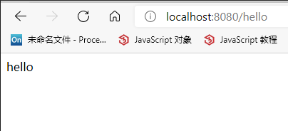

## 使用SpringBoot创建简单的web，访问并返回hello

### 1. 环境变量配置
- jdk 1.8以上
    - JAVA_HOME = E:\java\jdk8\jdk1.8.0_281
    - Path = .:%JAVA_HOME%\bin;%JAVA_HOME%\jre\bin
- maven 3.6.x
    - MAVEN_HOME = E:\apache-maven-3.6.3
    - Path = %MAVEN_HOME%\bin
- idea_maven 配置

### 2. 创建maven项目
- pom.xml
    - 添加父工程
      ```xml
      <parent>
        <artifactId>spring-boot-dependencies</artifactId>
        <groupId>org.springframework.boot</groupId>
        <version>2.4.3</version>
      </parent>
      ```
    - 添加web应用启动器
      ```xml
      <dependency>
        <groupId>org.springframework.boot</groupId>
        <artifactId>spring-boot-starter-web</artifactId>
      </dependency>
      ```
### 3. 创建启动类 com.zichen.boot.MainApplication.java
```java
package com.zichen.boot;

import org.springframework.boot.SpringApplication;
import org.springframework.boot.autoconfigure.SpringBootApplication;
import sun.applet.Main;

/**
 * @name: MainApplication
 * @description:
 * @author: zichen
 * @date: 2021/5/2  18:24
 */

/**
 * 告诉springboot，这是一个springboot应用
 */
@SpringBootApplication
public class MainApplication {
    public static void main(String[] args) {
        SpringApplication.run(MainApplication.class, args);
    }
}
```

### 4. 创建Controller
```java
package com.zichen.boot.controller;

import org.springframework.web.bind.annotation.RequestMapping;
import org.springframework.web.bind.annotation.RestController;

/**
 * @name: HelloController
 * @description:
 * @author: zichen
 * @date: 2021/5/2  18:31
 */
//@ResponseBody//使返回的hello以字符串的形式写给浏览器
//@Controller
@RestController// @ResponseBody和@Controller的合体
public class HelloController {

    @RequestMapping("/hello")//请求资源路径
    public String handle01() {
        return "hello";
    }
}
```
### 5. 运行
- 启动主方法
```properties
  .   ____          _            __ _ _
 /\\ / ___'_ __ _ _(_)_ __  __ _ \ \ \ \
( ( )\___ | '_ | '_| | '_ \/ _` | \ \ \ \
 \\/  ___)| |_)| | | | | || (_| |  ) ) ) )
  '  |____| .__|_| |_|_| |_\__, | / / / /
 =========|_|==============|___/=/_/_/_/
 :: Spring Boot ::                (v2.4.3)

2021-05-02 18:37:59.512  INFO 15784 --- [           main] com.zichen.boot.MainApplication          : Starting MainApplication using Java 1.8.0_281 on 子辰 with PID 15784 (E:\idea-springboot\SpringBoot\boot-01-helloworld\target\classes started by Administrator in E:\idea-springboot\SpringBoot)
2021-05-02 18:37:59.514  INFO 15784 --- [           main] com.zichen.boot.MainApplication          : No active profile set, falling back to default profiles: default
2021-05-02 18:38:00.309  INFO 15784 --- [           main] o.s.b.w.embedded.tomcat.TomcatWebServer  : Tomcat initialized with port(s): 8080 (http)
2021-05-02 18:38:00.319  INFO 15784 --- [           main] o.apache.catalina.core.StandardService   : Starting service [Tomcat]
2021-05-02 18:38:00.319  INFO 15784 --- [           main] org.apache.catalina.core.StandardEngine  : Starting Servlet engine: [Apache Tomcat/9.0.43]
2021-05-02 18:38:00.390  INFO 15784 --- [           main] o.a.c.c.C.[Tomcat].[localhost].[/]       : Initializing Spring embedded WebApplicationContext
2021-05-02 18:38:00.391  INFO 15784 --- [           main] w.s.c.ServletWebServerApplicationContext : Root WebApplicationContext: initialization completed in 832 ms
2021-05-02 18:38:00.534  INFO 15784 --- [           main] o.s.s.concurrent.ThreadPoolTaskExecutor  : Initializing ExecutorService 'applicationTaskExecutor'
2021-05-02 18:38:00.686  INFO 15784 --- [           main] o.s.b.w.embedded.tomcat.TomcatWebServer  : Tomcat started on port(s): 8080 (http) with context path ''
2021-05-02 18:38:00.696  INFO 15784 --- [           main] com.zichen.boot.MainApplication          : Started MainApplication in 1.647 seconds (JVM running for 2.843)

```
- 打开浏览器访问
    localhost:8080/hello

  