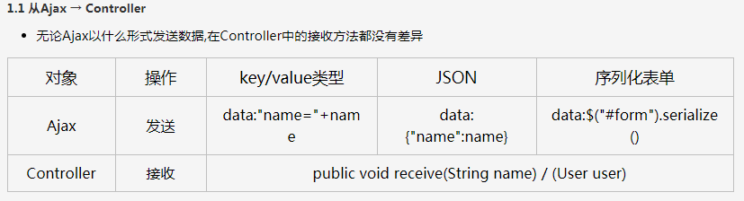
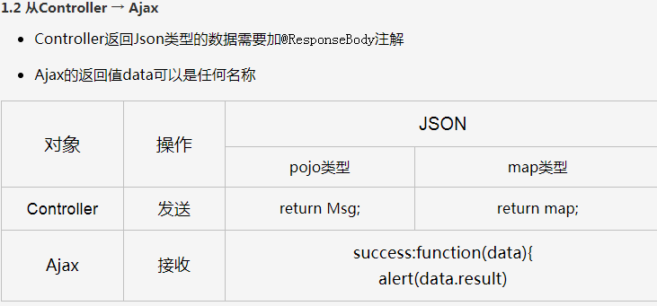

# Ajax 请求测试
## 1. 测试类
AjaxTestController.java

## 2. 问题
- 页面发送get或者post请求时，controller层需要有注解 @ResponseBody
    - 如果没有 @ResponseBody 注解，会报错，模板引擎无法解析
    - org.thymeleaf.exceptions.TemplateInputException: Error resolving template [test/ajax_get], template might not exist or might not be accessible by any of the configured Template Resolvers

- 跳转页面
    - return "ajax_test/ajax";      正确
    - return "/ajax_test/ajax";     错误
  
## 3. ajax <---> controller
- ajax --> controller
  

- controller --> ajax


## 4. 页面报错

- GET https://fonts.googleapis.com/css?family=Open+Sans:400,300,300italic,400italic,600,600italic,700,700italic,800,800italic net::ERR_INTERNET_DISCONNECTED

- 1. 复制网页内容（
     [字体](https://fonts.googleapis.com/css?family=Open+Sans:400,300,300italic,400italic,600,600italic,700,700italic,800,800italic)
- 2. 保存成fontgoogle.css
  
- 3. 将字体导入文件 style.css 做修改
```css
@import url(http://fonts.googleapis.com/css?family=Open+Sans:400,300,300italic,400italic,600,600italic,700,700italic,800,800italic);
修改成
@import url('../fonts/css/fontgoogle.css');
```