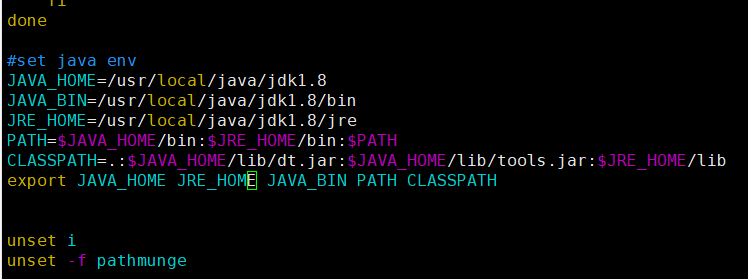

# Linux相关配置（CentOS-7-x86_64-Everything-2009）

## 网卡配置

**/etc/sysconfig/network-scripts/ifcfg-ens33**

```properties
默认配置：
WSER_ONLY="no"
BOOTPROTO="dhcp"
DEFROUTE="yes"
IPV4_FAILURE_FATAL="no"
IPV6INIT="yes"
IPV6_AUTOCONF="yes"
IPV6_DEFROUTE="yes"
IPV6_FAILURE_FATAL="no"
IPV6_ADDR_GEN_MODE="stable-privacy"
NAME="ens33"
UUID="9694998a-3ff6-49bd-89f9-84789821837d"
DEVICE="ens33"
ONBOOT="yes"

比较全面的配置：
TYPE="Ethernet"		#网卡类型（通常是Ethemet以太网）
PROXY_METHOD="none"	#代理方式：为关闭状态
BROWSER_ONLY="no"	#只是浏览器：否
BOOTPROTO="static"	#网卡的引导协议【static：静态IP  dhcp：动态IP   none：不指定，不指定容易出现各种各样的网络受限】
DEFROUTE="yes"		#默认路由
IPV4_FAILURE_FATAL="no"		#是否开启IPV4致命错误检测
IPV6INIT="yes"		#IPV6是否自动初始化：是（现在还未用到IPV6，不会有任何影响）
IPV6_AUTOCONF="yes"	#IPV6是否自动配置：是（现在还未用到IPV6，不会有任何影响）
IPV6_DEFROUTE="yes"	#IPV6是否可以为默认路由：是（现在还未用到IPV6，不会有任何影响）
IPV6_FAILURE_FATAL="no"		#是否开启IPV6致命错误检测
IPV6_ADDR_GEN_MODE="stable-privacy"	#IPV6地址生成模型
NAME="ens33"		#网卡物理设备名称
UUID="ab60d501-535b-49f5-a76b-3336a4120f64"#通用唯一识别码，每一个网卡都会有，不能重复，否则两台linux机器只有一台可上网
DEVICE="ens33"		#网卡设备名称，必须和‘NAME’值一样
ONBOOT="yes"		#是否开机启动，要想网卡开机就启动或通过 `systemctl restart network`控制网卡,必须设置为 `yes`
IPADDR=192.168.137.129		# 本机IP
NETMASK=255.255.255.0		#子网掩码
GATEWAY=192.168.137.2		#默认网关
DNS1=8.8.8.8#
DNS2=8.8.8.5#
ZONE=public#
```

**重启网卡**

```text
service network restart
systemctl restart network.service
```

- 桌面右上角网络小图标的开启与停止

```text
systemctl start NetworkManager.service 
systemctl stop NetworkManager.service 
```


**jdk1.8配置**

- 创建jdk目录   /usr/local/java

- 导入jdk-8u51-linux-x64.tar.gz文件，并解压到当前目录 

```text
tar -xvf jdk-8u51-linux-x64.tar.gz
  改名
  mv jdk-8u51-linux-x64 jdk1.8
```

- 配置环境变量

```properties
  done
  
  #set java env
  JAVA_HOME=/usr/local/java/jdk1.8
  JAVA_BIN=/usr/local/java/jdk1.8/bin
  JRE_HOME=/usr/local/java/jdk1.8/jre
  PATH=$JAVA_HOME/bin:$JRE_HOME/bin:$PATH
  CLASSPATH=.:$JAVA_HOME/lib/dt.jar:$JAVA_HOME/lib/tools.jar:$JRE_HOME/lib
  export JAVA_HOME JRE_HOME JAVA_BIN PATH CLASSPATH

  unset i
  unset -f pathmunge
  
  以上配置可以在任何目录使用javac、javap等
``



- 使配置生效

```properties
source /etc/profile
```

- 配置完成

```text
  [root@bogon java]# java -version
  openjdk version "1.8.0_262"
  OpenJDK Runtime Environment (build 1.8.0_262-b10)
  OpenJDK 64-Bit Server VM (build 25.262-b10, mixed mode)
  [root@bogon java]# 
```

  

  

**查看进程**

- jps  -  查看进程
- netstat -natp  -  查看进程的网络状态
- nc  -  开启一个线程，可以执行连接Socket


**问题记录**：

1、java HelloWorld不可以运行问题

报错：

> [zichen@zichen code]$ java HelloWorld
> Error: Could not find or load main class HelloWorld

解决：

> 是由于配置jdk环境变量，对于CLASSPATH路径前没有加  .:  ，改符号表示当前路径。

https://www.bilibili.com/video/BV1bK4y1Y7bo?p=8&spm_id_from=pageDriver