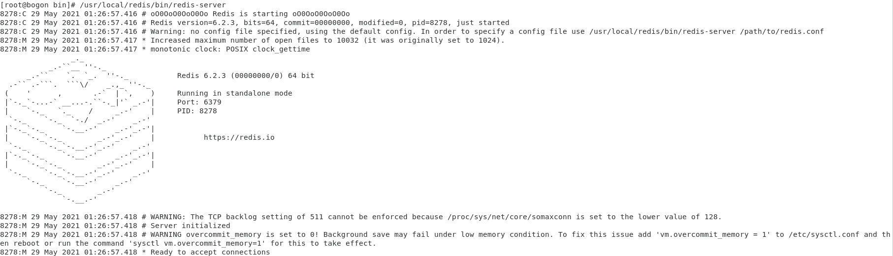

# Redis

## 1. 下载Redis
> wget https://download.redis.io/releases/redis-6.2.3.tar.gz

## 2. 解压 Redis
> tar -xvzf redis-6.2.3

## 3. 进入 redis-6.2.3
> cd redis-6.2.3/

## 4. 编译redis（可以和第5不一起来做  meke PREFIX=/usr/local/redis install）
> make

## 5. 编译后可以得到服务端和客户端的可执行文件,但是这些文件就位于源码目录中,不方便使用,所以我们可以使用install命令将可执行文件安装至指定的目录下;
> cd /usr/local/redis/redis-6.2.3
> 
> make install PREFIX=/usr/local/redis
> 
> 会在 /usr/local/redis 目录下得到 bin 目录
> 
> bin 下有以下文件： 
> 
> -rwxr-xr-x. 1 root root 4829488 May 29 01:23 redis-benchmark
> 
> lrwxrwxrwx. 1 root root      12 May 29 01:23 redis-check-aof -> redis-server
> 
> lrwxrwxrwx. 1 root root      12 May 29 01:23 redis-check-rdb -> redis-server
> 
> -rwxr-xr-x. 1 root root 5002888 May 29 01:23 redis-cli
> 
> lrwxrwxrwx. 1 root root      12 May 29 01:23 redis-sentinel -> redis-server
> 
> -rwxr-xr-x. 1 root root 9484216 May 29 01:23 redis-server

## 6. 测试命令
> /usr/local/redis/bin/redis-server 或者 ./redis-server

## 7. 看到以下截图，表示安装成功

# 2. 后台启动redis
## 1. 赋值redis配置文件到bin目录
> cd /usr/local/redis/redis-6.2.3
> 
> cp redis.conf /usr/local/redis/bin

## 2. 编辑redis.conf 
> vim  /usr/local/redis/bin/redis.conf
> 
> 修改daemonize no 为 daemonize yes  修改这个是代表允许后台启动，修改完成以后保存退出

## 3. 查看redis进程
> ps -ef|grep redis

> root    8620    3479    0 01:42 pts/0    00:00:00 grep --color=auto redis

## 4. 杀死redis进程
> kill -9 3479

## 5. 执行  ./redis-server redis.conf 进行启动 
> ./redis-server redis.conf

> [zichen@bogon bin]$ ./redis-server redis.conf
> 
> [zichen@bogon bin]$

## 6. 看到以下结果，表示启动成功
> [zichen@bogon bin]$ ps -ef | grep redis
> 
> zichen     8703      1  0 01:45 ?        00:00:00 ./redis-server 127.0.0.1:6379
> 
> zichen     8731   3423  0 01:47 pts/0    00:00:00 grep --color=auto redis

## 7. redis 停止命令
> ./redis-cli shutdown

## 8. 远程连接redis
> ./redis-cli -h ip -p 6379
> 本地连接redis ./redis-cli

## 8. 查看redis进程
> redis未启动进程状态
> 
> [root@bogon bin]# ps -ef | grep redis
> 
> root       3173   3089  0 12:04 pts/0    00:00:00 grep --color=auto redis
> 
> redis启动后进程状态
> 
> [root@bogon bin]# ./redis-server redis.conf
> 
> [root@bogon bin]# ps -ef| grep redis
> 
> root       3186      1  0 12:04 ?        00:00:00 ./redis-server *:6379
> 
> root       3228   3089  0 12:04 pts/0    00:00:00 grep --color=auto redis
> 
> [root@bogon bin]#

# 3. linux中连接redis
## 1. 进入bin
> cd /usr/local/redis/bin

## 2. 执行redis-cli
> ./redis-cli

## 3. 出现以下命令表示连接成功
> [zichen@bogon bin]$ ./redis-cli
> 
> 127.0.0.1:6379> 

# 4. 给redis设置密码，以供连接（重启redis密码失效）
> [zichen@bogon bin]$ ./redis-cli
> 
> 127.0.0.1:6379> config set requirepass 123456
> 
> OK

- 退出
> 127.0.0.1:6379> quit

## 1. 给redis设置密码，重启redis密码不会失效
> vim /usr/local/redis/bin/redis.conf
> 
>-- # requirepass foobared 修改成requirepass 123456

## 2. 通过auth加密码命令登录，返回OK
> [zichen@bogon bin]$ ./redis-cli
> 
> 127.0.0.1:6379> auth 123456
> 
> OK
> 
> 127.0.0.1:6379> 

- 此时密码设置已经完成

## 3. 验证密码是否设置成功
> 启动redis
> 
> ./redis-server redis.conf
> 
> 进入客户端
> 
> ./redis-cli
> 
> 输入命令 config get requirepass 进行验证
> 
> 出现“(error) NOAUTH Authentication required.证明设置密码成功！
> 
> 输入密码 auth 123456 
> 
> 返回 ok
> 
> 证明设置成功
> 
> 再次输入 config get requirepass 即可看到自己设置的密码
> 
> 127.0.0.1:6379> config get requirepass
> -1) "requirepass"
> 
> -2) "123456"
> 
> 127.0.0.1:6379>

# 5. 确保6379端口堆外开放
## 1. 返回Windows测试6379是否连通
> Linux中查看地址
> 
> ifconfig
> 
> inet 192.168.60.128
> 
> 查看Linux网络已经连接

## 2. 打开cmd
- 执行 telnet 192.168.60.128 6379
- 报错：'telnet' 不是内部或外部命令，也不是可运行的程序 或批处理文件。
- 原因：系统中的telnet客户端是关闭状态。即Win10默认没有安装telnet功能。
- 解决：控制面板 -> 程序 -> 启用或关闭Windows功能 -> 勾选Telnet客户端 -> 确定
- 再次执行：telnet 192.168.60.128 6379
> C:\Users\Administrator>telnet 192.168.60.128 6379
> 
> 正在连接192.168.60.128...无法打开到主机的连接。 在端口 6379: 连接失败
> 
> C:\Users\Administrator>

- 说明 CentOS的6379端口没有开启
# 6. 去Linux中开启6379
## 1. 输入firewall-cmd --query-port=6379/tcp，如果返回结果为no，那么证明6379端口确实没有开启
> [root@bogon bin]# firewall-cmd --query-port=6379/tcp
> 
> no
> 
> [root@bogon bin]#

## 2. 输入firewall-cmd --add-port=6379/tcp，将6379端口开启，返回success。
> [root@bogon bin]# firewall-cmd --add-port=6379/tcp
> 
> success
> 
> [root@bogon bin]#

## 3. 然后再执行firewall-cmd --query-port=6379/tcp，返回yes，证明端口已经成功开启。
> [root@bogon bin]# firewall-cmd --query-port=6379/tcp
> 
> yes
> 
> [root@bogon bin]# 

- 此时 6379 已经开启

## 4. 去配置里面，注释掉 bind 127.0.0.1
> bind 127.0.0.1 -::1 改成 #bind 127.0.0.1 -::1

## 5. 在redis的配置文件里面，是否把本地保护模式给关闭，如果没有，连接不上
> protected-mode yes  改成 protected-mode no

## 6. 关闭防火墙
> systemctl stop firewalld # 临时关闭防火墙
> 
> systemctl disable firewalld # 禁止开机启动
> 
> systemctl status firewalld # 查看防火墙

## 7. 修改好配置文件需要重启redis
> 检测6379端口是否在监听
> 
> netstat -lntp | grep 6379
> 
> ps -ef |grep redis
> 
> kill -9 xxxx
> 
> netstat -lntp | grep 6379

- 直到出现
> [zichen@bogon ~]$ netstat -lntp | grep 6379
> 
> (Not all processes could be identified, non-owned process info
> 
> will not be shown, you would have to be root to see it all.)
> [zichen@bogon ~]$
- redis关闭成功

## 8. 重新启动redis
> ./server

----
到此，redis安装、编译、生成启动命令（bin下）、设置密码、开放6379端口，全都设置完毕
----

# 7. 通过Redis Desktop Manager连接Redis
## 1. 查看redis名称
> [root@bogon bin]# ./redis-cli
> 
> 127.0.0.1:6379> auth 123456
> 
> OK
> 
> 127.0.0.1:6379> client getname
> 
> (nil)
> 
> 127.0.0.1:6379> 

- 新安装的redis是没有名称的，故此返回空

## 2. 设置redis名字（重启redis会失效）
> 127.0.0.1:6379> client setname redis
> 
> OK
> 
> 127.0.0.1:6379> client getname
> 
> "redis"
> 
> 127.0.0.1:6379> 

## 3. 设置redis名字（重启redis不会失效）
**> 暂时还不知道如何修改**

## 3. 连接redis
> Name : redis
> 
> Host : 192.168.60.128
> 
> Port : 6379
> 
> Auth : 123456
> 
> Test Connection
> 
> Successful connection to redis-server

# 8. 以后连接，如果连接不上，记得关闭防火墙
> systemctl stop firewalld
> 
> systemctl start firewalld
> 
> systemctl status firewalld  or firewall-cmd --state

- 永久关闭防火墙

> 执行systemctl disable firewalld.service命令，禁止防火墙开机启动
> 
> 执行vi /etc/selinux/config命令，永久关闭selinux
> 
> 修改前 SELINUX=enforcing
> 
> 修改后 SELINUX=disabled
> 
> 使用reboot命令，重启虚拟机使刚刚的配置生效，并检查刚刚配置是否生效

> [zichen@bogon ~]$ firewall-cmd --state
> 
> not running
> 
> [zichen@bogon ~]$ systemctl status firewalld
> 
> ● firewalld.service - firewalld - dynamic firewall daemon
> 
> Loaded: loaded (/usr/lib/systemd/system/firewalld.service; disabled; vendor preset: enabled)
> Active: inactive (dead)
> 
> Docs: man:firewalld(1)
> 
> [zichen@bogon ~]$ 

