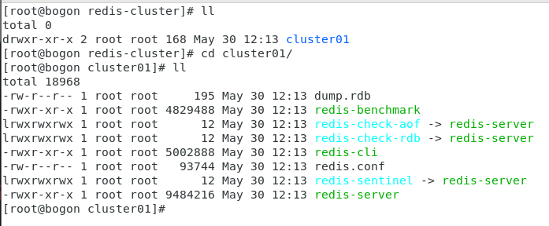

# 1. Redis 集群
## 1.2. 在开始redis集群搭建之前，我们先简单回顾一下redis单机版的搭建过程
- 下载redis压缩包，然后解压压缩文件；
- 进入到解压缩后的redis文件目录（此时可以看到Makefile文件），编译redis源文件；
- 把编译好的redis源文件安装到/usr/local/redis目录下，如果/local目录下没有redis目录，会自动新建redis目录；
- 进入/usr/local/redis/bin目录，直接./redis-server启动redis（此时为前端启动redis）；
- 将redis启动方式改为后端启动，具体做法：把解压缩的redis文件下的redis.conf文件复制到/usr/local/redis/bin目录下，然后修改该redis.conf文件->daemonize：no 改为daemonize：yse；
- 在/bin目录下通过./redis-server redis.conf启动redis（此时为后台启动）。
- 综上redis单机版安装启动完成。

## 1.3. Redis Cluster（Redis集群）简介
- redis是一个开源的key value存储系统，受到了广大互联网公司的青睐。redis3.0版本之前只支持单例模式，在3.0版本及以后才支持集群，我这里用的是redis6.2.3版本；
- redis集群采用P2P模式，是完全去中心化的，不存在中心节点或者代理节点；
- redis集群是没有统一的入口的，客户端（client）连接集群的时候连接集群中的任意节点（node）即可，集群内部的节点是相互通信的（PING-PONG机制），每个节点都是一个redis实例；
- 为了实现集群的高可用，即判断节点是否健康（能否正常使用），redis-cluster有这么一个**投票容错机制**：如果集群中超过半数的节点投票认为某个节点挂了，那么这个节点就挂了（fail）。这是判断节点是否挂了的方法；
- 那么如何判断集群是否挂了呢? -> 如果集群中任意一个节点挂了，而且该节点没有从节点（备份节点），那么这个集群就挂了。这是判断集群是否挂了的方法；
- 那么为什么任意一个节点挂了（没有从节点）这个集群就挂了呢？ -> 因为集群内置了16384个slot（哈希槽），并且把所有的物理节点映射到了这16384[0-16383]个slot上，或者说把这些slot均等的分配给了各个节点。当需要在Redis集群存放一个数据（key-value）时，redis会先对这个key进行crc16算法，然后得到一个结果。再把这个结果对16384进行求余，这个余数会对应[0-16383]其中一个槽，进而决定key-value存储到哪个节点中。所以一旦某个节点挂了，该节点对应的slot就无法使用，那么就会导致集群无法正常工作。
- 综上所述，每个Redis集群理论上最多可以有16384个节点。

## 1.4. 集群搭建需要的环境
### 1.4.1. Redis集群至少需要3个节点，因为投票容错机制要求超过半数节点认为某个节点挂了该节点才是挂了，所以2个节点无法构成集群。
### 1.4.2. 要保证集群的高可用，需要每个节点都有从节点，也就是备份节点，所以Redis集群至少需要6台服务器。因为我没有那么多服务器，也启动不了那么多虚拟机，所在这里搭建的是伪分布式集群，即一台服务器虚拟运行6个redis实例，修改端口号为（7001-7006），当然实际生产环境的Redis集群搭建和这里是一样的。

#### 1.4.3.1. 在usr/local目录下新建redis-cluster目录，用于存放集群节点
- mkdir /usr/local/redis-cluster

## 1.5. 集群搭建具体步骤如下（注意要关闭防火墙）
### 1.5.1. 把redis目录下的bin目录下的所有文件复制到/usr/local/redis-cluster/redis01目录下
- cp -r /usr/local/redis/bin /usr/local/redis-cluster/cluster01



### 1.5.2. 删除redis01目录下的快照文件dump.rdb，并且修改该目录下的redis.cnf文件，具体修改几处地方
- rm -rf dump.rdb 
- vim redis-conf
    - 修改端口号为 port 6379 为 port 7001
    - 开启集群创建模式  cluster-enabled yes 的注释打开
    - daemonize no #设置为yes,使redis在后台运行
    - cluster-config-file nodes-6379.conf #集群的配置，把注释#去掉，并改为对应的7000,7001,7002 
    - cluster-node-timeout 15000 #请求超时，默认15秒，可自行设置
    - appendonly no #aof日志开启 ，有需要就开启，它会每次写操作都记录一条日志
- pidfile /var/run/redis_6379.pid #修改端口为7001、7002、7003、7004、7005、7006
- 


### 1.5.3. 将redis-cluster/redis01文件复制5份到redis-cluster目录下（redis02-redis06），创建6个redis实例，模拟Redis集群的6个节点。然后将其余5个文件下的redis.conf里面的端口号分别修改为7002-7006。
- cp -r /usr/local/redis-cluster/cluster01/ /usr/local/redis-cluster/cluster02
- cp -r /usr/local/redis-cluster/cluster01/ /usr/local/redis-cluster/cluster03 
- cp -r /usr/local/redis-cluster/cluster01/ /usr/local/redis-cluster/cluster04
- cp -r /usr/local/redis-cluster/cluster01/ /usr/local/redis-cluster/cluster05
- cp -r /usr/local/redis-cluster/cluster01/ /usr/local/redis-cluster/cluster06
- 修改每一个cluster中的配置文件的端口号为 port 7002 - port 7006

### 1.5.4. 接着启动所有redis节点，由于一个一个启动太麻烦了，所以在这里创建一个批量启动redis节点的脚本文件，命令为start-all.sh，文件内容如下：
```shell
cd /usr/local/redis-cluster/cluster01
./redis-server redis.conf
cd /usr/local/redis-cluster/cluster02
./redis-server redis.conf
cd /usr/local/redis-cluster/cluster03
./redis-server redis.conf
cd /usr/local/redis-cluster/cluster04
./redis-server redis.conf
cd /usr/local/redis-cluster/cluster05
./redis-server redis.conf
cd /usr/local/redis-cluster/cluster06
./redis-server redis.conf
```

### 1.5.5. 创建好启动脚本文件之后，需要修改该脚本的权限，使之能够执行，指令如下：
- chmod +x start-all.sh

### 1.5.6. 执行start-all.sh脚本，启动6个redis节点
- sh start-all.sh

### 1.5.7. 至此6个redis节点启动成功，接下来正式开启搭建集群，以上都是准备条件。其实以上步骤也就一句话的事情：创建6个redis实例（6个节点）并启动。
```shell
[root@bogon redis-cluster]# sh start-all.sh
[root@bogon redis-cluster]# ps -ef | grep redis
root       6248      1  0 13:39 ?        00:00:00 ./redis-server *:7001 [cluster]
root       6254      1  0 13:39 ?        00:00:00 ./redis-server *:7002 [cluster]
root       6260      1  0 13:39 ?        00:00:00 ./redis-server *:7003 [cluster]
root       6266      1  0 13:39 ?        00:00:00 ./redis-server *:7004 [cluster]
root       6272      1  0 13:39 ?        00:00:00 ./redis-server *:7005 [cluster]
root       6278      1  0 13:39 ?        00:00:00 ./redis-server *:7006 [cluster]
root       6284   5966  0 13:39 pts/1    00:00:00 grep --color=auto redis
[root@bogon redis-cluster]#
```

### 1.5.8. 关闭集群
```shell
[root@bogon redis-cluster]# ps -ef|grep redis
root       6248      1  0 13:39 ?        00:00:02 ./redis-server *:7001 [cluster]
root       6254      1  0 13:39 ?        00:00:02 ./redis-server *:7002 [cluster]
root       6260      1  0 13:39 ?        00:00:02 ./redis-server *:7003 [cluster]
root       6266      1  0 13:39 ?        00:00:02 ./redis-server *:7004 [cluster]
root       6272      1  0 13:39 ?        00:00:01 ./redis-server *:7005 [cluster]
root       6278      1  0 13:39 ?        00:00:02 ./redis-server *:7006 [cluster]
root       7456   5966  0 14:08 pts/1    00:00:00 grep --color=auto redis
[root@bogon redis-cluster]# kill -9 6248 6254 6260 6266 6272 6278
[root@bogon redis-cluster]# ps -ef|grep redis
root       7466   5966  0 14:09 pts/1    00:00:00 grep --color=auto redis
[root@bogon redis-cluster]# 
```
### 1.5.9. 进到/usr/local/redis/bin执行以下命令，且已在前面启动了各个节点
- 执行以下命令
```shell
./redis-cli --cluster create 192.168.60.128:7001 192.168.60.128:7002 192.168.60.128:7003 192.168.60.128:7004 192.168.60.128:7005 192.168.60.128:7006 --cluster-replicas 1
```
```shell
[root@bogon bin]# ./redis-cli --cluster create 192.168.60.128:7001 192.168.60.128:7002 192.168.60.128:7003 192.168.60.128:7004 192.168.60.128:7005 192.168.60.128:7006 --cluster-replicas 1
>>> Performing hash slots allocation on 6 nodes...
Master[0] -> Slots 0 - 5460
Master[1] -> Slots 5461 - 10922
Master[2] -> Slots 10923 - 16383
Adding replica 192.168.60.128:7005 to 192.168.60.128:7001
Adding replica 192.168.60.128:7006 to 192.168.60.128:7002
Adding replica 192.168.60.128:7004 to 192.168.60.128:7003
>>> Trying to optimize slaves allocation for anti-affinity
[WARNING] Some slaves are in the same host as their master
M: ad5daad804ac23a148c9a6625e42ca281d071be8 192.168.60.128:7001
   slots:[0-5460] (5461 slots) master
M: bbf0e1c90bb59d284b0101953e7388fcca40c025 192.168.60.128:7002
   slots:[5461-10922] (5462 slots) master
M: 3e76de1e9110a549060c4a0578d603bac1bcfc25 192.168.60.128:7003
   slots:[10923-16383] (5461 slots) master
S: de4d17135bddcceaaf34baabb9c5053e56888be1 192.168.60.128:7004
   replicates bbf0e1c90bb59d284b0101953e7388fcca40c025
S: 04a5ee103ac29ae739cbea1a49df09f84fe84e7c 192.168.60.128:7005
   replicates 3e76de1e9110a549060c4a0578d603bac1bcfc25
S: 7c1a0fb0390674e95530602fbade5689c519f777 192.168.60.128:7006
   replicates ad5daad804ac23a148c9a6625e42ca281d071be8
Can I set the above configuration? (type 'yes' to accept): yes         
>>> Nodes configuration updated
>>> Assign a different config epoch to each node
>>> Sending CLUSTER MEET messages to join the cluster
Waiting for the cluster to join

>>> Performing Cluster Check (using node 192.168.60.128:7001)
M: ad5daad804ac23a148c9a6625e42ca281d071be8 192.168.60.128:7001
   slots:[0-5460] (5461 slots) master
   1 additional replica(s)
M: 3e76de1e9110a549060c4a0578d603bac1bcfc25 192.168.60.128:7003
   slots:[10923-16383] (5461 slots) master
   1 additional replica(s)
S: 7c1a0fb0390674e95530602fbade5689c519f777 192.168.60.128:7006
   slots: (0 slots) slave
   replicates ad5daad804ac23a148c9a6625e42ca281d071be8
M: bbf0e1c90bb59d284b0101953e7388fcca40c025 192.168.60.128:7002
   slots:[5461-10922] (5462 slots) master
   1 additional replica(s)
S: de4d17135bddcceaaf34baabb9c5053e56888be1 192.168.60.128:7004
   slots: (0 slots) slave
   replicates bbf0e1c90bb59d284b0101953e7388fcca40c025
S: 04a5ee103ac29ae739cbea1a49df09f84fe84e7c 192.168.60.128:7005
   slots: (0 slots) slave
   replicates 3e76de1e9110a549060c4a0578d603bac1bcfc25
[OK] All nodes agree about slots configuration.
>>> Check for open slots...
>>> Check slots coverage...
[OK] All 16384 slots covered.
[root@bogon bin]#
```
### 1.5.10. 集群部署成功，接下来需要验证功能了
- 注意最后一段文字，显示了每个节点所分配的slots（哈希槽），这里总共6个节点，其中3个是从节点，所以3个主节点分别映射了0-5460、5461-10922、10923-16383 solts。
## 1.6. 验证集群
### 1.6.1. 连接集群节点，连接任意一个即可：
```shell
[root@bogon cluster01]# /usr/local/redis-cluster/cluster01/redis-cli -p 7001 -c
127.0.0.1:7001> 
```
- 注意：一定要加上-c，不然节点之间是无法自动跳转的！如下图可以看到，存储的数据（key-value）是均匀分配到不同的节点的：

```shell
[root@bogon cluster01]# /usr/local/redis-cluster/cluster01/redis-cli -p 7001 -c
127.0.0.1:7001> set str1 1
OK
127.0.0.1:7001> ping
PONG
127.0.0.1:7001> set str2 2
-> Redirected to slot [9547] located at 192.168.60.128:7002
OK
192.168.60.128:7002> set str3 3
-> Redirected to slot [13674] located at 192.168.60.128:7003
OK
192.168.60.128:7003> set str4 4
-> Redirected to slot [1421] located at 192.168.60.128:7001
OK
192.168.60.128:7001> set str5 5
-> Redirected to slot [5548] located at 192.168.60.128:7002
OK
192.168.60.128:7002> set str6 6
OK
192.168.60.128:7002>
```

## 1.7. 最后学习两条集群查看指令
- cluster info
- cluster nodes
```shell
[root@bogon cluster01]# /usr/local/redis-cluster/cluster01/redis-cli -p 7001 -c
127.0.0.1:7001> cluster info
cluster_state:ok
cluster_slots_assigned:16384
cluster_slots_ok:16384
cluster_slots_pfail:0
cluster_slots_fail:0
cluster_known_nodes:6
cluster_size:3
cluster_current_epoch:6
cluster_my_epoch:1
cluster_stats_messages_ping_sent:589
cluster_stats_messages_pong_sent:625
cluster_stats_messages_sent:1214
cluster_stats_messages_ping_received:620
cluster_stats_messages_pong_received:589
cluster_stats_messages_meet_received:5
cluster_stats_messages_received:1214
127.0.0.1:7001> cluster nodes
3e76de1e9110a549060c4a0578d603bac1bcfc25 192.168.60.128:7003@17003 master - 0 1622356066000 3 connected 10923-16383
7c1a0fb0390674e95530602fbade5689c519f777 192.168.60.128:7006@17006 slave ad5daad804ac23a148c9a6625e42ca281d071be8 0 1622356067000 1 connected
bbf0e1c90bb59d284b0101953e7388fcca40c025 192.168.60.128:7002@17002 master - 0 1622356068874 2 connected 5461-10922
de4d17135bddcceaaf34baabb9c5053e56888be1 192.168.60.128:7004@17004 slave bbf0e1c90bb59d284b0101953e7388fcca40c025 0 1622356066828 2 connected
04a5ee103ac29ae739cbea1a49df09f84fe84e7c 192.168.60.128:7005@17005 slave 3e76de1e9110a549060c4a0578d603bac1bcfc25 0 1622356067848 3 connected
ad5daad804ac23a148c9a6625e42ca281d071be8 192.168.60.128:7001@17001 myself,master - 0 1622356066000 1 connected 0-5460
127.0.0.1:7001> 
```