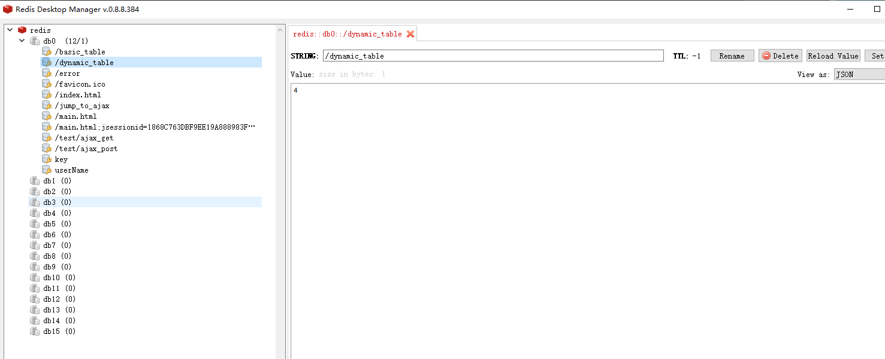
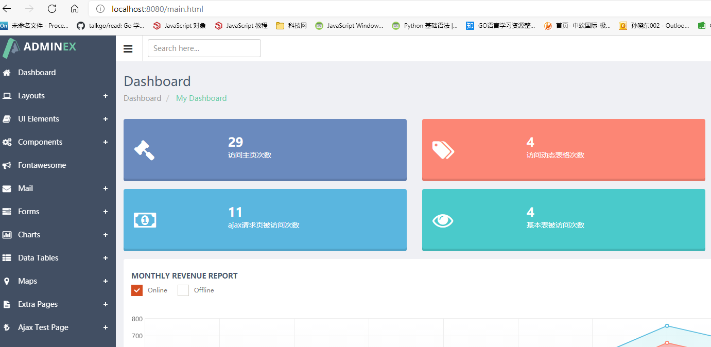

# 1. 访问页面，Redis计数
## 1. 添加拦截器，拦截请求
- 编写自己的拦截器拦截请求
    - 由于这里要操作Redis
    - 所以需要使用redisTemplate来操作redis
```java
@Slf4j
@Component
public class RedisUrlCountInterceptor implements HandlerInterceptor {

    @Autowired
    StringRedisTemplate redisTemplate;

    @Override
    public boolean preHandle(HttpServletRequest request, HttpServletResponse response, Object handler) throws Exception {
        // 每次访问，uri访问次数会加1
        String uri = request.getRequestURI();
        log.info("redis保存页面访问次数，拦截的路径是：{}", uri);
        redisTemplate.opsForValue().increment(uri);
        return true;
    }
}
```

- 将自己的拦截器添加到WebMvcConfigurer中
```java
@Configuration
public class AdminWebConfig implements WebMvcConfigurer {

    /**
     * Filter和Interceptor功能差不多，如何确定使用那个?
     * Filter: filter即使脱离spring也可以使用
     * Interceptor: interceptor是spring特有的，脱离spring不可食用
     * 
     * 所以Interceptor在spring容器中已经是存在的，直接装配使用即可
     * 如果我们直接new一个Interceptor放到WebMvcConfigurer中的话
     * 我们自己的拦截器操作redis功能将不可用
     */
    @Autowired
    RedisUrlCountInterceptor redisUrlCountInterceptor;

    @Override
    public void addInterceptors(InterceptorRegistry registry) {
        registry.addInterceptor(new LoginInterceptor())
                .addPathPatterns("/**")
                .excludePathPatterns("/", "/login", "/login4Postman", "/sql", "/css/**", "/fonts/**", "/images/**", "/js/**", "/saveUserTb", "/saveUserTb4Annotation", "/insertCity");
        registry.addInterceptor(redisUrlCountInterceptor)
                .addPathPatterns("/**")
                .excludePathPatterns("/", "/login", "/login4Postman", "/sql", "/css/**", "/fonts/**", "/images/**", "/js/**", "/saveUserTb", "/saveUserTb4Annotation", "/insertCity");
    }
}
```

## 2. 测试
- 访问页面
  http://localhost:8080/
  http://localhost:8080/sql
## 3. 查看redis是否有计数


# 2. 将计数结果放到页面展示
## 1. 编写Controller
```java
@Controller
@Slf4j
public class IndexController {
    
  @Autowired
  StringRedisTemplate redisTemplate;
  
  @GetMapping("/main.html")
  public String indexPage(HttpSession session, Model model) {
    log.info("indexPage 执行");

    // 操作redis，获取数据 放到Model中
    ValueOperations opsForValue = redisTemplate.opsForValue();
    String s = opsForValue.get("/main.html");
    String s1 = opsForValue.get("/dynamic_table");
    String s2 = opsForValue.get("/jump_to_ajax");
    String s3 = opsForValue.get("/basic_table");
    model.addAttribute("main_count", s);
    model.addAttribute("dynamic_table_count", s1);
    model.addAttribute("jump_to_ajax_count", s2);
    model.addAttribute("basic_table_count", s3);
    return "index";
  }
}
```

## 2. 编写HTML
```html
<div class="col-md-6">
    <!--statistics start-->
    <div class="row state-overview">
        <div class="col-md-6 col-xs-12 col-sm-6">
            <div class="panel purple">
                <div class="symbol">
                    <i class="fa fa-gavel"></i>
                </div>
                <div class="state-value">
                    <div class="value" th:text="${main_count}">230</div>
                    <div class="title">访问主页次数</div>
                </div>
            </div>
        </div>
        <div class="col-md-6 col-xs-12 col-sm-6">
            <div class="panel red">
                <div class="symbol">
                    <i class="fa fa-tags"></i>
                </div>
                <div class="state-value">
                    <div class="value" th:text="${dynamic_table_count}">3490</div>
                    <div class="title">访问动态表格次数</div>
                </div>
            </div>
        </div>
    </div>
    <div class="row state-overview">
        <div class="col-md-6 col-xs-12 col-sm-6">
            <div class="panel blue">
                <div class="symbol">
                    <i class="fa fa-money"></i>
                </div>
                <div class="state-value">
                    <div class="value" th:text="${favicon_count}">22020</div>
                    <div class="title">ajax请求页被访问次数</div>
                </div>
            </div>
        </div>
        <div class="col-md-6 col-xs-12 col-sm-6">
            <div class="panel green">
                <div class="symbol">
                    <i class="fa fa-eye"></i>
                </div>
                <div class="state-value">
                    <div class="value" th:text="${basic_table_count}">390</div>
                    <div class="title">基本表被访问次数</div>
                </div>
            </div>
        </div>
    </div>
    <!--statistics end-->
</div>
```

## 3. 访问页面
- http://localhost:8080/
- http://localhost:8080/dynamic_table
- http://localhost:8080/jump_to_ajax
- http://localhost:8080/basic_table

## 4. 查看结果
