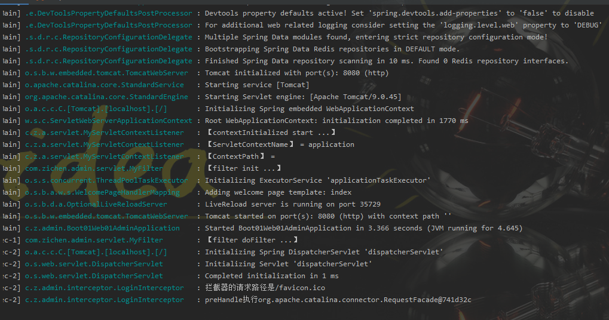

## 原生组件注入_servlet_filter_listener

- /css/*   servlet写法
- /css/**  spring写法

### 注入方式一

- 注入servlet原生组件
    - 扫描包 @SpringComponentScan("com.zichen.admin")
    - 测试Servlet类，继承HttpServlet（众多Servlet中的一个） 重写doGet()    use @WebServlet(urlPatterns = {"/test"})
        - /test 请求被拦截
    - 实现Filter（众多Filter中的一个） 重写init() doFilter()  destroy()  use @WebFilter(urlPatterns = {"/css/*", "/js/*"})测试Filter类，
        - /css/* 和 /js/*  资源被拦截
    - 测试Listener类，实现ServletContextListener（众多Listener中的一个） 重写 contextInitialized()   contextDestroyed()  use @WebListener




### 注入方式二

- use ServletRegistrationBean, FilterRegistrationBean, and ServletListenerRegistrationBean classes for complete control

- 先把方式一注释掉

```java
@Slf4j
@Configuration
public class MyRegistrationBeanConfig {

    @Bean
    public ServletRegistrationBean myServlet() {
        MyServlet myServlet = new MyServlet();
        return new ServletRegistrationBean(myServlet, "/myServlet");
    }

    @Bean
    public FilterRegistrationBean myFilter() {
        return new FilterRegistrationBean(new MyFilter(), myServlet());
    }
    
    /*
    @Bean
    public FilterRegistrationBean myFilter02() {
        FilterRegistrationBean filterRegistrationBean = new FilterRegistrationBean(new MyFilter());
        filterRegistrationBean.setUrlPatterns(Arrays.asList("/myFilter", "/css/*"));
        return filterRegistrationBean;
    }      
     */

    @Bean
    public ServletListenerRegistrationBean myListener() {
        return new ServletListenerRegistrationBean(new MyServletContextListener());
    }
}
```
