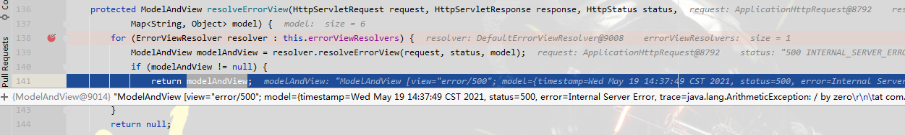

## 异常处理

> 1. SpringBoot 默认会查找 templates/error/5xx.html or templates/error/4xx.html页面显示错误页


> 2. 准备错误自动跳转

> package eg

- For example
```text
to map 404 to a static HTML file, your directory structure would be as follows:
src/
 +- main/
     +- java/
     |   + <source code>
     +- resources/
         +- public/
             +- error/
             |   +- 404.html
             +- <other public assets>
```
or
```text
To map all 5xx errors by using a FreeMarker template, your directory structure would be as follows:
src/
 +- main/
     +- java/
     |   + <source code>
     +- resources/
         +- templates/
             +- error/
             |   +- 5xx.ftlh
             +- <other templates>
```

## ErrorMvcAutoConfiguration (error handle configuration)
**可以配置的属性绑定在：** @EnableConfigurationProperties({ ServerProperties.class, WebMvcProperties.class })

**注册的bean**

- 
    - @bean DefaultErrorAttributes   --> id:errorAttributes
        - 保存错误属性：storeErrorAttributes(request, ex);
            - exception、trace、message、errors、timestamp...
    - @bean BasicErrorController  --> id:basicErrorController
        - BasicErrorController是一个映射  @RequestMapping("${server.error.path:${error.path:/error}}")
            - 处理错误页，返回ModelAndView
    - @bean ErrorPageCustomizer  --> id:errorPageCustomizer
        - 自定义错误页 ：public void registerErrorPages(ErrorPageRegistry errorPageRegistry) {...}
    - @bean PreserveErrorControllerTargetClassPostProcessor  --> id:preserveErrorControllerTargetClassPostProcessor
        - postProcessBeanFactory() --> 使用这个方法，我们可以在容器初始化时，做一些业务操作
    - @bean DefaultErrorViewResolver  --> id:conventionErrorViewResolver   (@ConditionalOnMissingBean(ErrorViewResolver.class))
        - 在静态代码块中预定义了两个错误视图页 SERVER_ERROR“5xx”和 CLIENT_ERROR“4xx”
        - 解析错误视图的时候会拼接 "error/" + viewName，， 而viewName就是状态码（404,501,502等）
    - @bean(name="error") 白页错误视图配置，在class WhitelabelErrorViewConfiguration{...}中
        - 当容器中没有名叫error的bean是才使用默认错误视图页
    
## 断点跟踪
- 请求：/dynamic_table
- controller发生除0异常
- mv = ha.handle(processedRequest, response, mappedHandler.getHandler());
    - mav = invokeHandlerMethod(request, response, handlerMethod);
        - invocableMethod.invokeAndHandle(webRequest, mavContainer);
            - Object returnValue = invokeForRequest(webRequest, mavContainer, providedArgs);
                - 这里回去执行目标方法，报出异常
                - log.info(10/0 + "");
                - InvocableHandlerMethod类会捕获
                    - doInvoke(Object... args)
                        - catch (InvocationTargetException ex) {throw (RuntimeException) targetException;}
        - finally{webRequest.requestCompleted();} （标记请求执行完成，this.requestActive = false;）
- catch (Exception ex) {dispatchException = ex;}
- processDispatchResult(processedRequest, response, mappedHandler, mv, dispatchException);（派发请求，生成视图等工作）
    - if (exception != null) 判断是否存在异常的情况
        - 拿到handler=com.zichen.admin.controller.TableController#dynamic_table(Model)
        - mv = processHandlerException(request, response, handler, exception);
            - 循环遍历this.handlerExceptionResolvers，看那个resolver可以解析异常【for (HandlerExceptionResolver resolver : this.handlerExceptionResolvers)】
            - exMv = resolver.resolveException(request, response, handler, ex);
            - 没有找到可以解析异常的解析器
            - throw ex;将异常抛出
            - 该程序放行，紧接着又会发起一个请求 /error
        - invocableMethod.invokeAndHandle(webRequest, mavContainer);
            - Object returnValue = invokeForRequest(webRequest, mavContainer, providedArgs);
                - Object returnValue = invokeForRequest(webRequest, mavContainer, providedArgs);
                    - doInvoke(args);(开始执行目标方法)
                        - ModelAndView errorHtml(req, res)
                        - return modelAndView
    
```java
@Controller
@RequestMapping("${server.error.path:${error.path:/error}}")
public class BasicErrorController extends AbstractErrorController {
    @RequestMapping(produces = MediaType.TEXT_HTML_VALUE)
    public ModelAndView errorHtml(HttpServletRequest request, HttpServletResponse response) {
        HttpStatus status = getStatus(request);// status = 500 INTERNAL_SERVER_ERROR
        Map<String, Object> model = Collections //model封装了"timestamp/status(500)/error(Internal Server Error)/trace/message(/by zero)/path"
                .unmodifiableMap(getErrorAttributes(request, getErrorAttributeOptions(request, MediaType.TEXT_HTML)));
        response.setStatus(status.value());
        ModelAndView modelAndView = resolveErrorView(request, response, status, model);
        return (modelAndView != null) ? modelAndView : new ModelAndView("error", model);
    }
}

class DefaultErrorViewResolver(){
    /**
     * 解析视图
     * @param request
     * @param status
     * @param model
     * @return
     */
    @Override
    public ModelAndView resolveErrorView(HttpServletRequest request, HttpStatus status, Map<String, Object> model) {
        ModelAndView modelAndView = resolve(String.valueOf(status.value()), model);
        if (modelAndView == null && SERIES_VIEWS.containsKey(status.series())) {
            modelAndView = resolve(SERIES_VIEWS.get(status.series()), model);
        }
        return modelAndView;
    }

    private ModelAndView resolve(String viewName, Map<String, Object> model) {
        String errorViewName = "error/" + viewName;// error/500
        TemplateAvailabilityProvider provider = this.templateAvailabilityProviders.getProvider(errorViewName,
                this.applicationContext);
        if (provider != null) {
            return new ModelAndView(errorViewName, model);
        }
        return resolveResource(errorViewName, model);
    }
}
```

