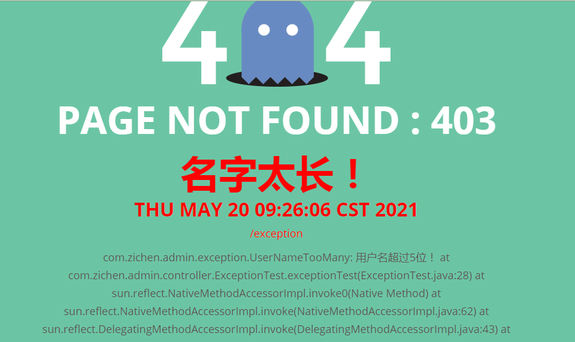

## 1. 异常处理

> 1. SpringBoot 默认会查找 templates/error/5xx.html or templates/error/4xx.html页面显示错误页


> 2. 准备错误自动跳转

> package eg

- For example
```text
to map 404 to a static HTML file, your directory structure would be as follows:
src/
 +- main/
     +- java/
     |   + <source code>
     +- resources/
         +- public/
             +- error/
             |   +- 404.html
             +- <other public assets>
```
or
```text
To map all 5xx errors by using a FreeMarker template, your directory structure would be as follows:
src/
 +- main/
     +- java/
     |   + <source code>
     +- resources/
         +- templates/
             +- error/
             |   +- 5xx.ftlh
             +- <other templates>
```

## ErrorMvcAutoConfiguration (error handle configuration)
**可以配置的属性绑定在：** @EnableConfigurationProperties({ ServerProperties.class, WebMvcProperties.class })

**注册的bean**

- 
    - @bean DefaultErrorAttributes   --> id:errorAttributes
        - 保存错误属性：storeErrorAttributes(request, ex);
            - exception、trace、message、errors、timestamp...
    - @bean BasicErrorController  --> id:basicErrorController
        - BasicErrorController是一个映射  @RequestMapping("${server.error.path:${error.path:/error}}")
            - 处理错误页，返回ModelAndView
    - @bean ErrorPageCustomizer  --> id:errorPageCustomizer
        - 自定义错误页 ：public void registerErrorPages(ErrorPageRegistry errorPageRegistry) {...}
    - @bean PreserveErrorControllerTargetClassPostProcessor  --> id:preserveErrorControllerTargetClassPostProcessor
        - postProcessBeanFactory() --> 使用这个方法，我们可以在容器初始化时，做一些业务操作
    - @bean DefaultErrorViewResolver  --> id:conventionErrorViewResolver   (@ConditionalOnMissingBean(ErrorViewResolver.class))
        - 在静态代码块中预定义了两个错误视图页 SERVER_ERROR“5xx”和 CLIENT_ERROR“4xx”
        - 解析错误视图的时候会拼接 "error/" + viewName，， 而viewName就是状态码（404,501,502等）
    - @bean(name="error") 白页错误视图配置，在class WhitelabelErrorViewConfiguration{...}中
        - 当容器中没有名叫error的bean是才使用默认错误视图页
    
## 2. 断点跟踪
- 请求：/dynamic_table
- controller发生除0异常
- mv = ha.handle(processedRequest, response, mappedHandler.getHandler());
    - mav = invokeHandlerMethod(request, response, handlerMethod);
        - invocableMethod.invokeAndHandle(webRequest, mavContainer);
            - Object returnValue = invokeForRequest(webRequest, mavContainer, providedArgs);
                - 这里回去执行目标方法，报出异常
                - log.info(10/0 + "");
                - InvocableHandlerMethod类会捕获
                    - doInvoke(Object... args)
                        - catch (InvocationTargetException ex) {throw (RuntimeException) targetException;}
        - finally{webRequest.requestCompleted();} （标记请求执行完成，this.requestActive = false;）
- catch (Exception ex) {dispatchException = ex;}
- processDispatchResult(processedRequest, response, mappedHandler, mv, dispatchException);（派发请求，生成视图等工作）
    - if (exception != null) 判断是否存在异常的情况
        - 拿到handler=com.zichen.admin.controller.TableController#dynamic_table(Model)
        - mv = processHandlerException(request, response, handler, exception);
            - 循环遍历this.handlerExceptionResolvers，看那个resolver可以解析异常【for (HandlerExceptionResolver resolver : this.handlerExceptionResolvers)】
            - exMv = resolver.resolveException(request, response, handler, ex);
            - 没有找到可以解析异常的解析器
            - throw ex;将异常抛出
            - 该程序放行，紧接着又会发起一个请求 /error
        - invocableMethod.invokeAndHandle(webRequest, mavContainer);
            - Object returnValue = invokeForRequest(webRequest, mavContainer, providedArgs);
                - Object returnValue = invokeForRequest(webRequest, mavContainer, providedArgs);
                    - doInvoke(args);(开始执行目标方法)
                        - ModelAndView errorHtml(req, res)
                        - return modelAndView
    
```java
@Controller
@RequestMapping("${server.error.path:${error.path:/error}}")
public class BasicErrorController extends AbstractErrorController {
    @RequestMapping(produces = MediaType.TEXT_HTML_VALUE)
    public ModelAndView errorHtml(HttpServletRequest request, HttpServletResponse response) {
        HttpStatus status = getStatus(request);// status = 500 INTERNAL_SERVER_ERROR
        Map<String, Object> model = Collections //model封装了"timestamp/status(500)/error(Internal Server Error)/trace/message(/by zero)/path"
                .unmodifiableMap(getErrorAttributes(request, getErrorAttributeOptions(request, MediaType.TEXT_HTML)));
        response.setStatus(status.value());
        ModelAndView modelAndView = resolveErrorView(request, response, status, model);
        return (modelAndView != null) ? modelAndView : new ModelAndView("error", model);
    }
}

class DefaultErrorViewResolver(){
    /**
     * 解析视图
     * @param request
     * @param status
     * @param model
     * @return
     */
    @Override
    public ModelAndView resolveErrorView(HttpServletRequest request, HttpStatus status, Map<String, Object> model) {
        ModelAndView modelAndView = resolve(String.valueOf(status.value()), model);
        if (modelAndView == null && SERIES_VIEWS.containsKey(status.series())) {
            modelAndView = resolve(SERIES_VIEWS.get(status.series()), model);
        }
        return modelAndView;
    }

    private ModelAndView resolve(String viewName, Map<String, Object> model) {
        String errorViewName = "error/" + viewName;// error/500
        TemplateAvailabilityProvider provider = this.templateAvailabilityProviders.getProvider(errorViewName,
                this.applicationContext);
        if (provider != null) {
            return new ModelAndView(errorViewName, model);
        }
        return resolveResource(errorViewName, model);
    }
}
```


```text
2021-05-19 14:07:18.337  INFO 316 --- [nio-8080-exec-4] c.z.admin.interceptor.LoginInterceptor   : 拦截器的请求路径是/dynamic_table
2021-05-19 14:07:18.338  INFO 316 --- [nio-8080-exec-4] c.z.admin.interceptor.LoginInterceptor   : preHandle执行org.apache.catalina.connector.RequestFacade@31d1d523
2021-05-19 14:29:24.116  INFO 316 --- [nio-8080-exec-4] c.z.admin.interceptor.LoginInterceptor   : afterCompletion执行{}

java.lang.ArithmeticException: / by zero
	at com.zichen.admin.controller.TableController.dynamic_table(TableController.java:29) ~[classes/:na]
	at sun.reflect.NativeMethodAccessorImpl.invoke0(Native Method) ~[na:1.8.0_131]
	
2021-05-19 14:29:35.101  INFO 316 --- [nio-8080-exec-4] c.z.admin.interceptor.LoginInterceptor   : 拦截器的请求路径是/error
2021-05-19 14:29:35.101  INFO 316 --- [nio-8080-exec-4] c.z.admin.interceptor.LoginInterceptor   : preHandle执行org.apache.catalina.core.ApplicationHttpRequest@217d7727
2021-05-19 14:53:48.916  INFO 316 --- [nio-8080-exec-4] c.z.admin.interceptor.LoginInterceptor   : 行{postHandle执}
2021-05-19 14:53:57.049  INFO 316 --- [nio-8080-exec-4] c.z.admin.interceptor.LoginInterceptor   : afterCompletion执行{}
```


## 3. 几种错误处理原理

### 1. 如果参数传递错误

```java
import org.springframework.web.bind.annotation.RequestParam;

@Controller
@Slf4j
public class TableController {
    @GetMapping("/basic_table")
    public String basic_table(@RequestParam("a") String a) {
        log.info(10/0 + "");
        return "table/basic_table";
    }
}
```
- 如果请求中传递的参数不是 a ,那么会报400，bad request
- 此时会报错白页
- 这是由于，错误页处理逻辑是，先精确查找400.html，如果精确查找没有找到，才进行4xx.html查找，我们没有配置4xx.html，所以会出现白页
- 如果增加一个4xx.html，就会找到4xx页面了

**_定制多种处理逻辑_**

- 1. 配置 error/4xx.html   error/5xx.html，先精确定位，在模糊定位
- 2. @ControllerAdvice + @ExceptionHandler 处理全局异常（ExceptionHandlerExceptionResolver进行解析）

```java
@ControllerAdvice
@Slf4j
public class GobalExceptionHandler {

    @ExceptionHandler({ArithmeticException.class, NullPointerException.class})
    public String handleArithException() {
        log.info("handleArithException execing...");
        return "login";//路径地址
    }
}
```
- 当发生ArithmeticException或者NullPointerException异常的时候，可以执行相关业务逻辑

- 3. @ResponseStatus + 自定义异常（ResponseStatusExceptionResolver进行解析）
    - 获取到状态码，然后调用 response.sendError(statusCode, resolverReason); statusCode=403, resolverReason="名字太长！"

```java
// 自定义异常
@Slf4j
@ResponseStatus(value =  HttpStatus.FORBIDDEN, reason = "名字太长！")
public class UserNameTooMany extends RuntimeException {

    public UserNameTooMany() {
    }

    public UserNameTooMany(String message) {
        super(message);
    }
}
```

```java
// 测试自定义异常
@Slf4j
@Controller
public class ExceptionTest {
    @ResponseBody
    @RequestMapping(value = "/exception", method = RequestMethod.GET)
    public String exceptionTest(@RequestParam("str") String str) {
        if (str.length() > 5) {
            throw new UserNameTooMany("用户名超过5位！");
        }
        return "<a>Exception</a>";
    }
}
```

- 测试结果



- 4. Spring底层的异常，如参数不存在，类型转换异常（DefaultHandlerExceptionResolver）
    
```java
Supported Exception
Exception                                       HTTP Status Code
HttpRequestMethodNotSupportedException          405 (SC_METHOD_NOT_ALLOWED)
HttpMediaTypeNotSupportedException              415 (SC_UNSUPPORTED_MEDIA_TYPE)
HttpMediaTypeNotAcceptableException             406 (SC_NOT_ACCEPTABLE)
MissingPathVariableException                    500 (SC_INTERNAL_SERVER_ERROR)
MissingServletRequestParameterException         400 (SC_BAD_REQUEST)
ServletRequestBindingException                  400 (SC_BAD_REQUEST)
ConversionNotSupportedException                 500 (SC_INTERNAL_SERVER_ERROR)
TypeMismatchException                           400 (SC_BAD_REQUEST)
HttpMessageNotReadableException                 400 (SC_BAD_REQUEST)
HttpMessageNotWritableException                 500 (SC_INTERNAL_SERVER_ERROR)
MethodArgumentNotValidException                 400 (SC_BAD_REQUEST)
MissingServletRequestPartException              400 (SC_BAD_REQUEST)
BindException                                   400 (SC_BAD_REQUEST)
NoHandlerFoundException                         404 (SC_NOT_FOUND)
AsyncRequestTimeoutException                    503 (SC_SERVICE_UNAVAILABLE)
```
response.sendError(statusCode, resolverReason); - 结束本次请求，Tomcat重新发起一个error请求

- 5. 自定义异常解析器 
    
```java
//继承 HandlerExceptionResolver
//重写 resolverException()
@Order(value = Ordered.HIGHEST_PRECEDENCE)//容器加载顺序
@Slf4j
@Component
public class CustomerHandlerExceptionResolver_01 implements HandlerExceptionResolver {
    @Override
    public ModelAndView resolveException(HttpServletRequest request, HttpServletResponse response, Object handler, Exception ex) {

        try {
            response.sendError(711, "我喜欢的异常");
        } catch (IOException e) {
            e.printStackTrace();
        }
        return null;
    }
}
```
- 
- 抛出的异常如果没有解析器可以解析，会被交给controller处理；
- 抛出的异常可以自定义交给controller处理（response.sendError(xxx, "...");）
- 