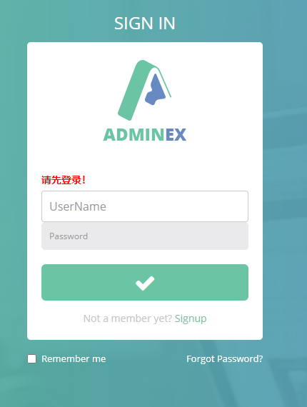
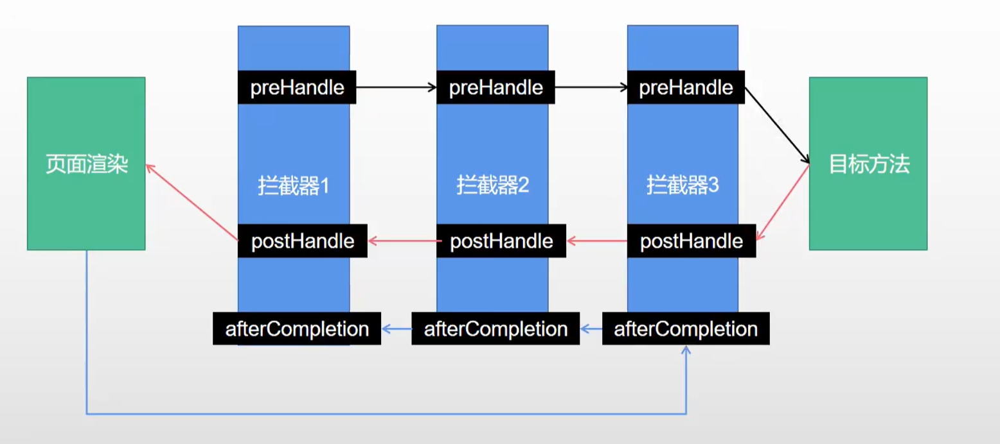

## 拦截器

### 1. 编写一个拦截器，实现HanderInterceptor接口

```java
/**
 * @name: LoginInterceptor
 * @description:
 * @author: zichen
 * @date: 2021/5/15  15:14
 */
@Slf4j
public class LoginInterceptor implements HandlerInterceptor {

    /**
     * 拦截执行目标方法前置处理
     * @param request
     * @param response
     * @param handler
     * @return
     * @throws Exception
     */
    @Override
    public boolean preHandle(HttpServletRequest request, HttpServletResponse response, Object handler) throws Exception {

        String requestURI = request.getRequestURI();
        log.info("拦截器的请求路径是{}", requestURI);

        // 登录检查逻辑
        HttpSession session = request.getSession();

        Object loginUser = session.getAttribute("loginUser");

        if (loginUser != null) {
            // session中用户不为空，则放行
            return true;
        }

        // 拦截
        // 使用session，必须是登录之后才能拿到信息
        //session.setAttribute("msg", "请先登录！");
        //response.sendRedirect("/");
        // 使用request域，不需要登录之后就可以拿到消息
        request.setAttribute("msg", "请先登录！");
        request.getRequestDispatcher("/").forward(request, response);
        return false;
    }

    /**
     * 拦截目标方法执行之后
     * @param request
     * @param response
     * @param handler
     * @param modelAndView
     * @throws Exception
     */
    @Override
    public void postHandle(HttpServletRequest request, HttpServletResponse response, Object handler, ModelAndView modelAndView) throws Exception {
    }

    /**
     *
     * @param request
     * @param response
     * @param handler
     * @param ex
     * @throws Exception
     */
    @Override
    public void afterCompletion(HttpServletRequest request, HttpServletResponse response, Object handler, Exception ex) throws Exception {
    }
}
```
### 2. 配置拦截器(将编写的拦截器，注册到容器中)

```java
/**
 * @name: AdminWebConfig
 * @description:
 * @author: zichen
 * @date: 2021/5/15  15:22
 */
@Configuration
public class AdminWebConfig implements WebMvcConfigurer {

    @Override
    public void addInterceptors(InterceptorRegistry registry) {
        registry.addInterceptor(new LoginInterceptor())
                // 放行所有请求
                .addPathPatterns("/**")
                // 不拦截静态资源，以及登录页
                .excludePathPatterns("/", "/login", "/css/**", "/fonts/**", "/images/**", "/js/**");
    }
}
```
### 3. 验证拦截器

- 拦截的请求，跳转到登录页
- 登录页提示“还未登录”
- 这里使用 请求域存放提示信息比较合适
    - 因为请求域的信息不需要登录就可以获取到，而session不登录是获取不到信息的

```java
// 拦截
// 使用session，必须是登录之后才能拿到信息
//session.setAttribute("msg", "请先登录！");
//response.sendRedirect("/");
// 使用request域，不需要登录之后就可以拿到消息
request.setAttribute("msg", "请先登录！");
request.getRequestDispatcher("/").forward(request, response);
```



- 拦截器执行过程
    - preHandle
    - postHandle
    - afterCompletion



### 4. 拦截器原码分析

- DispatcherServlet.java
  - doDispatch();

```java
class DispatcherServlet{
    protected void doDispatch(HttpServletRequest request, HttpServletResponse response) throws Exception {
        // 获取处理适配器
        HandlerAdapter ha = getHandlerAdapter(mappedHandler.getHandler());
  
        // Process last-modified header, if supported by the handler.
        // 获取目标方法
        String method = request.getMethod();
        // 拦截器前置处理 HandlerInterceptor.preHandle()
        if (!mappedHandler.applyPreHandle(processedRequest, response)) {
            return;
        }
  
        // Actually invoke the handler.
        mv = ha.handle(processedRequest, response, mappedHandler.getHandler());
  
        if (asyncManager.isConcurrentHandlingStarted()) {
            return;
        }
  
        applyDefaultViewName(processedRequest, mv);
        // 执行完目标方法，得到 ModelAndView
        mappedHandler.applyPostHandle(processedRequest, response, mv);

        // 程序调度结果
        processDispatchResult(processedRequest, response, mappedHandler, mv, dispatchException);
    }
}
```

```java
class DispatcherServlet{
    private void processDispatchResult(HttpServletRequest request, HttpServletResponse response,
                                     @Nullable HandlerExecutionChain mappedHandler, @Nullable ModelAndView mv,
                                     @Nullable Exception exception) throws Exception {
        if (mv != null && !mv.wasCleared()) {
            // 视图渲染
            render(mv, request, response);
            if (errorView) {
                 WebUtils.clearErrorRequestAttributes(request);
            }
        }

        if (mappedHandler != null) {
            // 视图渲染完成之后，执行拦截器的后置处理 afterCompletion();
            // Exception (if any) is already handled..
            mappedHandler.triggerAfterCompletion(request, response, null);
        }
    }
}
```