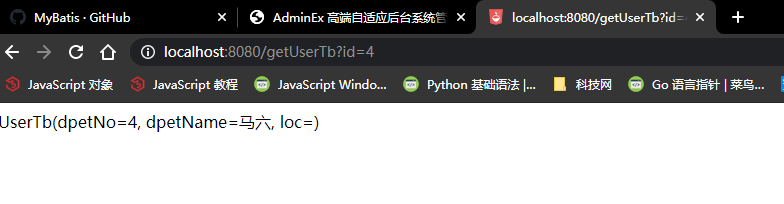
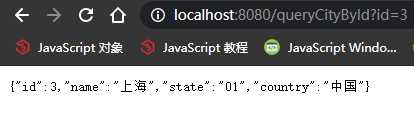
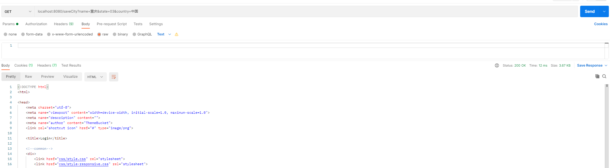
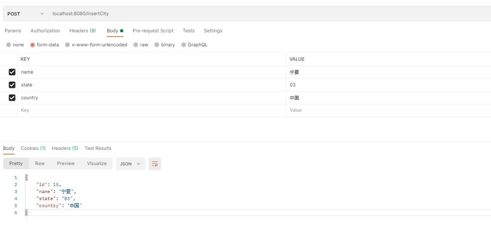

# 整合mybatis

[mybatis-GitHub地址](https://github.com/mybatis)
[mybatis-官方文档地址](https://mybatis.org/mybatis-3/zh/index.html)
- SpringBoot 官方的starter： spring-boot-starter-*
- 第三方的starter：*-spring-boot-starter

-导入mybatis依赖

```xml
<dependencys>
    <!-- Spring Boot 整合 Mybatis -->
    <dependency>
        <groupId>org.mybatis.spring.boot</groupId>
        <artifactId>mybatis-spring-boot-starter</artifactId>
        <version>2.1.4</version>
    </dependency>
</dependencys>
```

## 1. mybatis纯配置的方式

### 1. 配置mybatis全局配置
location： mybatis/mybatis-config.xml

```xml
<?xml version="1.0" encoding="UTF-8" ?>
<!DOCTYPE configuration
        PUBLIC "-//mybatis.org//DTD Config 3.0//EN"
        "http://mybatis.org/dtd/mybatis-3-config.dtd">
<configuration>
</configuration>
```

### 2. 在yaml中配置mybatis全局配置位置
```yaml
#mybatis config
mybatis:
  #mybatis global config
  config-location: classpath:mybatis/mybatis-config.xml
```

### 3. 编写bean对象文件
```java
@Data
@ToString
public class UserTb {
    private Integer id;
    private String uName;
    private String  uCreateTime;
    private int age;
}
```

### 4. 编写mapper接口文件
```java
@Mapper
public interface UserTbMapper {
    UserTb getUserTb(Integer id);
}
```
     
### 5. 配置mapper配置文件
mybatis/mapper/UserTbMapper.xml

```xml
<?xml version="1.0" encoding="UTF-8" ?>
<!DOCTYPE mapper
        PUBLIC "-//mybatis.org//DTD Mapper 3.0//EN"
        "http://mybatis.org/dtd/mybatis-3-mapper.dtd">
<mapper namespace="com.zichen.admin.mapper.UserTbMapper">
    <select id="getUserTb" resultType="userTb">
        select * from usertb where id = #{id}
    </select>
</mapper>
```

### 6. 配置别名
```yaml
mybatis:
  #mybatis global config
  #config-location: classpath:mybatis/mybatis-config.xml
  type-aliases-package: com.zichen.admin.bean
```

### 7. 在yaml中配置mybatis的mapper文件位置
```yaml
#mybatis config
mybatis:
  #mybatis global config
  #config-location: classpath:mybatis/mybatis-config.xml
  #mybatis mapper config
  mapper-locations: classpath:mybatis/mapper/UserTbMapper.xml
```

### 8. 编写service文件
```java
@Service
public class UserTbService {

    @Autowired
    private UserTbMapper userTbMapper;

    public UserTb getUserTbByDpetNo(Integer id) {
        return userTbMapper.getUserTb(id);
    }
}
```

### 9. 编写controller测试文件
```java
@Controller
public class UserTbController {

    @Autowired
    private UserTbService userTbService;

    @ResponseBody
    @GetMapping("/getUserTb")
    public String getUserTbByDpetNo(@RequestParam("id") Integer dpetNo) {
        UserTb userTbByDpetNo = userTbService.getUserTbByDpetNo(dpetNo);
        return userTbByDpetNo.toString();
    }
}
```

### 10. 注意，mapper接口都要标注 @Mapper 注解
### 11. 注意，service接口都要标注 @Service 注解
### 12. 注意，controller接口都要标注 @Controller 注解

### 13. 页面测试



### 14. 补充
- mybatis-config.xml 全局配置可以配置的setting和别名

```xml
<?xml version="1.0" encoding="UTF-8" ?>
<!DOCTYPE configuration
        PUBLIC "-//mybatis.org//DTD Config 3.0//EN"
        "http://mybatis.org/dtd/mybatis-3-config.dtd">
<configuration>

    <!-- setting config -->
    <settings>
        <setting name="cacheEnabled" value="true"/>
        <setting name="lazyLoadingEnabled" value="true"/>
        <setting name="multipleResultSetsEnabled" value="true"/>
        <setting name="useColumnLabel" value="true"/>
        <setting name="useGeneratedKeys" value="false"/>
        <setting name="autoMappingBehavior" value="PARTIAL"/>
        <setting name="autoMappingUnknownColumnBehavior" value="WARNING"/>
        <setting name="defaultExecutorType" value="SIMPLE"/>
        <setting name="defaultStatementTimeout" value="25"/>
        <setting name="defaultFetchSize" value="100"/>
        <setting name="safeRowBoundsEnabled" value="false"/>
        <!-- 开启驼峰命名规则 -->
        <setting name="mapUnderscoreToCamelCase" value="false"/>
        <setting name="localCacheScope" value="SESSION"/>
        <setting name="jdbcTypeForNull" value="OTHER"/>
        <setting name="lazyLoadTriggerMethods" value="equals,clone,hashCode,toString"/>
    </settings>

    <!-- Aliases config -->
    <typeAliases>
        <typeAlias alias="UserTb" type="com.zichen.admin.bean.Dpet"/>
    </typeAliases>
</configuration>
```

- 注意，yaml中全局配置文件路径的配置可以不用写，因为都在yaml 中配置

### 15. 修改yaml中的配置，注释掉全局配置路径，添加驼峰命名和别名规则
```yaml
mybatis:
  #mybatis global config
  #config-location: classpath:mybatis/mybatis-config.xml
  #mybatis mapper config
  mapper-locations: classpath:mybatis/mapper/UserTbMapper.xml
  configuration:
    map-underscore-to-camel-case: true
  type-aliases-package: com.zichen.admin.bean
```
```yaml
<?xml version="1.0" encoding="UTF-8" ?>
<!DOCTYPE mapper
        PUBLIC "-//mybatis.org//DTD Mapper 3.0//EN"
        "http://mybatis.org/dtd/mybatis-3-mapper.dtd">
<mapper namespace="com.zichen.admin.mapper.UserTbMapper">
    <select id="getUserTb" resultType="userTb">
        select * from dpet where dpetNo = #{dpetNo}
    </select>

    <!--UPDATE testdb.dpet SET dpetno=0, dpetname='', loc='';-->
    <insert id="insertUserTb" parameterType="hashmap">
        insert into dpet(dpetno, dpetname, loc) values (#{dpetNo}, #{dpetName}, #{loc})
    </insert>
</mapper>
```

### 16. 编写步骤
- 导入 mybatis 官方 starter
- 编写mapper接口，标注 @Mapper 注解
- 编写sql映射文件，并绑定mapper接口
- 在application.yaml中指定mapper配置文件的位置，以及指定全局配置文件的信息（建议：配置在mybatis.configuration中）

## 2. mybatis纯注解版
[quick_start](https://github.com/mybatis/spring-boot-starter/wiki/Quick-Start)

### 1. 准备一张表
```sql
CREATE TABLE testdb.city
(
  id      INT(11) PRIMARY KEY auto_increment,
  name    VARCHAR(30),
  state   VARCHAR(30),
  country VARCHAR(30)
);
```
- insert data
```sql
INSERT INTO testdb.city (name, state, country) values ('内蒙古', '03', '中国');
INSERT INTO testdb.city (name, state, country) values ('北京', '01', '中国');
INSERT INTO testdb.city (name, state, country) values ('上海', '01', '中国');
INSERT INTO testdb.city (name, state, country) values ('江苏', '03', '中国');
INSERT INTO testdb.city (name, state, country) values ('天津', '02', '中国');
INSERT INTO testdb.city (name, state, country) values ('东京', '01', '日本');
INSERT INTO testdb.city (name, state, country) values ('耶鲁', '03', '美国');
```

### 2. 编写实体类，映射数据库数据使用
```java
@Data
@ToString
public class City {
    private Long id;
    private String name;
    private String state;
    private String country;
}
```

### 3. 编写mapper接口
```java
@Mapper
public interface CityMapper {

    @Select("select * from City where id = #{id}")
    City getCityById(int id);
}
```

### 4. 编写service接口
```java
@Service
public class CityService {

    @Autowired
    private CityMapper cityMapper;
    
    public City getCityById(int id) {
        return cityMapper.getCityById(id);
    }
}
```

### 5. 编写controller接口
```java
@Controller
public class CityController {

    @Autowired
    private CityService cityService;

    @ResponseBody
    @GetMapping("/queryCityById")
    public City getCityById(@RequestParam("id") int id) {
        return cityService.getCityById(id);
    }
}
```

### 6. 测试Mybatis纯注解的方式访问数据库
```json
{"id":3,"name":"上海","state":"01","country":"中国"}
```
、


### 7. 如果有查询语句很长，我们也可以使用注解和配置文件混合使用

#### 1. 增加一个查询（使用配置文件版）
- 添加mapper接口
```java
@Mapper
public interface CityMapper {

    @Select("select * from City where id = #{id}")
    City getCityById(int id);

    void insertCity(City city);
}
```

- 添加mapper映射文件
```xml
<?xml version="1.0" encoding="UTF-8" ?>
<!DOCTYPE mapper
        PUBLIC "-//mybatis.org//DTD Mapper 3.0//EN"
        "http://mybatis.org/dtd/mybatis-3-mapper.dtd">
<mapper namespace="com.zichen.admin.mapper.CityMapper">
    <insert id="insertCity" parameterType="city">
        insert into city(`name`, `state`, `country`) values (#{name}, #{state}, #{country})
    </insert>
</mapper>
```

- 实体文件别名在application.yaml中有配置
```yaml
# 实体类所在的包，别名首字母小写即可自动找到
mybatis:
  type-aliases-package: com.zichen.admin.bean
  # 添加mapper映射文件，不然找不到 mybatis/mapper/CityMapper.xml
  mapper-locations: classpath:classpath:mybatis/mapper/*.xml
```

- 编写service接口
```java
@Service
public class CityService {

    @Autowired
    private CityMapper cityMapper;

    public City getCityById(int id) {
        return cityMapper.getCityById(id);
    }

    public void saveCity(City city) {
        cityMapper.insertCity(city);
    }
}
```

- 编写controller接口

```java
import org.springframework.web.bind.annotation.ResponseBody;

@Controller
public class CityController {

    @Autowired
    private CityService cityService;

    @ResponseBody
    @GetMapping("/queryCityById")
    public City getCityById(@RequestParam("id") int id) {
        return cityService.getCityById(id);
    }

    @ResponseBody
    //@PostMapping("/saveCity")
    @GetMapping("/saveCity")
    public void saveCity(City city) {
        cityService.saveCity(city);
    }
}
```

- Controller中@ResponseBody注解是需要的，因为无返回void，在底层也会有响应的解析，需要@ResponseBody

- 使用@PostMapping(/saveCity)报错 postman测试报错 405  Resolved [org.springframework.web.HttpRequestMethodNotSupportedException: Request method 'POST' not supported]
- 该问题还没有解决，不只是什么原因
- 该问题已经解决，原因是有拦截，放行/insertCity 请求即可

- 使用PostMan测试






- 如果想拿到数据库的自增主键的值，需要配置mapper映射文件 中的 useGeneratedKeys="true" keyProperty="id"属性
```xml
<?xml version="1.0" encoding="UTF-8" ?>
<!DOCTYPE mapper
        PUBLIC "-//mybatis.org//DTD Mapper 3.0//EN"
        "http://mybatis.org/dtd/mybatis-3-mapper.dtd">
<mapper namespace="com.zichen.admin.mapper.CityMapper">
    <insert id="insertCity" parameterType="city" useGeneratedKeys="true" keyProperty="id">
        insert into city(`name`, `state`, `country`) values (#{name}, #{state}, #{country})
    </insert>
</mapper>
```
- 这样，就可以拿到数据库的自增主键的值了，会将其放到 com.zichen.admin.mapper.City中

- 这样的，属性调整，也可以使用注解的方式来调整
```java
@Mapper
public interface CityMapper {

    @Select("select * from City where id = #{id}")
    City getCityById(int id);

    @Insert("insert into city(`name`, `state`, `country`) values (#{name}, #{state}, #{country})")
    //@Options(...) 是注解@Insert的调整项
    @Options(useGeneratedKeys = true, keyProperty = "id")
    void insertCity(City city);
}
```

#### 2. 最佳实战
- 1. 引入mybatis-state人
- 2. 配置application.yaml中，指定mapper-location位置即可
- 3. 编写mapper接口并标注@Mapper注解
- 4. 简单方法直接注解方式
- 5. 复杂方法编写mapper.xml进行绑定映射


- 由于每一个mapper接口都需要标注@Mapper注解
- 我们可以在启动类上标注一个总的Mapper注解 @MapperScan("com.zichen.admin.mapper")
- 其他的mapper就不需要标注了


#### 3. @PostMapping("/saveUserTb")测试
**post请求，传递UserTb作为参数，插入数据到数据库，将自增ID返回到页面，mapping映射配置测试**

- Controller
```java
@Controller
public class UserTbController {

    @Autowired
    private UserTbService userTbService;

    @ResponseBody
    @PostMapping("/saveUserTb")
    public UserTb saveUserTb(UserTb userTb) {
        userTbService.saveUserTb(userTb);
        return userTb;
    }
}
```
- Service

```java
@Service
public class UserTbService {

    @Autowired
    private UserTbMapper userTbMapper;

    public void saveUserTb(UserTb userTb) {
        userTbMapper.saveUserTb(userTb);
    }
}
```
- mapper

```java
@Mapper
public interface UserTbMapper {

    void saveUserTb(UserTb userTb);
}
```
- mapper映射

```xml
<?xml version="1.0" encoding="UTF-8" ?>
<!DOCTYPE mapper
        PUBLIC "-//mybatis.org//DTD Mapper 3.0//EN"
        "http://mybatis.org/dtd/mybatis-3-mapper.dtd">
<mapper namespace="com.zichen.admin.mapper.UserTbMapper">
    <insert id="saveUserTb" parameterType="userTb" useGeneratedKeys="true" keyProperty="id">
        insert into userTb(uName, uCreateTime, age) values (#{uName}, #{uCreateTime}, #{age})
    </insert>
</mapper>
```
- UserTb实体类

```java
@Data
@ToString
public class UserTb {

    private Integer id;
    private String uName;
    private String  uCreateTime;
    private int age;

}
```

- 映射地址

```yaml
mybatis:
  #mybatis global config
  #config-location: classpath:mybatis/mybatis-config.xml
  #mybatis mapper config
  mapper-locations: classpath:mybatis/mapper/*.xml
```

- PostMan 测试


#### 4. @PostMapping("/saveUserTb")请求
**post请求，传递UserTb作为参数，插入数据到数据库，将自增ID返回到页面，纯注解方式测试**

- Controller

```java
@Controller
public class UserTbController {

    @Autowired
    private UserTbService userTbService;

    @ResponseBody
    @PostMapping("/saveUserTb")
    public UserTb saveUserTb(UserTb userTb) {
        userTbService.saveUserTb(userTb);
        return userTb;
    }
    
    @ResponseBody
    @PostMapping("/saveUserTb4Annotation")
    public UserTb saveUserTb4Annotation(UserTb userTb) {
        userTbService.saveUserTb4Annotation(userTb);
        return userTb;
    }
}
```
- mapper

```java
@Mapper
public interface UserTbMapper {

    void saveUserTb(UserTb userTb);

    @Insert("insert into userTb(uName, uCreateTime, age) values (#{uName}, #{uCreateTime}, #{age})")
    @Options(useGeneratedKeys = true, keyProperty = "id")
    void saveUserTb4Annotation(UserTb userTb);
}
```
- service

```java
@Service
public class UserTbService {

    @Autowired
    private UserTbMapper userTbMapper;

    public void saveUserTb(UserTb userTb) {
        userTbMapper.saveUserTb(userTb);
    }

    public void saveUserTb4Annotation(UserTb userTb) {
        userTbMapper.saveUserTb4Annotation(userTb);
    }
}
```

- postman测试
