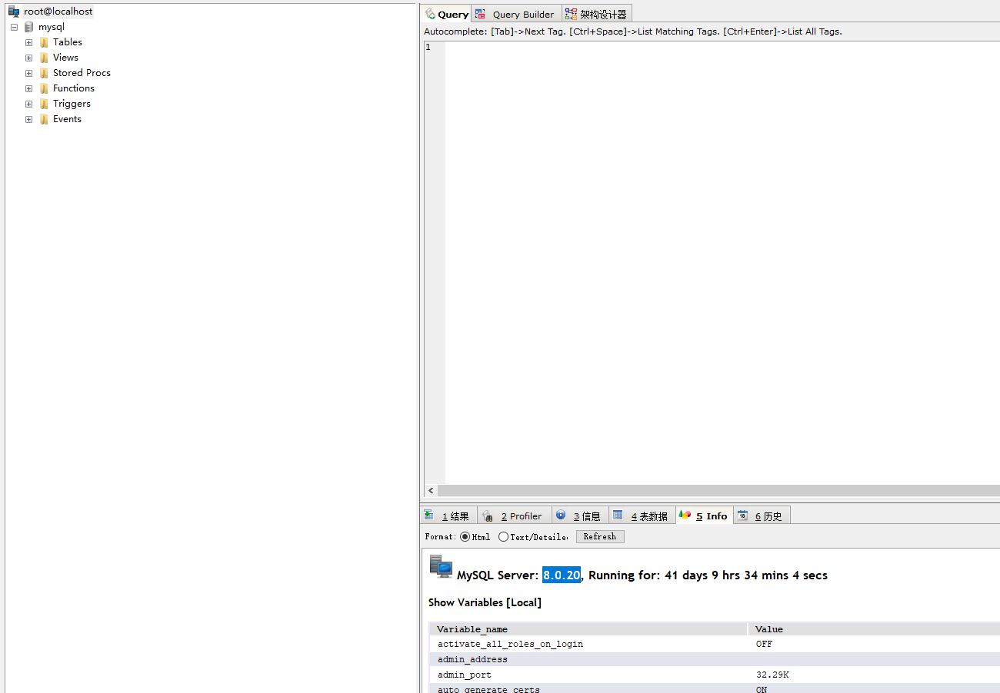
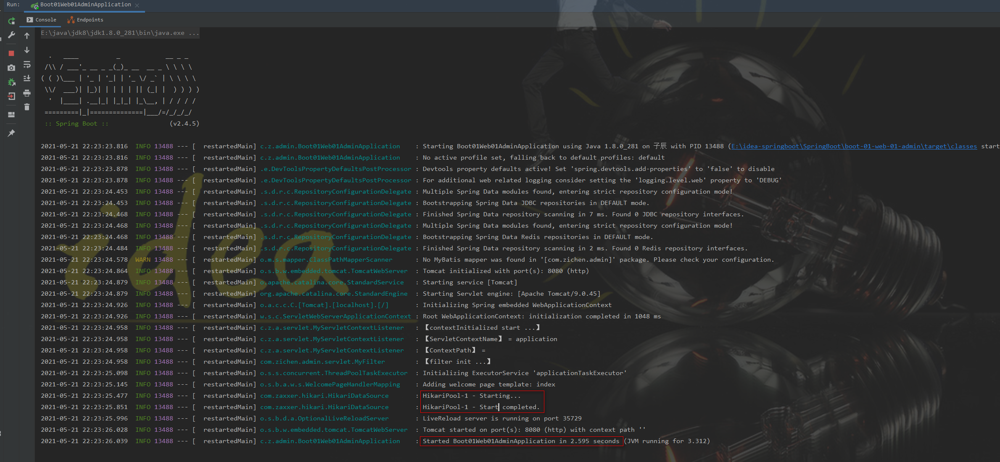

## 连接数据库

### 1. 导入数据库连接依赖

```xml
<!-- data for JDBC -->
<dependency>
    <groupId>org.springframework.boot</groupId>
    <artifactId>spring-boot-starter-data-jdbc</artifactId>
</dependency>
```
- SpringBoot 会自动导入

```xml
<dependencys>
    <dependency>
        <groupId>com.zaxxer</groupId>
        <artifactId>HikariCP</artifactId>
        <version>3.4.5</version>
        <scope>compile</scope>
    </dependency>
    <dependency>
        <groupId>org.springframework</groupId>
        <artifactId>spring-jdbc</artifactId>
        <version>5.3.6</version>
        <scope>compile</scope>
    </dependency>
</dependencys>

```

- 此时还没有导入数据库驱动。。

```xml
<dependencys>
    <!--SpringBoot2.5.0默认给配置的版本是-->
    <mysql.version>8.0.23</mysql.version>
    <!--目前数据库连接驱动最高版本是：-->
    <!-- https://mvnrepository.com/artifact/mysql/mysql-connector-java -->
    <dependency>
        <groupId>mysql</groupId>
        <artifactId>mysql-connector-java</artifactId>
        <version>8.0.25</version><!-- 版本号可以不用写，SpringBoot 2.4.5 默认导入 8.0.23 -->
    </dependency>
    
    <!-- 方案一：利用maven的就近依赖原则 -->
    <!--找到适合本地驱动的版本8.0.20-->
    <!-- https://mvnrepository.com/artifact/mysql/mysql-connector-java -->
    <dependency>
        <groupId>mysql</groupId>
        <artifactId>mysql-connector-java</artifactId>
        <version>8.0.20</version>
    </dependency>

    <!-- 方案二：覆盖默认版本 -->
    <!-- https://mvnrepository.com/artifact/mysql/mysql-connector-java -->
    <dependency>
        <groupId>mysql</groupId>
        <artifactId>mysql-connector-java</artifactId>
        <!--<version>8.0.20</version>-->
    </dependency>
    <properties>
        <mysql.version>8.0.20</mysql.version>
    </properties>
</dependencys>
```

- 注意，导入的驱动版本要和本地数据库驱动版本匹配



### 2. 分析自动配置类

- DataSourceAutoConfiguration： 数据源的自动配置
- DataSourceTransactionManagerAutoConfiguration: 事务管理器自动配置
- JdbcTemplateAutoConfiguration： JdbcTemplate的自动配置，可以来对数据库进行CRUD
- JndiDataSourceAutoConfiguration: Jndi 类似于Web容器中的数据库配置
- XADataSourceAutoConfiguration：分布式事务相关配置

- DataSourceAutoConfiguration
    - @ConditionalOnMissingBean(type = "io.r2dbc.spi.ConnectionFactory") 基于响应式变成的连接配置
    - @EnableConfigurationProperties(DataSourceProperties.class) 开启配置源绑定功能，和数据园属性有关的配置到这里
        - @ConfigurationProperties(prefix = "spring.datasource")
    - @Conditional(PooledDataSourceCondition.class) 数据库连接池的配置，如果自己配置类连接池则用自己的，否则使用默认的连接池配置
    - 底层配置好的连接池是HikariDataSource连接池（我们引入的也是Hikari.jar）
```java
@Configuration(proxyBeanMethods = false)
@ConditionalOnClass({ DataSource.class, EmbeddedDatabaseType.class })
@ConditionalOnMissingBean(type = "io.r2dbc.spi.ConnectionFactory")
@EnableConfigurationProperties(DataSourceProperties.class)
@Import({ DataSourcePoolMetadataProvidersConfiguration.class, DataSourceInitializationConfiguration.class })
public class DataSourceAutoConfiguration {
    //...
    @Configuration(proxyBeanMethods = false)
    @Conditional(PooledDataSourceCondition.class)
    @ConditionalOnMissingBean({DataSource.class, XADataSource.class})
    @Import({DataSourceConfiguration.Hikari.class, DataSourceConfiguration.Tomcat.class,
            DataSourceConfiguration.Dbcp2.class, DataSourceConfiguration.OracleUcp.class,
            DataSourceConfiguration.Generic.class, DataSourceJmxConfiguration.class})
    protected static class PooledDataSourceConfiguration {

    }
    //...
}
```

- JdbcTemplateAutoConfiguration
    - 和JDBC有关的配置，我们可以修改@EnableConfigurationProperties(JdbcProperties.class) 来设置
        - @EnableConfigurationProperties(JdbcProperties.class)
    - 由于在JdbcTemplateConfiguration中配置了@Bean JdbcTemplate
        - 我们在测试的时候，只需要注入JdbcTemplate即可

### 3. 修改配置项

```yaml
spring:
  datasource:
    # url: jdbc:mysql://localhost:3306/mysql?serverTimezone=GMT   该配置可以用于 SpringBoot 2.4.5
    url: jdbc:mysql://localhost:3306/mysql?serverTimezone=Asia/Shanghai&characterEncoding=utf8
    username: 'root'
    password: 'root'
    #type: com.zaxxer.hikari.HikariDataSource
    driver-class-name: com.mysql.cj.jdbc.Driver
```

- 注意，SpringBoot 2.0 以上，需要配置时区 "?serverTimezone=Asia/Shanghai"
- 注意，数据库的 Driver-class-name = com.mysql.cj.jdbc.Driver


- 解释：
    - 在创建数据连接配置时指定时区：serverTimezone=GMT%2B8
    - serverTimezone=GMT%2B8   -   北京时区，也就是东八区
    - serverTimezone=UTC  -   UTC代表的是全球标准时间
        - 但是我们使用的时间是北京时区也就是东八区，领先UTC八个小时。
        - 比如在java代码里面插入的时间为：2018-06-24 17:29:56
        - 但是在数据库里面显示的时间却为：2018-06-24 09:29:56
        - 有了8个小时的时差


- 启动成功截图：




### 4. 测试

```java
package com.zichen.admin;

import lombok.extern.slf4j.Slf4j;
import org.junit.jupiter.api.Test;
import org.springframework.beans.factory.annotation.Autowired;
import org.springframework.boot.test.context.SpringBootTest;
import org.springframework.jdbc.core.JdbcTemplate;

/**
 * @name: Boot01Web01AdminApplication
 * @description:
 * @author: zichen
 * @date: 2021/5/22  0:51
 */
@Slf4j
@SpringBootTest
public class Boot01Web01AdminApplicationTests {

    @Autowired
    private JdbcTemplate jdbcTemplate;

    @Test
    public void contextLoads() {
        Integer count = jdbcTemplate.queryForObject("select count(*) from employee", Integer.class);
        log.info("{}", count);
    }
}
```
- 测试结果
```text
2021-05-22 01:00:46.919  INFO 11948 --- [           main] c.z.a.Boot01Web01AdminApplicationTests   : 1
```

- 注意，测试包一定和main包同级
> boot-01-web-01-admin   
    |- src
    |   |- main
    |   |   |- java
    |   |   |   |- com.zichen.admin
    |   |   |       |- bean
    |   |   |       |- config
    |   |   |       |- controller
    |   |   |       |- exception
    |   |   |       |- interceptor
    |   |   |       |- servlet
    |   |   |       |- util
    |   |   |       |- Boot01Web01AdminApplication.java
    |   |   |- resources
    |   |       |- image
    |   |       |- md
    |   |       |- static
    |   |       |- templates
    |   |       |- upload
    |   |       |- zip
    |   |       |- application.properties
    |   |       |- application.yaml
    |   |- test
    |       |- java
    |           |- com.zichen.admin
    |               |- Boot01Web01AdminApplicationTests.java
    |- target


