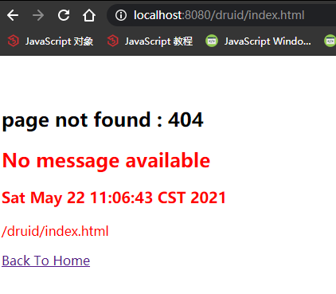
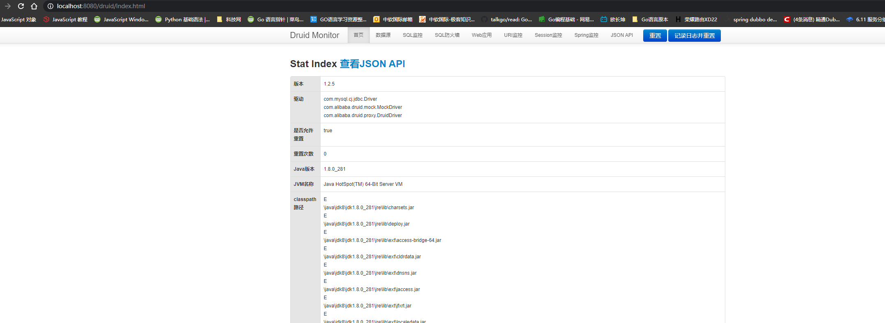
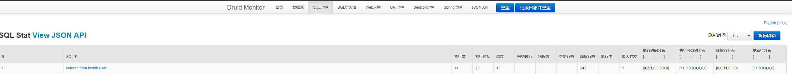
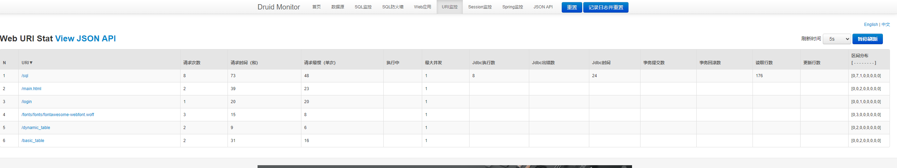
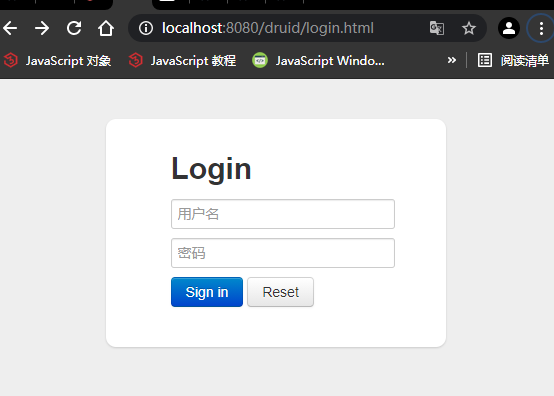

# 连接数据库

## 1. 导入数据库连接依赖

```xml
<!-- data for JDBC -->
<dependency>
    <groupId>org.springframework.boot</groupId>
    <artifactId>spring-boot-starter-data-jdbc</artifactId>
</dependency>
```
- SpringBoot 会自动导入

```xml
<dependencys>
    <dependency>
        <groupId>com.zaxxer</groupId>
        <artifactId>HikariCP</artifactId>
        <version>3.4.5</version>
        <scope>compile</scope>
    </dependency>
    <dependency>
        <groupId>org.springframework</groupId>
        <artifactId>spring-jdbc</artifactId>
        <version>5.3.6</version>
        <scope>compile</scope>
    </dependency>
</dependencys>

```

- 此时还没有导入数据库驱动。。

```xml
<dependencys>
    <!--SpringBoot2.5.0默认给配置的版本是-->
    <mysql.version>8.0.23</mysql.version>
    <!--目前数据库连接驱动最高版本是：-->
    <!-- https://mvnrepository.com/artifact/mysql/mysql-connector-java -->
    <dependency>
        <groupId>mysql</groupId>
        <artifactId>mysql-connector-java</artifactId>
        <version>8.0.25</version><!-- 版本号可以不用写，SpringBoot 2.4.5 默认导入 8.0.23 -->
    </dependency>
    
    <!-- 方案一：利用maven的就近依赖原则 -->
    <!--找到适合本地驱动的版本8.0.20-->
    <!-- https://mvnrepository.com/artifact/mysql/mysql-connector-java -->
    <dependency>
        <groupId>mysql</groupId>
        <artifactId>mysql-connector-java</artifactId>
        <version>8.0.20</version>
    </dependency>

    <!-- 方案二：覆盖默认版本 -->
    <!-- https://mvnrepository.com/artifact/mysql/mysql-connector-java -->
    <dependency>
        <groupId>mysql</groupId>
        <artifactId>mysql-connector-java</artifactId>
        <!--<version>8.0.20</version>-->
    </dependency>
    <properties>
        <mysql.version>8.0.20</mysql.version>
    </properties>
</dependencys>
```

- 注意，导入的驱动版本要和本地数据库驱动版本匹配


## 2. 分析自动配置类

- DataSourceAutoConfiguration： 数据源的自动配置
- DataSourceTransactionManagerAutoConfiguration: 事务管理器自动配置
- JdbcTemplateAutoConfiguration： JdbcTemplate的自动配置，可以来对数据库进行CRUD
- JndiDataSourceAutoConfiguration: Jndi 类似于Web容器中的数据库配置
- XADataSourceAutoConfiguration：分布式事务相关配置

- DataSourceAutoConfiguration
    - @ConditionalOnMissingBean(type = "io.r2dbc.spi.ConnectionFactory") 基于响应式变成的连接配置
    - @EnableConfigurationProperties(DataSourceProperties.class) 开启配置源绑定功能，和数据园属性有关的配置到这里
        - @ConfigurationProperties(prefix = "spring.datasource")
    - @Conditional(PooledDataSourceCondition.class) 数据库连接池的配置，如果自己配置类连接池则用自己的，否则使用默认的连接池配置
    - 底层配置好的连接池是HikariDataSource连接池（我们引入的也是Hikari.jar）
```java
@Configuration(proxyBeanMethods = false)
@ConditionalOnClass({ DataSource.class, EmbeddedDatabaseType.class })
@ConditionalOnMissingBean(type = "io.r2dbc.spi.ConnectionFactory")
@EnableConfigurationProperties(DataSourceProperties.class)
@Import({ DataSourcePoolMetadataProvidersConfiguration.class, DataSourceInitializationConfiguration.class })
public class DataSourceAutoConfiguration {
    //...
    @Configuration(proxyBeanMethods = false)
    @Conditional(PooledDataSourceCondition.class)
    @ConditionalOnMissingBean({DataSource.class, XADataSource.class})
    @Import({DataSourceConfiguration.Hikari.class, DataSourceConfiguration.Tomcat.class,
            DataSourceConfiguration.Dbcp2.class, DataSourceConfiguration.OracleUcp.class,
            DataSourceConfiguration.Generic.class, DataSourceJmxConfiguration.class})
    protected static class PooledDataSourceConfiguration {

    }
    //...
}
```

- JdbcTemplateAutoConfiguration
    - 和JDBC有关的配置，我们可以修改@EnableConfigurationProperties(JdbcProperties.class) 来设置
        - @EnableConfigurationProperties(JdbcProperties.class)
    - 由于在JdbcTemplateConfiguration中配置了@Bean JdbcTemplate
        - 我们在测试的时候，只需要注入JdbcTemplate即可

## 3. 修改配置项

```yaml
spring:
  datasource:
    # url: jdbc:mysql://localhost:3306/mysql?serverTimezone=GMT   该配置可以用于 SpringBoot 2.4.5
    url: jdbc:mysql://localhost:3306/mysql?serverTimezone=Asia/Shanghai&characterEncoding=utf8
    username: 'root'
    password: 'root'
    #type: com.zaxxer.hikari.HikariDataSource
    driver-class-name: com.mysql.cj.jdbc.Driver
```

- 注意，SpringBoot 2.0 以上，需要配置时区 "?serverTimezone=Asia/Shanghai"
- 注意，数据库的 Driver-class-name = com.mysql.cj.jdbc.Driver


- 解释：
    - 在创建数据连接配置时指定时区：serverTimezone=GMT%2B8
    - serverTimezone=GMT%2B8   -   北京时区，也就是东八区
    - serverTimezone=UTC  -   UTC代表的是全球标准时间
        - 但是我们使用的时间是北京时区也就是东八区，领先UTC八个小时。
        - 比如在java代码里面插入的时间为：2018-06-24 17:29:56
        - 但是在数据库里面显示的时间却为：2018-06-24 09:29:56
        - 有了8个小时的时差


- 启动成功截图：


## 4. 测试

```java
package com.zichen.admin;

import lombok.extern.slf4j.Slf4j;
import org.junit.jupiter.api.Test;
import org.springframework.beans.factory.annotation.Autowired;
import org.springframework.boot.test.context.SpringBootTest;
import org.springframework.jdbc.core.JdbcTemplate;

/**
 * @name: Boot01Web01AdminApplication
 * @description:
 * @author: zichen
 * @date: 2021/5/22  0:51
 */
@Slf4j
@SpringBootTest
public class Boot01Web01AdminApplicationTests {

    @Autowired
    private JdbcTemplate jdbcTemplate;

    @Test
    public void contextLoads() {
        Integer count = jdbcTemplate.queryForObject("select count(*) from employee", Integer.class);
        log.info("{}", count);
    }
}
```
- 测试结果
```text
2021-05-22 01:00:46.919  INFO 11948 --- [           main] c.z.a.Boot01Web01AdminApplicationTests   : 1
```

- 注意，测试包一定和main包同级
```text
- boot-01-web-01-admin   
    |- src
    |   |- main
    |   |   |- java
    |   |   |   |- com.zichen.admin
    |   |   |       |- bean
    |   |   |       |- config
    |   |   |       |- controller
    |   |   |       |- exception
    |   |   |       |- interceptor
    |   |   |       |- servlet
    |   |   |       |- util
    |   |   |       |- Boot01Web01AdminApplication.java
    |   |   |- resources
    |   |       |- image
    |   |       |- md
    |   |       |- static
    |   |       |- templates
    |   |       |- upload
    |   |       |- zip
    |   |       |- application.properties
    |   |       |- application.yaml
    |   |- test
    |       |- java
    |           |- com.zichen.admin
    |               |- Boot01Web01AdminApplicationTests.java
    |- target
```


## 5. 使用Druid数据源

### 1. druid官方GitHub地址
[druid官方文档Wiki_FAQ](https://github.com/alibaba/druid/wiki/FAQ)
[druid官方GitHub地址](https://github.com/alibaba/druid)

- 整合第三方技术的两种方式
    - 自定义
    - 找starter
    
### 2. 自定义方式
#### 1. 创建数据源
- 引入依赖

```xml
<dependencies>
    <!--alibaba druid datasource-->
    <!-- https://mvnrepository.com/artifact/com.alibaba/druid -->
    <dependency>
        <groupId>com.alibaba</groupId>
        <artifactId>druid</artifactId>
        <version>1.2.6</version>
    </dependency>
</dependencies>
```

- spring之前的做法

```xml
<bean id="dataSource" class="com.alibaba.druid.pool.DruidAbstractDataSource" destory-method="close">
    <property name="url" value="${jdbc.url}"/>
    <property name="username" value="${jdbc.username}"/>
    <property name="password" value="${jdbc.password}"/>
    <property name="maxActive" value="20"/>
    <property name="initialSize" value="1"/>
    <property name="maxWait" value="60000"/>
    <property name="minIdle" value="1"/>
    <property name="timeBetweenEvictionRunsMillis" value="60000"/>
    <property name="minEvictableIdleTimeMillis" value="300000"/>
    <property name="testWhileIdle" value="true"/>
    <property name="testOnBorrow" value="false"/>
    <property name="testOnReturn" value="fasle"/>
    <property name="poolPreparedStatements" value="true"/>
    <property name="maxOpenPreparedStatements" value="20"/>
</bean>
```

- 现在使用了 SpringBoot 我们可以写一个自己的配置类

```java
import com.alibaba.druid.pool.DruidDataSource;
import org.springframework.boot.context.properties.ConfigurationProperties;
import org.springframework.context.annotation.Bean;
import org.springframework.context.annotation.Configuration;

import javax.sql.DataSource;

@Configuration
class MyDataSourceConfig {

    @ConfigurationProperties("spring.datasource") //和配置文件中的属性一一绑定
    @Bean
    public DataSource dataSource() {
        DruidDataSource druidDataSource = new DruidDataSource();
        return druidDataSource;
    }
}
```

- 我们可以配置自己的数据源配置类，是由于，底层已经实现了 @ConditionalOnMissingBean(DataSource.class)，如果容器中没有DataSource的时候，容器中的配置生效，反之，我们自己的配置生效；故此，我们可以在容器中放一个DataSource配置，使我们自己的配置生效

- 编写测试文件，确定自己配置的数据源生效

```java
@Slf4j
@SpringBootTest
public class Boot01Web01AdminApplicationTests {

    @Autowired
    private JdbcTemplate jdbcTemplate;

    @Autowired
    private DataSource dataSource;

    @Test
    public void contextLoads() {
        Integer count = jdbcTemplate.queryForObject("select count(*) from employee", Integer.class);
        log.info("{}", count);

        log.info("自定义数据源类型：{}", dataSource.getClass());
    }
}
```

- 测试结果
    - 1. 看如无启动日志信息：2021-05-22 10:44:19.876  INFO 1040 --- [  restartedMain] com.alibaba.druid.pool.DruidDataSource   : {dataSource-1} inited
    - 2. 测试类结果：2021-05-22 10:45:53.239  INFO 1328 --- [           main] c.z.a.Boot01Web01AdminApplicationTests   : 自定义数据源类型：class com.alibaba.druid.pool.DruidDataSource


**使用druid的内置监控页**

- 内置监控页是一个servlet 具体看：[使用druid的内置监控页](https://github.com/alibaba/druid/wiki/配置_StatViewServlet配置)

- 在容器中注册一个servlet

```java
@Configuration
public class MyDataConfig {

    /*
     * 配置druid数据源
     * @return
     */
    @ConfigurationProperties("spring.datasource")
    @Bean
    public DataSource dataSource() {
        DruidDataSource druidDataSource = new DruidDataSource();
        return druidDataSource;
    }

    /*
     * 配置druid监控页
     * @return
     */
    public ServletRegistrationBean statViewServlet() {
        StatViewServlet statViewServlet = new StatViewServlet();
        ServletRegistrationBean<StatViewServlet> registrationBean = new ServletRegistrationBean<>(statViewServlet, "/druid/*");
        return registrationBean;
    }
}
```

- 访问localhost:808/druid/index.html报错



- 发现是由于自己配置的servlet没有将其注册为@Bean
- 给配置的servlet加上@Bean，正常访问



- 测试druid监控页，监控sql查询

```java
@Controller
public class DruidMonitorQuerySqlTest {

    @Autowired
    JdbcTemplate jdbcTemplate;

    @ResponseBody
    @GetMapping("/sql")
    public String querySqlForDruidMonitor() {
        List<Map<String, Object>> maps = jdbcTemplate.queryForList("select * from testdb.usertb");
        return maps.toString();
    }
}
```
- 发现没有监控到东西
- 查看文档，需要打开监控功能

[打开Druid的监控功能](https://github.com/alibaba/druid/wiki/配置_StatFilter)

- 发现以前的配置，是给DataSource配置属性filters，值为stat

- 我们现在也需要这样配置

```java
@Configuration
public class MyDataConfig {

    /*
     * 配置druid数据源
     * @return
     */
    @ConfigurationProperties("spring.datasource")
    @Bean
    public DataSource dataSource() throws SQLException {
        //...
        // 添加监控和防火墙
        druidDataSource.setFilters("wall,stat");//给数据源设置 filters为stat
        return druidDataSource;
    }

}
```

- 测试结果




- 开启Web监控
- 给filter放一个WebStatFilter

```java
@Configuration
public class MyDataConfig {

    /*
     * 配置druid数据源
     * @return
     */
    @ConfigurationProperties("spring.datasource")
    @Bean
    public DataSource dataSource() throws SQLException {
        DruidDataSource druidDataSource = new DruidDataSource();
        // 添加监控和防火墙
        druidDataSource.setFilters("wall,stat");
        return druidDataSource;
    }

    /*
     * 配置druid监控页
     * @return
     */
    @Bean
    public ServletRegistrationBean statViewServlet() {
        StatViewServlet statViewServlet = new StatViewServlet();
        ServletRegistrationBean<StatViewServlet> registrationBean = new ServletRegistrationBean<>(statViewServlet, "/druid/*");
        return registrationBean;
    }

    /*
     * 配置web监控页
     * @return
     */
    @Bean
    public FilterRegistrationBean webStatFilter() {
        FilterRegistrationBean<WebStatFilter> registrationBean = new FilterRegistrationBean<>(new WebStatFilter());
        registrationBean.addUrlPatterns("/*");
        registrationBean.addInitParameter("exclusions", "*.js,*.gif,*.jpg,*.png,*.css,*.ico,/druid/*");
        // sessionStatMaxCount配置
        registrationBean.addInitParameter("sessionStatMaxCount", "1000");
        //sessionStatEnable配置
        registrationBean.addInitParameter("sessionStatEnable", "false");
        return registrationBean;
    }
}
```

- 上面webStatFilter()设置的参数，是根据官方文档来确定的
[image-配置_配置WebStatFilter](https://github.com/alibaba/druid/wiki/%E9%85%8D%E7%BD%AE_%E9%85%8D%E7%BD%AEWebStatFilter)

```xml
<filter>
    <filter-name>DruidWebStatFilter</filter-name>
        <filter-class>com.alibaba.druid.support.http.WebStatFilter</filter-class>
    <init-param>
        <param-name>exclusions</param-name>
        <param-value>*.js,*.gif,*.jpg,*.png,*.css,*.ico,/druid/*</param-value>
    </init-param>
</filter>
<filter-mapping>
    <filter-name>DruidWebStatFilter</filter-name>
    <url-pattern>/*</url-pattern>
</filter-mapping>
```

- uri监控测试结果




**设置druid账号密码登录**

```java
import org.springframework.context.annotation.Configuration;

@Configuration
class MyDataConfig {
    @Bean
    public ServletRegistrationBean statViewServlet() {
        StatViewServlet statViewServlet = new StatViewServlet();
        ServletRegistrationBean<StatViewServlet> registrationBean = new ServletRegistrationBean<>(statViewServlet, "/druid/*");
        //允许清空统计数据
        registrationBean.addInitParameter("resetEnable", "true");
        //用户名
        registrationBean.addInitParameter("loginUsername", "druid");
        //密码
        registrationBean.addInitParameter("loginPassword", "druid");
        return registrationBean;
    }
}
```




#### 2. 找starter


****

****


****


