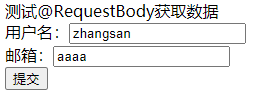

# SpringBoot2核心技术-核心功能

## 2. web开发
~~~~~
1 - SpringMVC自动配置预览
2 - 简单功能分析
3 - 请求参数处理
4 - 数据响应与内容协商
5 - 视图解析与模板引擎
6 - 拦截器
7 - 跨域
8 - 异常处理
9 - 原生servlet组件
10 - 嵌入式Web容器
11 - 定制化原理
~~~~~
### 2.1. 简单功能分析
> 2.1.1. 静态资源访问

**静态资源目录：**
- /static
- /public
- /resources
- /META-INF/resources
> 图片、视频、js、css等这些资源放到/static or /public or /resources or /META-INF/resources目录中，就可以直接访问根路径来访问静态资源了

访问：http://localhost:8080/xxx.jpg

原理：静态资源映射的是 /**，也就是说拦截所有请求；当请求进来，先去找Controller，如果Controller可以处理，则去处理；如果Controller不能处理，则去找静态资源，如果静态资源不能处理，则返回404

- 静态资源访问前缀

静态资源默认无前缀，我们可以在配置文件中配置一个前缀
```yaml
spring:
  mvc:
    # 访问静态资源添加前缀
    static-path-pattern: /res/**
```
访问的话就需要加上前缀来访问了：http://localhost:8080/res/xxx.xxx

- 改变默认的静态资源路径
```yaml
spring:
  mvc:
    # 访问静态资源添加前缀
    static-path-pattern: /res/**
  web:
    resources:
      # 改变静态资源访问路径
      #static-locations: classpath:/haha/
      # 改变资源访问路径可以使用数组，改变多个资源访问路径
      static-locations: ["classpath:/haha/", "classpath:/abc/"]
#数组中的双引号不是必须的，可以不加，也可以加上
```
- 支持 webjars (webjars.org) 自动映射
```xml
<!-- 添加一个webjars:jquery:1.6.0-->
<dependency>
    <groupId>org.webjars</groupId>
    <artifactId>jquery</artifactId>
    <version>3.6.0</version>
</dependency>
```
访问路径是：http://localhost:8080/webjars/jquery/3.6.0/xxx.xx

> 2.1.2. 欢迎页支持
- 静态资源路径下 放一个 index.html 页面
```html
<!DOCTYPE html>
<html lang="en">
<head>
    <meta charset="UTF-8">
    <title>欢迎页</title>
</head>
<body>
<h1>子辰，欢迎您</h1>
</body>
</html>
```
访问路径：http://localhost:8080


*注意1：* 如果有静态资源访问前缀，这个静态资源欢迎页不能直接访问根路径访问到，（可能使springboot的一个bug吧）
*注意2：* 加上静态资源访问前缀，得使用全路径访问欢迎页，如：http://localhost:8080/res/index.html


```yaml
spring:
# 会导致 welcome page 功能失效
#  mvc:
#    # 访问静态资源添加前缀
#    static-path-pattern: /res/**
  web:
    resources:
      # 改变静态资源访问路径
      #static-locations: classpath:/haha/
      # 改变资源访问路径可以使用数组，改变多个资源访问路径
      static-locations: ["classpath:/haha/", "classpath:/abc/"]
```
- controller能处理/index请求的
- 将欢迎页放到静态资源路径下
- 编写Controller
```java
//@RestController
@Controller
public class HelloController {

    @RequestMapping("/index")
    public String index() {
        return "index.html";
    }
}
```
- 这里注意：使用@Controller和@RequestMapping("/)
- @RequestBody注解是将字符串直接返回给页面
- 测试


> 2.1.3. 自定义 Favicon
- 使用图标名字固定 favicon.ico
- 将favicon.ico放到静态资源访问路径下
- 重启
- 访问：http://localhost:8080/hello


*注意：* 显示ico图标有可能会有缓存影响，禁用尝试
> 2.1.3. 静态资源配置原理
- SpringB启动默认加载 xxxAautoConfiguration类（自动配置类）
- SpringMVC功能的自动配置类WebMVCAutoConfiguration
- 看这个配置类是否生效
```java
@Configuration(
    proxyBeanMethods = false
)
@ConditionalOnWebApplication(
    type = Type.SERVLET
)
@ConditionalOnClass({Servlet.class, DispatcherServlet.class, WebMvcConfigurer.class})
@ConditionalOnMissingBean({WebMvcConfigurationSupport.class})
@AutoConfigureOrder(-2147483638)
@AutoConfigureAfter({DispatcherServletAutoConfiguration.class, TaskExecutionAutoConfiguration.class, ValidationAutoConfiguration.class})
public class WebMvcAutoConfiguration {
    //...
}
```
- 给容器中配置了什么
```java
@Configuration(
    proxyBeanMethods = false
)
@Import({WebMvcAutoConfiguration.EnableWebMvcConfiguration.class})
@EnableConfigurationProperties({WebMvcProperties.class, ResourceProperties.class, WebProperties.class})//
@Order(0)
public static class WebMvcAutoConfigurationAdapter implements WebMvcConfigurer {
    //...
}
@ConfigurationProperties(prefix = "spring.mvc")
public class WebMvcProperties {
    //...
}
@Deprecated
@ConfigurationProperties(prefix = "spring.resources", ignoreUnknownFields = false)
public class ResourceProperties extends Resources {
    //...
}
@ConfigurationProperties("spring.web")
public class WebProperties {
    //...
}
```
- 配置文件的相关属性和什么进行了绑定。WebMvcProperties = **spring.mvc** 、ResourceProperties = **spring.resources**、WebProperties = **spring.web**


**扩展：**
- 1. 配置类只有一个有参构造器，所有参数的值都会从容器中确定
```java
    @Configuration(
            proxyBeanMethods = false
    )
    @EnableConfigurationProperties({WebProperties.class})
    public static class EnableWebMvcConfiguration extends DelegatingWebMvcConfiguration implements ResourceLoaderAware {
    private static final Log logger = LogFactory.getLog(WebMvcConfigurer.class);
    private final Resources resourceProperties;
    private final WebMvcProperties mvcProperties;
    private final WebProperties webProperties;
    private final ListableBeanFactory beanFactory;
    private final WebMvcRegistrations mvcRegistrations;
    private final WebMvcAutoConfiguration.ResourceHandlerRegistrationCustomizer resourceHandlerRegistrationCustomizer;
    private ResourceLoader resourceLoader;

    // ResourceProperties resourceProperties    prefix = "spring.resources"
    // WebMvcProperties mvcProperties   prefix = "spring.mvc"
    // WebProperties webProperties   prefix = "spring.web"
    // ObjectProvider<WebMvcRegistrations> mvcRegistrationsProvider
    // ObjectProvider<WebMvcAutoConfiguration.ResourceHandlerRegistrationCustomizer> resourceHandlerRegistrationCustomizerProvider 找ResourceHandlerRegistrationCustomizer资源处理器自定义器
    //ListableBeanFactory beanFactory IOC容器工厂中获得
    public EnableWebMvcConfiguration(ResourceProperties resourceProperties, WebMvcProperties mvcProperties, WebProperties webProperties, ObjectProvider<WebMvcRegistrations> mvcRegistrationsProvider, ObjectProvider<WebMvcAutoConfiguration.ResourceHandlerRegistrationCustomizer> resourceHandlerRegistrationCustomizerProvider, ListableBeanFactory beanFactory) {
        this.resourceProperties = (Resources) (resourceProperties.hasBeenCustomized() ? resourceProperties : webProperties.getResources());
        this.mvcProperties = mvcProperties;
        this.webProperties = webProperties;
        this.mvcRegistrations = (WebMvcRegistrations) mvcRegistrationsProvider.getIfUnique();
        this.resourceHandlerRegistrationCustomizer = (WebMvcAutoConfiguration.ResourceHandlerRegistrationCustomizer) resourceHandlerRegistrationCustomizerProvider.getIfAvailable();
        this.beanFactory = beanFactory;
    }
}
```
- 资源处理的默认规则
```java
@Configuration(
        proxyBeanMethods = false
)
@EnableConfigurationProperties({WebProperties.class})
public static class EnableWebMvcConfiguration extends DelegatingWebMvcConfiguration implements ResourceLoaderAware {
    protected void addResourceHandlers(ResourceHandlerRegistry registry) {
        super.addResourceHandlers(registry);
        // resourceProperties =  ["classpath:/haha...", "classpath:/abc/", "classpath:/stat...", "classpath:/temp...", ...]
        if (!this.resourceProperties.isAddMappings()) {
            logger.debug("Default resource handling disabled");
        } else {
            ServletContext servletContext = this.getServletContext();
            // 处理webjars资源寻找路径 classpath:/META-INF/resources/webjars/**
            this.addResourceHandler(registry, "/webjars/**", "classpath:/META-INF/resources/webjars/");
            // 处理默认资源路径  /**   registration里面有默认访问路径/**，以及我们自己配置的访问路径：。。。
            this.addResourceHandler(registry, this.mvcProperties.getStaticPathPattern(), (registration) -> {
                registration.addResourceLocations(this.resourceProperties.getStaticLocations());
                if (servletContext != null) {
                    registration.addResourceLocations(new Resource[]{new ServletContextResource(servletContext, "/")});
                }
            });
        }
    }
}

public static class Resources {

    private static final String[] CLASSPATH_RESOURCE_LOCATIONS = {"classpath:/META-INF/resources/",
            "classpath:/resources/", "classpath:/static/", "classpath:/public/"};

    /**
     * Locations of static resources. Defaults to classpath:[/META-INF/resources/,
     * /resources/, /static/, /public/].
     */
    private String[] staticLocations = CLASSPATH_RESOURCE_LOCATIONS;

    /**
     * Whether to enable default resource handling.
     */
    private boolean addMappings = true;

    private boolean customized = false;

    private final Chain chain = new Chain();

    private final Cache cache = new Cache();

    public String[] getStaticLocations() {
        return this.staticLocations;
    }
}
```
- 欢迎页处理规则
*HandlerMapping* : 处理映射器，保存了每一个Handler能处理那些请求。
```java
@EnableConfigurationProperties({WebProperties.class})
public static class EnableWebMvcConfiguration extends DelegatingWebMvcConfiguration implements ResourceLoaderAware {
    @Bean
    public WelcomePageHandlerMapping welcomePageHandlerMapping(ApplicationContext applicationContext, FormattingConversionService mvcConversionService, ResourceUrlProvider mvcResourceUrlProvider) {
        WelcomePageHandlerMapping welcomePageHandlerMapping = new WelcomePageHandlerMapping(new TemplateAvailabilityProviders(applicationContext), applicationContext, this.getWelcomePage(), this.mvcProperties.getStaticPathPattern());
        welcomePageHandlerMapping.setInterceptors(this.getInterceptors(mvcConversionService, mvcResourceUrlProvider));
        welcomePageHandlerMapping.setCorsConfigurations(this.getCorsConfigurations());
        return welcomePageHandlerMapping;
    }
}
```

### 2.2. 请求参数处理
> 请求映射
- @xxxMapping
- Rest风格支持（使用HTTP请求方式动词来表示对资源的操作）
    - 以前：/getUser 获取用户  /deleteUser 删除用户  /editUser  修改用户   /saveUser 保存用户
    - 现在：/user  GET-获取请求  DELETE-删除用户  PUT-修改用户  POST-保存用户
    - 核心Filter：需要配置HiddenHttpMethodFilter，才可以使用现在的Rest风格
        - 用法：表单method=post，隐藏域 _method=put
        - SpringBoot中需要手动开启Rest风格
```java
@Configuration(
        proxyBeanMethods = false
)
@ConditionalOnWebApplication(
        type = Type.SERVLET
)
@ConditionalOnClass({Servlet.class, DispatcherServlet.class, WebMvcConfigurer.class})
@ConditionalOnMissingBean({WebMvcConfigurationSupport.class})
@AutoConfigureOrder(-2147483638)
@AutoConfigureAfter({DispatcherServletAutoConfiguration.class, TaskExecutionAutoConfiguration.class, ValidationAutoConfiguration.class})
public class WebMvcAutoConfiguration {
    public static final String DEFAULT_PREFIX = "";
    public static final String DEFAULT_SUFFIX = "";
    private static final String SERVLET_LOCATION = "/";

    public WebMvcAutoConfiguration() {
    }

    @Bean
    @ConditionalOnMissingBean({HiddenHttpMethodFilter.class})//当HiddenHttpMethodFilter没有生效的时候，下面方法才生效
    @ConditionalOnProperty(
            prefix = "spring.mvc.hiddenmethod.filter",
            name = {"enabled"},
            matchIfMissing = false
    )//默认是没有开启提交方法过滤的，需要我们手动开启，在配置文件中配置
    public OrderedHiddenHttpMethodFilter hiddenHttpMethodFilter() {
        return new OrderedHiddenHttpMethodFilter();
    }
}
```
```yaml
spring:
#  mvc:
#    # 访问静态资源添加前缀，静态资源前缀对于访问欢迎页不支持，因为底层已经写死了，直接找静态资源下的index.html
#    static-path-pattern: /res/**
  web:
    resources:
      # 改变静态资源访问路径
      #static-locations: classpath:/haha/
      # 改变资源访问路径可以使用数组，改变多个资源访问路径
      static-locations: ["classpath:/haha/", "classpath:/abc/", "classpath:/templates"]
      # false是禁用静态资源，都访问不了了，  默认是true不禁用
      # add-mappings: false
  # 手动开启请求方法
  mvc:
    hiddenmethod:
      filter:
        enabled: true
```
- 页面提交的时候注意DELETE/PUT/等方式，from的method属性还得写post
```html
<!DOCTYPE html>
<html lang="en">
<head>
    <meta charset="UTF-8">
    <title>Title</title>
</head>
<body>
    <h1>com.zichen，welcome page</h1>
    <!--测试REST风格-->
    <form action="/user" method="get">
        <input value="REST-GET 提交" type="submit"/>
    </form>
    <br/>
    <form action="/user" method="post">
        <input value="REST-POST 提交" type="submit"/>
    </form>
    <br/>
    <form action="/user" method="post">
        <input name="_method" type="hidden" value="DELETE"/>
        <input value="REST-DELETE 提交" type="submit"/>
    </form>
    <br/>
    <form action="/user" method="post">
        <input name="_method" type="hidden" value="PUT">
        <input value="REST-PUT 提交" type="submit"/>
    </form>
    <br/>
    <hr/>
    <!-- 测试基本注解 -->
</body>
</html>
```
```java
public class HiddenHttpMethodFilter extends OncePerRequestFilter {
    private static final List<String> ALLOWED_METHODS;
    public static final String DEFAULT_METHOD_PARAM = "_method";
    private String methodParam = "_method";

    public HiddenHttpMethodFilter() {
    }

    public void setMethodParam(String methodParam) {
        Assert.hasText(methodParam, "'methodParam' must not be empty");
        this.methodParam = methodParam;
    }

    protected void doFilterInternal(HttpServletRequest request, HttpServletResponse response, FilterChain filterChain) throws ServletException, IOException {
        //拿到用户发起的请求
        HttpServletRequest requestToUse = request;
        //这里也就说明了HTML页面中，如果是PUT/DELETE/等提交，from的method属性为什么还得写post，由于底层代码会拿到页面的请求方法参数，进行和"POST"比较，相等的情况下，才去拿到我们隐藏的那个真正的提交方法。
        if ("POST".equals(request.getMethod()) && request.getAttribute("javax.servlet.error.exception") == null) {
            //获取请求参数    _method的请求参数
            String paramValue = request.getParameter(this.methodParam);
            if (StringUtils.hasLength(paramValue)) {
                String method = paramValue.toUpperCase(Locale.ENGLISH);
                if (ALLOWED_METHODS.contains(method)) {
                    requestToUse = new HiddenHttpMethodFilter.HttpMethodRequestWrapper(request, method);
                }
            }
        }
        filterChain.doFilter((ServletRequest) requestToUse, response);
    }
    static {
        ALLOWED_METHODS = Collections.unmodifiableList(Arrays.asList(HttpMethod.PUT.name(), HttpMethod.DELETE.name(), HttpMethod.PATCH.name()));
    }

    private static class HttpMethodRequestWrapper extends HttpServletRequestWrapper {
        private final String method;

        public HttpMethodRequestWrapper(HttpServletRequest request, String method) {
            super(request);
            this.method = method;
        }

        public String getMethod() {
            return this.method;
        }
    }
}
```
~~~~
**RESR原理**
~~~~
- Rest原理（表单提交要是用REST的时候）
    - 表单提交会带上 _method = PUT
    - 请求过来会被HiddenHttpMethodFilter拦截
        - 判断请求是否正常，并且是post方式
            - 获取到_method的值。
            - 兼容以下请求：PUT/DELETE/PATCH
            - 原生request(post)，包装模式，包装了一个requestWrapper重写了getMethod犯法，返回的是传入的值。
            - 下面过滤器链放行的是wrapper。以后的方法调用getMethod是调用requestWrapper的。

- REST使用客户端工具，就和上面的没关系了
    - 如果使用客户端工具（postman）发送，在HttpServletRequest requestToUse = request;（拿到请求的时候就已经是PUT/DELETE/PATCH请求了），直接进入filterChain.doFilter((ServletRequest) requestToUse, response);（过滤器链放行）
    - 所以springboot才有了选择开启请求方法功能

- 以下四组，每一组都是等价的
- @RequestMapping(value = "/user", method = RequestMethod.GET)
  @GetMapping("/user")
- @RequestMapping(value = "/user", method = RequestMethod.POST)
  @PostMapping("/user")
- @RequestMapping(value = "/user", method = RequestMethod.PUT)
  @PutMapping("/user")
- @RequestMapping(value = "/user", method = RequestMethod.DELETE)
  @DeleteMapping("/user")

**可以将 _method 变成自己喜欢的名字：**
- 由于springboot底层是使用@ConditionalOnMissingBean({HiddenHttpMethodFilter.class})注解，如果容器中没有HiddenHttpMethodFilter组件，则会执行方法中的内容，如果容器中有了@ConditionalOnMissingBean({HiddenHttpMethodFilter.class})注解，就不会执行方法中的内容，他也就不会使用默认的"_method"来找对应的方法。
```java
@Configuration(
        proxyBeanMethods = false
)
@ConditionalOnWebApplication(
        type = Type.SERVLET
)
@ConditionalOnClass({Servlet.class, DispatcherServlet.class, WebMvcConfigurer.class})
@ConditionalOnMissingBean({WebMvcConfigurationSupport.class})
@AutoConfigureOrder(-2147483638)
@AutoConfigureAfter({DispatcherServletAutoConfiguration.class, TaskExecutionAutoConfiguration.class, ValidationAutoConfiguration.class})
public class WebMvcAutoConfiguration {
    @Bean
    @ConditionalOnMissingBean({HiddenHttpMethodFilter.class})
    @ConditionalOnProperty(
            prefix = "spring.mvc.hiddenmethod.filter",
            name = {"enabled"},
            matchIfMissing = false
    )
    public OrderedHiddenHttpMethodFilter hiddenHttpMethodFilter() {
        return new OrderedHiddenHttpMethodFilter();
    }
}
```
- 我们就可以在容器中添加一个HiddenHttpMethodFilter组件即可
    - 创建一个WebConfig.java
    - 添加HiddenHttpMethodFilter组件
```java
@Configuration(proxyBeanMethods = false)
public class WebConfig {

    @Bean
    public HiddenHttpMethodFilter hiddenHttpMethodFilter() {
        HiddenHttpMethodFilter hiddenHttpMethodFilter = new HiddenHttpMethodFilter();
        hiddenHttpMethodFilter.setMethodParam("_m");
        return hiddenHttpMethodFilter;
    }

}
```
```java
public class HiddenHttpMethodFilter extends OncePerRequestFilter {
    private static final List<String> ALLOWED_METHODS;
    public static final String DEFAULT_METHOD_PARAM = "_method";
    private String methodParam = "_method";

    public HiddenHttpMethodFilter() {
    }
    // 底层HiddenHttpMethodFilter类提供了设置方法参数的方法，所以我们可以来设置自己的方法参数hiddenHttpMethodFilter.setMethodParam("_m");
    public void setMethodParam(String methodParam) {
        Assert.hasText(methodParam, "'methodParam' must not be empty");
        this.methodParam = methodParam;
    }
}
```
- 此时我们把请求参数方法改成了 "_m" ，那么我们也需要修改HTML文件内容
```html
<!DOCTYPE html>
<html lang="en">
<head>
    <meta charset="UTF-8">
    <title>Title</title>
</head>
<body>
    <form action="/user" method="post">
        <!-- 原生方法参数 -->
        <input name="_method" type="hidden" value="DELETE"/>
        <!-- 自定义方法参数 -->
        <input name="_m" type="hidden" value="DELETE"/>
        <input value="REST-DELETE 提交" type="submit"/>
    </form>
    <br/>
    <form action="/user" method="post">
        <!-- 原生方法参数 -->
        <input name="_method" type="hidden" value="PUT">
        <!-- 自定义方法参数 -->
        <input name="_m" type="hidden" value="PUT">
        <input value="REST-PUT 提交" type="submit"/>
    </form>
</body>
</html>
```

~~~~
**请求映射原理**
~~~~
- 请求映射原理（请求如何找到请求的那个方法呢？）
- 所有请求过来，都要进过DispatcherServlet.java
- DispatcherServlet.java是所有请求的开始
- SpringMVC 功能分析都从 org.springframework.web.servlet.DispatcherServlet -> doDispatch() 开始
```java
public class DispatcherServlet extends FrameworkServlet {
    protected void doDispatch(HttpServletRequest request, HttpServletResponse response) throws Exception {
        HttpServletRequest processedRequest = request;
        //处理器执行链
        HandlerExecutionChain mappedHandler = null;
        //文件上传功能默认是关闭的
        boolean multipartRequestParsed = false;
        //web请求一步管理器
        WebAsyncManager asyncManager = WebAsyncUtils.getAsyncManager(request);

        try {
            try {
                ModelAndView mv = null;
                Object dispatchException = null;

                try {
                    //校验是否是文件上传请求
                    processedRequest = this.checkMultipart(request);
                    multipartRequestParsed = processedRequest != request;
                    //找到当前请求使用那个Handler(Controller的方法)来处理
                    //请求传递过来一个参数 /user
                    mappedHandler = this.getHandler(processedRequest);
                    if (mappedHandler == null) {
                        this.noHandlerFound(processedRequest, response);
                        return;
                    }

                    HandlerAdapter ha = this.getHandlerAdapter(mappedHandler.getHandler());
                    String method = request.getMethod();
                    boolean isGet = "GET".equals(method);
                    if (isGet || "HEAD".equals(method)) {
                        long lastModified = ha.getLastModified(request, mappedHandler.getHandler());
                        if ((new ServletWebRequest(request, response)).checkNotModified(lastModified) && isGet) {
                            return;
                        }
                    }

                    if (!mappedHandler.applyPreHandle(processedRequest, response)) {
                        return;
                    }

                    mv = ha.handle(processedRequest, response, mappedHandler.getHandler());
                    if (asyncManager.isConcurrentHandlingStarted()) {
                        return;
                    }

                    this.applyDefaultViewName(processedRequest, mv);
                    mappedHandler.applyPostHandle(processedRequest, response, mv);
                } catch (Exception var20) {
                    dispatchException = var20;
                } catch (Throwable var21) {
                    dispatchException = new NestedServletException("Handler dispatch failed", var21);
                }

                this.processDispatchResult(processedRequest, response, mappedHandler, mv, (Exception)dispatchException);
            } catch (Exception var22) {
                this.triggerAfterCompletion(processedRequest, response, mappedHandler, var22);
            } catch (Throwable var23) {
                this.triggerAfterCompletion(processedRequest, response, mappedHandler, new NestedServletException("Handler processing failed", var23));
            }

        } finally {
            if (asyncManager.isConcurrentHandlingStarted()) {
                if (mappedHandler != null) {
                    mappedHandler.applyAfterConcurrentHandlingStarted(processedRequest, response);
                }
            } else if (multipartRequestParsed) {
                this.cleanupMultipart(processedRequest);
            }

        }
    }
}
```
```java
public class DispatcherServlet extends FrameworkServlet {
    protected HandlerExecutionChain getHandler(HttpServletRequest request) throws Exception {
        // 处理映射器
        if (this.handlerMappings != null) {
            Iterator var2 = this.handlerMappings.iterator();

            while(var2.hasNext()) {
                HandlerMapping mapping = (HandlerMapping)var2.next();
                HandlerExecutionChain handler = mapping.getHandler(request);
                if (handler != null) {
                    return handler;
                }
            }
        }

        return null;
    }
}
```


- RequestMapingHandlerMapping: 保存了所有@RequestMapping 和 handler 的映射规则


- 查找那个方法可以处理请求
```java
public class DispatcherServlet extends FrameworkServlet {
    protected HandlerExecutionChain getHandler(HttpServletRequest request) throws Exception {
        // 处理映射器
        // ...
        HandlerExecutionChain handler = mapping.getHandler(request);
        // ...
        return null;
    }
}
```
- 拿到lookupPath = /user，然后再查找 lookupPath 对应那个处理方法
```java
public abstract class AbstractHandlerMethodMapping<T> extends AbstractHandlerMapping implements InitializingBean {
    protected HandlerMethod getHandlerInternal(HttpServletRequest request) throws Exception {
        String lookupPath = this.initLookupPath(request);
        this.mappingRegistry.acquireReadLock();

        HandlerMethod var4;
        try {
            //查找 lookupPath 对应那个处理方法
            HandlerMethod handlerMethod = this.lookupHandlerMethod(lookupPath, request);
            var4 = handlerMethod != null ? handlerMethod.createWithResolvedBean() : null;
        } finally {
            this.mappingRegistry.releaseReadLock();
        }
        return var4;
    }
}
```
- 执行查找 lookupPath 的对应方法
```java
public abstract class AbstractHandlerMethodMapping<T> extends AbstractHandlerMapping implements InitializingBean {
    protected HandlerMethod lookupHandlerMethod(String lookupPath, HttpServletRequest request) throws Exception {
        List<AbstractHandlerMethodMapping<T>.Match> matches = new ArrayList();
        // 执行这个方法
        List<T> directPathMatches = this.mappingRegistry.getMappingsByDirectPath(lookupPath);
    }
}
```
- 然后使用拿到的lookupPath和容器中的进行对比，找到符合 /user 的所有方法
```java
public abstract class AbstractHandlerMethodMapping<T> extends AbstractHandlerMapping implements InitializingBean {
    public List<T> getMappingsByDirectPath(String urlPath) {
        return (List)this.pathLookup.get(urlPath);
    }
}
```


- 返回多个可以处理 lookupPath = /user 的方法


- 找到最终可以处理 lookupPath = /user 的那个方法
```java
public abstract class AbstractHandlerMethodMapping<T> extends AbstractHandlerMapping implements InitializingBean {
    private void addMatchingMappings(Collection<T> mappings, List<AbstractHandlerMethodMapping<T>.Match> matches, HttpServletRequest request) {
        Iterator var4 = mappings.iterator();

        while(var4.hasNext()) {
            T mapping = var4.next();
            // lookupPath 匹配对应方法
            T match = this.getMatchingMapping(mapping, request);
            if (match != null) {
                matches.add(new AbstractHandlerMethodMapping.Match(match, (AbstractHandlerMethodMapping.MappingRegistration)this.mappingRegistry.getRegistrations().get(mapping)));
            }
        }

    }
}
```


- 找到对应的请求方法
/user -> GET

- 再根据 /user  GET 找到对应的方法
```java
public abstract class AbstractHandlerMethodMapping<T> extends AbstractHandlerMapping implements InitializingBean {
    protected HandlerMethod lookupHandlerMethod(String lookupPath, HttpServletRequest request) throws Exception {
        // ...
        // bestMatch.getHandlerMethod() --> com.zichen.boot.controller.HelloController#getUser()
        request.setAttribute(BEST_MATCHING_HANDLER_ATTRIBUTE, bestMatch.getHandlerMethod());
        this.handleMatch(bestMatch.mapping, lookupPath, request);
        //bestMatch.getHandlerMethod() --> com.zichen.boot.controller.HelloController#getUser()
        return bestMatch.getHandlerMethod();
    }
}
```


- 至此，根据请求找到了对应的处理方法
```properties
com.zichen.boot.controller.HelloController#getUser()
```

-- --

- SpringBoot自动配置欢迎页的WelcomePageHandlerMapping。访问 / 能访问到 index.html；
- SpringBoot自动配置了默认的 RequestMappingHandlerMapping
- 请求进来，挨个尝试所有的HandlerMapping，看是否有请求信息。
    - 如果有就找到这个请求对应的handler
    - 如果没有就找下一个HandlerMapping
- 如果需要一些自定医德映射处理，我们也可以给容器中方HandlerMapping。


> 普通参数与基本注解

- 注解
    - @PathVariable
        - 写在参数前，获取请求路径上的值，需要给一个name要和REST上的{}中的值一样
    - @RequestHeader
        - 写在参数前，获取请求头
    - @ModelAttribute
    - @RequestAttribute
        - 获取请求域里的值，具体操作Demo，见RequestController.java中的goToPage()方法
    - @RequestParam
        - 在参数前标注，@RequestParam("name")，标注某个参数，请求调用的时候名字为name
        - @RequestParam(name="id", required=false)
          //在参数不存在的情况下，可能希望变量有一个默认值
          @RequestParam(name="id", required=false, defaultValue="0")
    - @MatrixVariable
    - @CookieValue
        - 写在参数前，获取Cookie，如果没有Cookie会报错，Cookie中的其他字段的名字根据浏览器不同而不同
    - @RequestBody
        - 写在参数前，POST请求提交表单获取表单参数
*测试：@PathVariable*
```java
@RestController
public class ParameterTestController {
  @GetMapping("/car/{id}/owner/{username}")
  public Map<String, Object> getCar(@PathVariable("id") Integer id,
                                    @PathVariable("username") String name,
                                    @PathVariable Map<String, String> pv,
                                    @RequestHeader("User-Agent") String userAgent,
                                    @RequestHeader Map<String, String> header,
                                    @RequestParam("age") Integer age,
                                    @RequestParam("inters") List<String> inters,
                                    @RequestParam Map<String, String> params,
                                      /*@CookieValue("_ga") String _ga,
                                      @CookieValue Cookie cookie*/) {
    Map<String, Object> map = new HashMap<>();
    map.put("id", id);
    map.put("name", name);
    map.put("pv", pv);
    map.put("userAgent", userAgent);
    map.put("header", header);
    map.put("age", age);
    map.put("inters", inters);
    map.put("params", params);
    //map.put("_ga", _ga);
    //map.put("cookie", cookie);
    return map;
  }
}
```
```textmate
http://localhost:8080/car/3/owner/lisi
http://localhost:8080/car/3/owner/lisi?age=18&inters=basketball&inters=game
```
问题：@CookieValue没有拿到
*结果：*
1. {"pv":{"id":"3","username":"lisi"},"name":"lisi","id":3}
2. {"header":{"host":"localhost:8080","connection":"keep-alive","cache-control":"max-age=0","sec-ch-ua":"\" Not A;Brand\";v=\"99\", \"Chromium\";v=\"90\", \"Microsoft Edge\";v=\"90\"","sec-ch-ua-mobile":"?0","upgrade-insecure-requests":"1","user-agent":"Mozilla/5.0 (Windows NT 10.0; Win64; x64) AppleWebKit/537.36 (KHTML, like Gecko) Chrome/90.0.4430.93 Safari/537.36 Edg/90.0.818.51","accept":"text/html,application/xhtml+xml,application/xml;q=0.9,image/webp,image/apng,*/*;q=0.8,application/signed-exchange;v=b3;q=0.9","sec-fetch-site":"same-origin","sec-fetch-mode":"navigate","sec-fetch-user":"?1","sec-fetch-dest":"document","referer":"http://localhost:8080/method.html","accept-encoding":"gzip, deflate, br","accept-language":"zh-CN,zh;q=0.9,en;q=0.8,en-GB;q=0.7,en-US;q=0.6"},"userAgent":"Mozilla/5.0 (Windows NT 10.0; Win64; x64) AppleWebKit/537.36 (KHTML, like Gecko) Chrome/90.0.4430.93 Safari/537.36 Edg/90.0.818.51"}
3. {"inters":["basketball","game"],"params":{"age":"18","inters":"basketball"},"age":18}


*提交表单：@RequestBody*
```java
@RestController
public class ParameterTestController {

    @PostMapping("/save")
    public Map postMethod(@RequestBody String content) {
        Map<String, Object> map = new HashMap<>();
        map.put("content", content);
        return map;
    }
}
```
```html
<form action="/save" method="post">
    测试@RequestBody获取数据 <br/>
    用户名：<input name="userName"/><br/>
    邮箱：<input name="email"/><br/>
    <input type="submit" value="提交">
</form>
```


结果：
{"content":"userName=zhangsan&email=aaaa"}


-视频看到这里：
[bilibili-雷丰阳](https://www.bilibili.com/video/BV19K4y1L7MT?p=31&spm_id_from=pageDriver)


- @MatrixVariable
    - /car/{path}/?xxx=xxx&aaa=ccc  这是queryString类型，查询字符串，使用@RequestParam
    - /car/sell;low=34;brand=byd,audi,yd    这是矩阵变量
    - 页面开发，如果cookie被禁用了，如何从session中获取值
    - 我们知道session中有一些值，其中还包括jsessionId，jsessionId是存放在cookie中的，每次发请求都会携带cookie
    - url重写：吧cookie的值使用矩阵变量的形式重写（/abc;jsessionId=xxx;...）
    - SpringBoot中矩阵变量是默认关闭的，需要手动开启
    - 见method.md和
```java
class WebMvcAutoConfiguration {
    public void configurePathMatch(PathMatchConfigurer configurer) {
        if (this.mvcProperties.getPathmatch().getMatchingStrategy() == MatchingStrategy.PATH_PATTERN_PARSER) {
            configurer.setPatternParser(new PathPatternParser());
        }

        configurer.setUseSuffixPatternMatch(this.mvcProperties.getPathmatch().isUseSuffixPattern());
        configurer.setUseRegisteredSuffixPatternMatch(this.mvcProperties.getPathmatch().isUseRegisteredSuffixPattern());
        this.dispatcherServletPath.ifAvailable((dispatcherPath) -> {
            String servletUrlMapping = dispatcherPath.getServletUrlMapping();
            if (servletUrlMapping.equals("/") && this.singleDispatcherServlet()) {
                UrlPathHelper urlPathHelper = new UrlPathHelper();
                urlPathHelper.setAlwaysUseFullPath(true);
                configurer.setUrlPathHelper(urlPathHelper);
            }

        });
    }
}
```
```java
class UrlPathHelper{
    // 移除请求参数 ; 分号内容 控制变量，默认true - 移除； 
    private boolean removeSemicolonContent = true;

    /**
     * Set if ";" (semicolon) content should be stripped from the request URI.
     * <p>Default is "true".
     * 设置是否为“;” （分号）内容应从请求URI中删除。
     * 默认值为“ true”。
     */
    public void setRemoveSemicolonContent(boolean removeSemicolonContent) {
        checkReadOnly();
        this.removeSemicolonContent = removeSemicolonContent;
    }
}
```
- 因此，如果想要使用矩阵变量来识别‘;’后面的内容，就需要手动开启
  1）.
- 配置类实现WebMvcConfigurer
```java
@Configuration(proxyBeanMethods = false)
public class WebConfig implements WebMvcConfigurer {
    
}
```
- 重写configurePathMatch方法
```java
@Configuration(proxyBeanMethods = false)
public class WebConfig implements WebMvcConfigurer {
    // 1. 自己写一个@Bean  // WebMvcConfigurer
    // 2. 实现WebMvcConfigurer
    @Override
    public void configurePathMatch(PathMatchConfigurer configurer) {
        //设置UrlPathHelper方法中的setRemoveSemicolonContent为false
        UrlPathHelper urlPathHelper = new UrlPathHelper();
        urlPathHelper.setRemoveSemicolonContent(false);
        configurer.setUrlPathHelper(urlPathHelper);
    }
}
```

 2）
- 手写自己的@Bean（WebMvcConfigurer）
```java
@Configuration(proxyBeanMethods = false)
public class WebConfig {


    // 1. 自己写一个@Bean  // WebMvcConfigurer
    // 2. 实现WebMvcConfigurer
    @Bean
    public WebMvcConfigurer webMvcConfigurer() {
        return new WebMvcConfigurer() {
            @Override
            public void configurePathMatch(PathMatchConfigurer configurer) {
                UrlPathHelper urlPathHelper = new UrlPathHelper();
                urlPathHelper.setRemoveSemicolonContent(false);
                configurer.setUrlPathHelper(urlPathHelper);
            }
        };
    }
}
```

测试：
```java
@RestController
public class ParameterTestController {
    // 1. 语法 /cars/sell;low=34;brand=byd,audi,yd
    // 2. SpringBoot默认是禁用矩阵变量的，需要手动开启
    @GetMapping("/cars/{path}")
    public Map carsSell(@MatrixVariable("low") Integer low,
                        @MatrixVariable("brand") List<String> brand,
                        @PathVariable("path") String path) {//矩阵变量是和路径绑定在一起的，英雌需要这样使用
        Map<String, Object> map = new HashMap<>();
        map.put("low", low);
        map.put("brand", brand);
        map.put("path", path);
        return map;
    }
}
```
- 访问路径为：http://localhost:8080/cars/sell;low=34;brand=byd,audi,yd
```html
<a href="/cars/sell;low=34;brand=byd,audi,yd">@MatrixVariable（矩阵变量）</a>
```
结果：
{"path":"sell","low":34,"brand":["byd","audi","yd"]}

- 如果矩阵变量在路径上多个路段上有相同的变量名，则存在歧义，不知道取得是那个变量
- 可以使用指定取值
```java
class ParameterTestController {
    //  /boss/1;age=20/2;age=10
    @GetMapping("/boss/{bossId}/{empId}")
    public Map boss(@MatrixVariable(value = "age", pathVar = "bossId") Integer bossAge,
                    @MatrixVariable(value = "age", pathVar = "empId") Integer empAge) {
        Map<String, Object> map = new HashMap<>();
        map.put("bossAge", bossAge);
        map.put("empAge", empAge);
        return map;
    }
}
```
- 访问路径为：http://localhost:8080/boss/1;age=20/2;age=10

> POJO封装过程


> 参数处理原理
[各种参数解析原理-雷丰阳](https://www.bilibili.com/video/BV19K4y1L7MT?p=32)
- SpringBoot所有请求入口是 DispatcherServlet.java -> doDispatcher()
**doDispatcher() - step：一**
```java
public class DispatcherServlet extends FrameworkServlet {
    protected void doDispatch(HttpServletRequest request, HttpServletResponse response) throws Exception {
        // 拿到请求，找到对应的处理器（handler）
        mappedHandler = this.getHandler(processedRequest);// processedRequest - 
        //mappedHandler = HandlerExecutionChain with [com.zichen.boot.controller.ParameterTestController#getCar(Integer, String, Map, String, Map, Integer, List, Map)] and 2 interceptors
    }
}
```


*所谓 handler 就是封装了目标方法的一些信息*
*getHandler() - step：1)*
```java
public class DispatcherServlet extends FrameworkServlet {
    protected HandlerExecutionChain getHandler(HttpServletRequest request) throws Exception {
        // 从容器中拿到所有的处理映射器 handlerMapping
        if (this.handlerMappings != null) {
            Iterator var2 = this.handlerMappings.iterator();//迭代handlerMapping
            while(var2.hasNext()) {
                HandlerMapping mapping = (HandlerMapping)var2.next();
                //根据请求，找到对应的处理器
                HandlerExecutionChain handler = mapping.getHandler(request);
                if (handler != null) {
                    return handler;
                }
            }
        }
        return null;
    }
}
public abstract class AbstractHandlerMapping extends WebApplicationObjectSupport implements HandlerMapping, Ordered, BeanNameAware {
    public final HandlerExecutionChain getHandler(HttpServletRequest request) throws Exception {
        // 根据lookupPath = /car/3/owner/lisi 找到对应的请求方法 ： handler = HandlerExecutionChain with [com.zichen.boot.controller.ParameterTestController#getCar(Integer, String, Map, String, Map, Integer, List, Map)] and 2 interceptors
        Object handler = this.getHandlerInternal(request);
        return handler;
    }
}
```

**doDispatcher() - step：二**
```java
public class DispatcherServlet extends FrameworkServlet {
    protected void doDispatch(HttpServletRequest request, HttpServletResponse response) throws Exception {
        //mappedHandler = this.getHandler(processedRequest);  = HandlerExecutionChain with [com.zichen.boot.controller.ParameterTestController#getCar(Integer, String, Map, String, Map, Integer, List, Map)] and 2 interceptors
        HandlerAdapter ha = this.getHandlerAdapter(mappedHandler.getHandler());
        //拿到 handler = com.zichen.boot.controller.ParameterTestController#getCar(Integer, String, Map, String, Map, Integer, List, Map)
        //ha = 处理适配器  （根据处理器获取处理适配器）
    }
}
```
*getHandlerAdapter():相当于是一个大的反射工具，里面会去调目标方法，确定一些列参数的值，以及其他信息，先拿到适配器，再用适配器调用handle()*
*getHandlerAdapter() - step：1)*
```java
//获取处理适配器
public class DispatcherServlet extends FrameworkServlet {
    protected HandlerAdapter getHandlerAdapter(Object handler) throws ServletException {
        //从容器中拿到所有的处理适配器
        if (this.handlerAdapters != null) {
            Iterator var2 = this.handlerAdapters.iterator();//迭代所有的处理适配器

            while(var2.hasNext()) {
                HandlerAdapter adapter = (HandlerAdapter)var2.next();
                // handler = com.zichen.boot.controller.ParameterTestController#getCar(Integer, String, Map, String, Map, Integer, List, Map)
                // adapter = RequestMappingHandlerAdapter@6956
                if (adapter.supports(handler)) {//找到适合处理当前请求的处理适配器
                    // 因此，最终找到可以处理当前请求的适配器 adapter = RequestMappingHandlerAdapter@6956
                    return adapter;
                }
                //adapter.supports(handler) ==>
            }
        }
        throw new ServletException("No adapter for handler [" + handler + "]: The DispatcherServlet configuration needs to include a HandlerAdapter that supports this handler");
    }
}
public abstract class AbstractHandlerMethodAdapter extends WebContentGenerator implements HandlerAdapter, Ordered {
    // 适配当前处理适配器 返回true - 适配；返回 false - 不适配
    public final boolean supports(Object handler) {
        // handler 自然是 HandlerMethod 类型
        // this.supportsInternal((HandlerMethod)handler) = true
        return handler instanceof HandlerMethod && this.supportsInternal((HandlerMethod)handler); 
    }
}
public class RequestMappingHandlerAdapter extends AbstractHandlerMethodAdapter implements BeanFactoryAware, InitializingBean {
    protected boolean supportsInternal(HandlerMethod handlerMethod) {
        return true;
    }
}
```


**doDispatcher() - step：三**
```java
public class DispatcherServlet extends FrameworkServlet {
    protected void doDispatch(HttpServletRequest request, HttpServletResponse response) throws Exception {
        //mappedHandler = this.getHandler(processedRequest);
        //HandlerAdapter ha = this.getHandlerAdapter(mappedHandler.getHandler());
        // Actually invoke the handler
        mv = ha.hanhadle(processedRequest, response, mappedHandler.getHandler());
    }
}
```
*handle() - step：1)*
```java
public abstract class AbstractHandlerMethodAdapter extends WebContentGenerator implements HandlerAdapter, Ordered {
    public final ModelAndView handle(HttpServletRequest request, HttpServletResponse response, Object handler) throws Exception {
        return this.handleInternal(request, response, (HandlerMethod)handler);//内部处理
    }
}
```
```java
public class RequestMappingHandlerAdapter extends AbstractHandlerMethodAdapter implements BeanFactoryAware, InitializingBean {
    protected ModelAndView handleInternal(HttpServletRequest request, HttpServletResponse response, HandlerMethod handlerMethod) throws Exception {
        ModelAndView mav;
        if (this.synchronizeOnSession) {
            //session 处理
        } else {
            //执行处理方法
            mav = this.invokeHandlerMethod(request, response, handlerMethod);
        }
    }
    protected ModelAndView invokeHandlerMethod(HttpServletRequest request, HttpServletResponse response, HandlerMethod handlerMethod) throws Exception {
        ServletWebRequest webRequest = new ServletWebRequest(request, response);

        Object result;
        try {
            WebDataBinderFactory binderFactory = this.getDataBinderFactory(handlerMethod);
            ModelFactory modelFactory = this.getModelFactory(handlerMethod, binderFactory);
            ServletInvocableHandlerMethod invocableMethod = this.createInvocableHandlerMethod(handlerMethod);
            // 拿到容器中所有的参数解释器（27个），以及容器缓冲该请求方法的所有参数解释器（9个 有一个重复）
            if (this.argumentResolvers != null) {
                // 为目标方法设置参数解析器，将来确定目标方法每个参数的值
                invocableMethod.setHandlerMethodArgumentResolvers(this.argumentResolvers);
            }
            // 拿到容器中所有的返回值处理器（15个）
            if (this.returnValueHandlers != null) {
                //为目标方法返回值设置处理器，将来将返回值封装成视图返回页面展示
                invocableMethod.setHandlerMethodReturnValueHandlers(this.returnValueHandlers);
            }
        } finally {
            //webRequest.requestCompleted();
        }
        return (ModelAndView)result;
    }
}
```


```java
public class ServletInvocableHandlerMethod extends InvocableHandlerMethod {
    public void invokeAndHandle(ServletWebRequest webRequest, ModelAndViewContainer mavContainer, Object... providedArgs) throws Exception {
        // 执行请求 , 返回请求方法的返回值
        Object returnValue = this.invokeForRequest(webRequest, mavContainer, providedArgs);
    }
}
public class InvocableHandlerMethod extends HandlerMethod {
    public Object invokeForRequest(NativeWebRequest request, @Nullable ModelAndViewContainer mavContainer, Object... providedArgs) throws Exception {
        // 从请求中获取请求的方法的参数的值
        // args 存了目标方法所有参数的值
        Object[] args = getMethodArgumentValues(request, mavContainer, providedArgs);
        if (logger.isTraceEnabled()) {
            logger.trace("Arguments: " + Arrays.toString(args));
        }
        // 将目标方法参数和请求中的值一一对应起来
        return doInvoke(args);
    }
    public class InvocableHandlerMethod extends HandlerMethod {
        protected Object doInvoke(Object... args) throws Exception {
            Method method = getBridgedMethod();
            ReflectionUtils.makeAccessible(method);
            try {
                if (KotlinDetector.isSuspendingFunction(method)) {
                    return CoroutinesUtils.invokeSuspendingFunction(method, getBean(), args);
                }
                // getBean() -> 目标方法对象
                // args -> 请求中的所有参数（List<String>）
                return method.invoke(getBean(), args);
            }
        }
    }
    public final class Method extends Executable {
        @CallerSensitive
        public Object invoke(Object obj, Object... args)
                throws IllegalAccessException, IllegalArgumentException,
                InvocationTargetException
        {
            if (!override) {
                if (!Reflection.quickCheckMemberAccess(clazz, modifiers)) {
                    Class<?> caller = Reflection.getCallerClass();
                    checkAccess(caller, clazz, obj, modifiers);
                }
            }
            // ma = public java.util.Map com.zichen.boot.controller.ParameterTestController.getCar(java.lang.Integer,java.lang.String,java.util.Map,java.lang.String,java.util.Map,java.lang.Integer,java.util.List,java.util.Map)
            MethodAccessor ma = methodAccessor;             // read volatile
            if (ma == null) {
                ma = acquireMethodAccessor();
            }
            // 一一匹配
            return ma.invoke(obj, args);//NativeMethodAccessorImpl.invoke(...)...
        }
    }
    // 给请求方法中的各个参数匹配请求路径上的对应的值 
    protected Object[] getMethodArgumentValues(NativeWebRequest request, @Nullable ModelAndViewContainer mavContainer, Object... providedArgs) throws Exception {
        MethodParameter[] parameters = getMethodParameters();
        if (ObjectUtils.isEmpty(parameters)) {
            return EMPTY_ARGS;
        }

        Object[] args = new Object[parameters.length];
        for (int i = 0; i < parameters.length; i++) {
            MethodParameter parameter = parameters[i];
            parameter.initParameterNameDiscovery(this.parameterNameDiscoverer);
            args[i] = findProvidedArgument(parameter, providedArgs);
            if (args[i] != null) {
                continue;
                throw new IllegalStateException(formatArgumentError(parameter, "No suitable resolver"));
            } }
            // 确定 27个参数解析器，那个可以解析 当前这种参数，或者说可不可以支持当前这种参数，全不支持抛异常
            if (!this.resolvers.supportsParameter(parameter)) {
                
            try {
                // 解析请求中参数，获取的值，放到List中
                args[i] = this.resolvers.resolveArgument(parameter, mavContainer, request, this.dataBinderFactory);// 执行 1286L resolveArgument()
            }
            catch (Exception ex) {
                // Leave stack trace for later, exception may actually be resolved and handled...
                if (logger.isDebugEnabled()) {
                    String exMsg = ex.getMessage();
                    if (exMsg != null && !exMsg.contains(parameter.getExecutable().toGenericString())) {
                        logger.debug(formatArgumentError(parameter, exMsg));
                    }
                }
                throw ex;
            }
        }
        // 获得参数信息，List<String>
        return args;
    }
}
// 1. 确定当前参数是否被支持解析
public class HandlerMethodArgumentResolverComposite implements HandlerMethodArgumentResolver {
    @Override
    public boolean supportsParameter(MethodParameter parameter) {
        // 确定当前参数是否可以被 27中解析器中的一种来支持，返回 true  or  false
        return getArgumentResolver(parameter) != null;
    }
}

public class HandlerMethodArgumentResolverComposite implements HandlerMethodArgumentResolver {
    private HandlerMethodArgumentResolver getArgumentResolver(MethodParameter parameter) {
        HandlerMethodArgumentResolver result = this.argumentResolverCache.get(parameter);
        if (result == null) {
            // 对27个参数解析器挨个遍历
            for (HandlerMethodArgumentResolver resolver : this.argumentResolvers) {
                // 判断这27个参数解析器，那个可以支持当前参数？
                if (resolver.supportsParameter(parameter)) {
                    // 匹配成功，结束循环返回匹配的参数解析器
                    result = resolver;
                    this.argumentResolverCache.put(parameter, result);
                    break;
                }
            }
        }
        return result;
    }
}

public interface HandlerMethodArgumentResolver {
    // 有28中实现，不同的参数解析器，执行不同的实现
    // 返回对应的参数解析器
    boolean supportsParameter(MethodParameter parameter);
}
// 2. 解析参数
public class HandlerMethodArgumentResolverComposite implements HandlerMethodArgumentResolver {
    public Object resolveArgument(MethodParameter parameter, @Nullable ModelAndViewContainer mavContainer,
                                  NativeWebRequest webRequest, @Nullable WebDataBinderFactory binderFactory) throws Exception {
        // 获取对应的参数解析器
        HandlerMethodArgumentResolver resolver = getArgumentResolver(parameter);
        if (resolver == null) {
            throw new IllegalArgumentException("Unsupported parameter type [" +
                    parameter.getParameterType().getName() + "]. supportsParameter should be called first.");
        }
        // 解析请求中的值 resolver.resolveArgument(parameter, mavContainer, webRequest, binderFactory) = "3"   （一个值）
        return resolver.resolveArgument(parameter, mavContainer, webRequest, binderFactory);
    }
}
// 真正解析参数的地方
public abstract class AbstractNamedValueMethodArgumentResolver implements HandlerMethodArgumentResolver {
    public final Object resolveArgument(MethodParameter parameter, @Nullable ModelAndViewContainer mavContainer,
                                        NativeWebRequest webRequest, @Nullable WebDataBinderFactory binderFactory) throws Exception {
        // 根据当前参数，获取该参数名信息
        NamedValueInfo namedValueInfo = getNamedValueInfo(parameter);
        MethodParameter nestedParameter = parameter.nestedIfOptional();
        // 获取参数名 
        Object resolvedName = resolveEmbeddedValuesAndExpressions(namedValueInfo.name);
        if (resolvedName == null) {
            throw new IllegalArgumentException(
                    "Specified name must not resolve to null: [" + namedValueInfo.name + "]");
        }

        // 解析该参数，从请求中获取对应的值  arg = 3
        Object arg = resolveName(resolvedName.toString(), nestedParameter, webRequest);
        if (arg == null) {
            if (namedValueInfo.defaultValue != null) {
                arg = resolveEmbeddedValuesAndExpressions(namedValueInfo.defaultValue);
            }
            else if (namedValueInfo.required && !nestedParameter.isOptional()) {
                handleMissingValue(namedValueInfo.name, nestedParameter, webRequest);
            }
            arg = handleNullValue(namedValueInfo.name, arg, nestedParameter.getNestedParameterType());
        }
        else if ("".equals(arg) && namedValueInfo.defaultValue != null) {
            arg = resolveEmbeddedValuesAndExpressions(namedValueInfo.defaultValue);
        }

        if (binderFactory != null) {
            WebDataBinder binder = binderFactory.createBinder(webRequest, null, namedValueInfo.name);
            try {
                arg = binder.convertIfNecessary(arg, parameter.getParameterType(), parameter);
            }
            catch (ConversionNotSupportedException ex) {
                throw new MethodArgumentConversionNotSupportedException(arg, ex.getRequiredType(),
                        namedValueInfo.name, parameter, ex.getCause());
            }
            catch (TypeMismatchException ex) {
                throw new MethodArgumentTypeMismatchException(arg, ex.getRequiredType(),
                        namedValueInfo.name, parameter, ex.getCause());
            }
            // Check for null value after conversion of incoming argument value
            if (arg == null && namedValueInfo.defaultValue == null &&
                    namedValueInfo.required && !nestedParameter.isOptional()) {
                handleMissingValueAfterConversion(namedValueInfo.name, nestedParameter, webRequest);
            }
        }
        // 处理解析值
        handleResolvedValue(arg, namedValueInfo.name, parameter, mavContainer, webRequest);
        
        return arg;
    }
}
public class PathVariableMethodArgumentResolver extends AbstractNamedValueMethodArgumentResolver
        implements UriComponentsContributor {
    @Override
    @SuppressWarnings("unchecked")
    @Nullable
    protected Object resolveName(String name, MethodParameter parameter, NativeWebRequest request) throws Exception {
        // 获取请求中的属性    uriTemplateVars = {"id": "3", "username": "lisi"}
        Map<String, String> uriTemplateVars = (Map<String, String>) request.getAttribute(
                HandlerMapping.URI_TEMPLATE_VARIABLES_ATTRIBUTE, RequestAttributes.SCOPE_REQUEST);
        // return uriTemplateVars.get("id") = 3
        return (uriTemplateVars != null ? uriTemplateVars.get(name) : null);
    }
}
public class ServletRequestAttributes extends AbstractRequestAttributes {
    @Override
    public Object getAttribute(String name, int scope) {
        if (scope == SCOPE_REQUEST) {
            if (!isRequestActive()) {
                throw new IllegalStateException(
                        "Cannot ask for request attribute - request is not active anymore!");
            }
            // 解析请求路径，获取路径上的变量，再将这些变量返回
            // request - R( /car/3/owner/lisi)
            // return (LinkedHashMap<String, String>()) Object = {"id": "3", "username": "lisi"}
            return this.request.getAttribute(name);
        } else {
            // ...
        }
    }
}
// 处理解析值
public class PathVariableMethodArgumentResolver extends AbstractNamedValueMethodArgumentResolver
        implements UriComponentsContributor {
    @Override
    @SuppressWarnings("unchecked")
    protected void handleResolvedValue(@Nullable Object arg, String name, MethodParameter parameter,
                                       @Nullable ModelAndViewContainer mavContainer, NativeWebRequest request) {

        String key = View.PATH_VARIABLES;
        int scope = RequestAttributes.SCOPE_REQUEST;
        Map<String, Object> pathVars = (Map<String, Object>) request.getAttribute(key, scope);
        if (pathVars == null) {
            pathVars = new HashMap<>();
            // 将Map 放到请求域中
            request.setAttribute(key, pathVars, scope);
        }
        // 给请求域中的map赋值 name = "id", arg = 3
        pathVars.put(name, arg);
    }
}
```


- 请求方法的参数赋上对应的值，然后执行请求方法中的内容
```java
class NativeMethodAccessorImpl extends MethodAccessorImpl {
    public Object invoke(Object var1, Object[] var2) throws IllegalArgumentException, InvocationTargetException {
        if (++this.numInvocations > ReflectionFactory.inflationThreshold() && !ReflectUtil.isVMAnonymousClass(this.method.getDeclaringClass())) {
            MethodAccessorImpl var3 = (MethodAccessorImpl)(new MethodAccessorGenerator()).generateMethod(this.method.getDeclaringClass(), this.method.getName(), this.method.getParameterTypes(), this.method.getReturnType(), this.method.getExceptionTypes(), this.method.getModifiers());
            this.parent.setDelegate(var3);
        }
        // 执行请求方法体
        return invoke0(this.method, var1, var2);
    }
}
```

```java
public class ParameterTestController {
    @GetMapping("/car/{id}/owner/{username}")
    public Map<String, Object> getCar(@PathVariable("id") Integer id,
                                      @PathVariable("username") String name,
                                      @PathVariable Map<String, String> pv,
                                      @RequestHeader("User-Agent") String userAgent,
                                      @RequestHeader Map<String, String> header,
                                      @RequestParam("age") Integer age,
                                      @RequestParam("inters") List<String> inters,
                                      @RequestParam Map<String, String> params
                                      /*@CookieValue("_ga") String _ga,
                                      @CookieValue Cookie cookie*/) {
        // new NativeMethodAccessorImpl().invoke0(this.method, var1, var2);
        Map<String, Object> map = new HashMap<>();
        map.put("id", id);
        map.put("name", name);
        map.put("pv", pv);
        map.put("userAgent", userAgent);
        map.put("header", header);
        map.put("age", age);
        map.put("inters", inters);
        map.put("params", params);
        //map.put("_ga", _ga);
        //map.put("cookie", cookie);
        return map;
    }
}
```
- 处理返回值
```java
public class ServletInvocableHandlerMethod extends InvocableHandlerMethod {
    public void invokeAndHandle(ServletWebRequest webRequest, ModelAndViewContainer mavContainer, Object... providedArgs) throws Exception {
        // 执行请求， 返回请求方法返回值（map）
        Object returnValue = this.invokeForRequest(webRequest, mavContainer, providedArgs);
        this.setResponseStatus(webRequest);
        if (returnValue == null) {
            if (this.isRequestNotModified(webRequest) || this.getResponseStatus() != null || mavContainer.isRequestHandled()) {
                this.disableContentCachingIfNecessary(webRequest);
                mavContainer.setRequestHandled(true);
                return;
            }
        } else if (StringUtils.hasText(this.getResponseStatusReason())) {
            mavContainer.setRequestHandled(true);
            return;
        }

        mavContainer.setRequestHandled(false);
        Assert.state(this.returnValueHandlers != null, "No return value handlers");

        try {
            // 处理返回值
            this.returnValueHandlers.handleReturnValue(returnValue, this.getReturnValueType(returnValue), mavContainer, webRequest);
        } catch (Exception var6) {
            if (logger.isTraceEnabled()) {
                logger.trace(this.formatErrorForReturnValue(returnValue), var6);
            }

            throw var6;
        }
    }
}
```
```java
public class HandlerMethod {
    public MethodParameter getReturnValueType(@Nullable Object returnValue) {
        return new ReturnValueMethodParameter(returnValue);
    }
}
```
**doDispatcher() - step：三**
```java
public class DispatcherServlet extends FrameworkServlet {
    protected void doDispatch(HttpServletRequest request, HttpServletResponse response) throws Exception {
        //mappedHandler = this.getHandler(processedRequest);
        //HandlerAdapter ha = this.getHandlerAdapter(mappedHandler.getHandler());
        //mv = ha.handle(processedRequest, response, mappedHandler.getHandler()); mv = null
        this.applyDefaultViewName(processedRequest, mv);
        mappedHandler.applyPostHandle(processedRequest, response, mv);
        this.processDispatchResult(processedRequest, response, mappedHandler, mv, (Exception)dispatchException);
    }
}
```
*applyPostHandle() - step：1)*
```java
public class HandlerExecutionChain {
    void applyPostHandle(HttpServletRequest request, HttpServletResponse response, @Nullable ModelAndView mv) throws Exception {
        for(int i = this.interceptorList.size() - 1; i >= 0; --i) {
            // 处理拦截器 有请求相关的拦截  /wapper/**   /**
            HandlerInterceptor interceptor = (HandlerInterceptor)this.interceptorList.get(i);
            interceptor.postHandle(request, response, this.handler, mv);
        }

    }
}
```


**doDispatch() - step：四**
```java
public class DispatcherServlet extends FrameworkServlet {
    protected void doDispatch(HttpServletRequest request, HttpServletResponse response) throws Exception {
        //mappedHandler = this.getHandler(processedRequest);
        //HandlerAdapter ha = this.getHandlerAdapter(mappedHandler.getHandler());
        //mv = ha.handle(processedRequest, response, mappedHandler.getHandler()); mv = null
        //this.applyDefaultViewName(processedRequest, mv);
        //mappedHandler.applyPostHandle(processedRequest, response, mv);
        this.processDispatchResult(processedRequest, response, mappedHandler, mv, (Exception)dispatchException);
    }
}
```
-至此，请求方法，解析参数，处理返回结果完成，视图解析后续更新

-------------------

[Servlet API](https://www.bilibili.com/video/BV19K4y1L7MT?p=33&spm_id_from=pageDriver)

- Servlet API
    - WebRequest
    - ServletRequest
    - MultipartRequest
    - HttpSession
    - javax.servlet.http.PushBuilder
    - Principal
    - InputStream
    - Reader
    - HttpMethod
    - Local
    - TimeZone
    - ZoneId

- 这些参数的处理，最终会拿到参数解析器(ServletRequestMethodArgumentResolver)
- 然后获取对应参数的类型，进行判断

```java
public class HandlerMethodArgumentResolverComposite implements HandlerMethodArgumentResolver {
    @Nullable
    private HandlerMethodArgumentResolver getArgumentResolver(MethodParameter parameter) {
        HandlerMethodArgumentResolver result = this.argumentResolverCache.get(parameter);
        if (result == null) {
            for (HandlerMethodArgumentResolver resolver : this.argumentResolvers) {
                // 第一次会进行适配，第二次会从换从中拿对应的参数解析器
                if (resolver.supportsParameter(parameter)) {
                    result = resolver;
                    this.argumentResolverCache.put(parameter, result);
                    break;
                }
            }
        }
        return result;
    }
}
public class ServletRequestMethodArgumentResolver implements HandlerMethodArgumentResolver {
    @Override
    public boolean supportsParameter(MethodParameter parameter) {
        Class<?> paramType = parameter.getParameterType();
        return (WebRequest.class.isAssignableFrom(paramType) ||
                ServletRequest.class.isAssignableFrom(paramType) ||
                MultipartRequest.class.isAssignableFrom(paramType) ||
                HttpSession.class.isAssignableFrom(paramType) ||
                (pushBuilder != null && pushBuilder.isAssignableFrom(paramType)) ||
                (Principal.class.isAssignableFrom(paramType) && !parameter.hasParameterAnnotations()) ||
                InputStream.class.isAssignableFrom(paramType) ||
                Reader.class.isAssignableFrom(paramType) ||
                HttpMethod.class == paramType ||
                Locale.class == paramType ||
                TimeZone.class == paramType ||
                ZoneId.class == paramType);
    }
}
```

-------------------

- 复杂参数
    - Map
    - Model
    -- Map、Model 作为参数，都是向Request域中放数据，可以使用request.getAttribute("xxx");来获取
    - Errors/BindingResult
    - RedirectAttributes
    - ServletResponse
    - SessionStatus
    - UriComponentsBuilder
    - ServletUriComponentsBuilder
**测试 Map/Model作为参数，向里面传值，其实就是想request域中放值，将来从request域中获取值即可**

```java
@Controller
public class RequestController {

    @GetMapping("/param")
    public String testParam(Map<String, Object> map,
                            Model model,
                            HttpServletRequest httpServletRequest,
                            HttpServletResponse httpServletResponse) {
        map.put("map", "map_setValue");
        model.addAttribute("model", "model_addValue");
        httpServletRequest.setAttribute("httpServletRequest", "httpServletRequest_setValue");

        Cookie cookie = new Cookie("cookie_key", "cookie_value");
        httpServletResponse.addCookie(cookie);
        return "forward:/success";
    }

    @ResponseBody
    @GetMapping("/success")
    public Map success(@RequestAttribute(value = "msg", required = false) String msg,
                       @RequestAttribute(value = "code", required = false) Integer code,
                       HttpServletRequest request) {
        Object msg1 = request.getAttribute("msg");
        Map<String, Object> map = new HashMap<>();
        map.put("reMethod_msg", msg1);
        map.put("annotation_msg1", msg);
        map.put("annotation_msg2", code);

        map.put("map", request.getAttribute("map"));
        map.put("model", request.getAttribute("model"));
        map.put("httpServletRequest", request.getAttribute("httpServletRequest"));
        return map;
    }
}
```

```text
http://localhost:8080/param
```

```text
测试结果：
{"reMethod_msg":null,"model":"model_addValue","annotation_msg1":null,"httpServletRequest":"httpServletRequest_setValue","annotation_msg2":null,"map":"map_setValue"}
```
**Map Model作为参数，底层核心代码：**

```text
- DispatcherServlet 
    -> doDispatch() 
    -> (参数解析完成，返回视图) 
    -> processDispatchResult(processedRequest, response, mappedHandler, mv, dispatchException);
        // Did the handler return a view to render?
        -> render(mv, request, response);
            // mv.getModelInternal() = {"map": "map_setValue", "model": "model_setValue"}
            -> view.render(mv.getModelInternal(), request, response);
                // 创建一个合并的输出模型 mergedModel = {"map": "map_setValue", "model": "model_setValue", ...}
                -> Map<String, Object> mergedModel = createMergedOutputModel(model, request, response); (AbstractView.render(.., .., ..))
                    -> 一些列的合并操作。
           -> renderMergedOutputModel(mergedModel, getRequestToExpose(request), response); (AbstractView.render(.., .., ..))
                // 暴露模型作为请求属性
                -> exposeModelAsRequestAttributes(model, request); (InternalResourceView.renderMergedOutputModel())
                    -> request.setAttribute(name, value); (AbstractView.exposeModelAsRequestAttributes())
                // 如果有请求转发，则会执行
                -> rd.forward(request, response);
```

- 自定义对象参数
    - 可以自动类型转换与格式化
    - 可以级联封装。

### 2.3. 数据响应与内容协商
>

>


### 2.4. 视图解析与模板引擎
>

>


### 2.5. 拦截器
>

>


### 2.6. 跨域
>

>


### 2.7. 异常处理
>

>


### 2.8. 原生servlet组件（原生组件注入）
>

>


### 2.9. 嵌入式Web容器
>

>


### 2.10. 定制化原理
>

>


## 3. 数据访问


## 4. 单元测试


## 5. 指标监控


## 6. 原理解析


