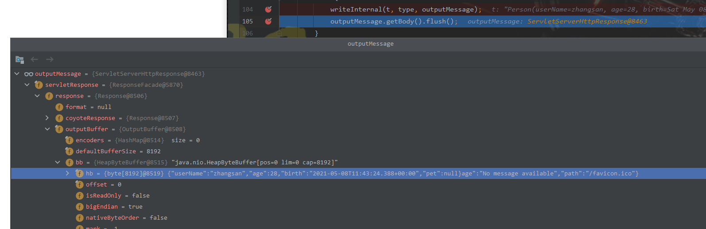

# SpringBoot2核心技术-核心功能
## 1. 数据响应

-----
> 响应页面

> 数据响应：JSON  XML  xls  图片、音视频..  自定义协议数据

-----
- 响应JSON

1) 需要在pom.xml中引入 *-start-web 场景
```xml
<dependencys>
    <dependency>
        <groupId>org.springframework.boot</groupId>
        <artifactId>spring-boot-starter-web</artifactId>
    </dependency>
    <!-- web 场景自动引入了json场景 (有的没有自动引入，需要手动引入) -->
    <dependency>
        <groupId>org.springframework.boot</groupId>
        <artifactId>spring-boot-starter-json</artifactId>
    </dependency>
    <dependency>
        <groupId>com.fasterxml.jackson.core</groupId>
        <artifactId>jackson-databind</artifactId>
    </dependency>
    <dependency>
        <groupId>com.fasterxml.jackson.datatype</groupId>
        <artifactId>jackson-datatype-jdk8</artifactId>
    </dependency>
    <dependency>
        <groupId>com.fasterxml.jackson.datatype</groupId>
        <artifactId>jackson-datatype-jsr310</artifactId>
    </dependency>
</dependencys>
```
**测试响应json**
- @Controller
- @ResponseBody
- @xxxMapping("/.../...")
```java
@Controller
public class ResponseTestController {
    @ResponseBody
    @GetMapping("/test/person")
    public Person getPerson() {
        Person person = new Person();
        person.setAge(28);
        person.setBirth(new Date());
        person.setUserName("zhangsan");
        return person;
    }
}
```
- 结果：{"userName":"zhangsan","age":28,"birth":"2021-05-08T08:53:34.106+00:00","pet":null}

**原码**

- 返回值解析器

```java
public class RequestMappingHandlerAdapter extends AbstractHandlerMethodAdapter
        implements BeanFactoryAware, InitializingBean {
    @Nullable
    protected ModelAndView invokeHandlerMethod(HttpServletRequest request,
                                               HttpServletResponse response, HandlerMethod handlerMethod) throws Exception {
        if (this.argumentResolvers != null) { // argumentResolvers
            invocableMethod.setHandlerMethodArgumentResolvers(this.argumentResolvers);
        }
        if (this.returnValueHandlers != null) { // returnValueHandlers
            invocableMethod.setHandlerMethodReturnValueHandlers(this.returnValueHandlers);
        }
    }
}
```
```java
public class ServletInvocableHandlerMethod extends InvocableHandlerMethod {
    public void invokeAndHandle(ServletWebRequest webRequest, ModelAndViewContainer mavContainer,
                                Object... providedArgs) throws Exception {
        // 执行请求，拿到返回值
        Object returnValue = invokeForRequest(webRequest, mavContainer, providedArgs);
        // 处理返回值
        this.returnValueHandlers.handleReturnValue(
                returnValue, getReturnValueType(returnValue), mavContainer, webRequest);
    }
}
```

```java
public class HandlerMethodReturnValueHandlerComposite implements HandlerMethodReturnValueHandler {
    @Override
    public void handleReturnValue(@Nullable Object returnValue, MethodParameter returnType,
                                  ModelAndViewContainer mavContainer, NativeWebRequest webRequest) throws Exception {

        HandlerMethodReturnValueHandler handler = selectHandler(returnValue, returnType);
        if (handler == null) {
            throw new IllegalArgumentException("Unknown return value type: " + returnType.getParameterType().getName());
        }
        // 拿到返回值处理器之后，开始处理返回值
        handler.handleReturnValue(returnValue, returnType, mavContainer, webRequest);
    }
    @Nullable
    private HandlerMethodReturnValueHandler selectHandler(@Nullable Object value, MethodParameter returnType) {
        boolean isAsyncValue = isAsyncReturnValue(value, returnType);
        for (HandlerMethodReturnValueHandler handler : this.returnValueHandlers) {
            if (isAsyncValue && !(handler instanceof AsyncHandlerMethodReturnValueHandler)) {
                continue;
            }
            if (handler.supportsReturnType(returnType)) { // 适配返回值类型处理器
                // handler = RequestResponseBodyMethodProcessor@6750
                return handler;
            }
        }
        return null;
    }
}
```


```properties
# 支持的返回值类型：
# ModelAndView - ModelAndViewMethodReturnValueHandler@7521
# Model - ModelMethodProcessor@7534
# View - ViewMethodReturnValueHandler@7546
# ResponseEntity - ResponseBodyEmitterReturnValueHandler@7558
# StreamingResponseBody - StreamingResponseBodyReturnValueHandler@7586
# HttpEntity/!RequestEntity - HttpEntityMethodProcessor@7600
# HttpHeaders - HttpHeadersReturnValueHandler@7609
# Callable - CallableMethodReturnValueHandler@7618
# DeferredResult/ListenableFutureCompletionStage - DeferredResultMethodReturnValueHandler@7627
# WebAsyncTask - AsyncTaskMethodReturnValueHandler@7633
# @ModelAttribute - ServletModelAttributeMethodProcessor@7634
# @ResponseBody - RequestResponseBodyMethodProcessor@6750
# void/CharSequence - ViewNameMethodReturnValueHandler@7635
# @ModelAttribute - ServletModelAttributeMethodProcessor@7637
```

```java
public class RequestResponseBodyMethodProcessor extends AbstractMessageConverterMethodProcessor {
    @Override
    public boolean supportsReturnType(MethodParameter returnType) {
        return (AnnotatedElementUtils.hasAnnotation(returnType.getContainingClass(), ResponseBody.class) ||
                returnType.hasMethodAnnotation(ResponseBody.class));
    }
}
```

- 最终找到 标注有@ResponseBody注解的返回值 # @ResponseBody - RequestResponseBodyMethodProcessor@6750

```java
public class RequestResponseBodyMethodProcessor extends AbstractMessageConverterMethodProcessor {
	@Override
	public void handleReturnValue(@Nullable Object returnValue, MethodParameter returnType,
			ModelAndViewContainer mavContainer, NativeWebRequest webRequest)
			throws IOException, HttpMediaTypeNotAcceptableException, HttpMessageNotWritableException {

		mavContainer.setRequestHandled(true);
		ServletServerHttpRequest inputMessage = createInputMessage(webRequest);
		ServletServerHttpResponse outputMessage = createOutputMessage(webRequest);

		// 最终返回值是该方法来处理的   直接翻译：使用消息转换器进行写出操作
		// Try even with null return value. ResponseBodyAdvice could get involved.
		writeWithMessageConverters(returnValue, returnType, inputMessage, outputMessage);
	}

}
```
```java
public abstract class AbstractMessageConverterMethodProcessor extends AbstractMessageConverterMethodArgumentResolver
		implements HandlerMethodReturnValueHandler {
    @SuppressWarnings({"rawtypes", "unchecked"})
    protected <T> void writeWithMessageConverters(@Nullable T value, MethodParameter returnType,
                                                  ServletServerHttpRequest inputMessage,            ServletServerHttpResponse outputMessage)
            throws IOException, HttpMediaTypeNotAcceptableException, HttpMessageNotWritableException {
        // 获得浏览器可以接收的数据类型 7种
        // text/html
        // application/xhtml+xml
        // image/webp
        // image/apng
        // application/xml;q=0.9
        // application/signed-exchange;v=b3;q=0.9
        // */*;q=0.8
        acceptableTypes = getAcceptableMediaTypes(request);

        // 获得服务器可以提供的数据类型 4种
        // application/json
        // application/*+json
        // application/json
        // application/*+json
        List<MediaType> producibleTypes = getProducibleMediaTypes(request, valueType, targetType);

        for (MediaType requestedType : acceptableTypes) {// 遍历浏览器可以接受的7种数据烈性
            for (MediaType producibleType : producibleTypes) {// 遍历服务器可以提供的4中数据类型
                // producibleType = application/json
                // requestedType = */*;q=0.8
                if (requestedType.isCompatibleWith(producibleType)) {
                    // 找到以哪种数据类型返回给浏览器, 发现4种可以提供的数据类型都可以发送给浏览器
                    // mediaTypesToUse.size() == 4
                    mediaTypesToUse.add(getMostSpecificMediaType(requestedType, producibleType));
                }
            }
        }

        for (MediaType mediaType : mediaTypesToUse) {
            if (mediaType.isConcrete()) {
                // 得到写到浏览器的数据类型
                // selectedMediaType = mediaType = application/json;q=0.8
                selectedMediaType = mediaType;
                break;
            }
            else if (mediaType.isPresentIn(ALL_APPLICATION_MEDIA_TYPES)) {
                selectedMediaType = MediaType.APPLICATION_OCTET_STREAM;
                break;
            }
        }
        
        // ...
        
        // this.messageConverters 消息转换器 10种
        // ByteArrayHttpMessageConverter@7701 - return byte[].class == clazz;
        // StringHttpMessageConverter@7702 - return String.class == clazz;
        // StringHttpMessageConverter@7703 - return String.class == clazz;
        // ResourceHttpMessageConverter@7704 - return Resource.class.isAssignableFrom(clazz);
        // ResourceRegionHttpMessageConverter@7705 - ResourceRegion
        // SourceHttpMessageConverter@7706 - DOMSource/SAXSource/StAXSource/StreamSource/Source
        // AllEncompassingFormHttpMessageConverter@7707 - MultiValueMap
        // MappingJackson2HttpMessageConverter@7264 - MediaType.ALL
        // MappingJackson2HttpMessageConverter@7708 - MediaType.ALL
        // Jaxb2RootElementHttpMessageConverter@7709 - @XmlRootElement
        for (HttpMessageConverter<?> converter : this.messageConverters) { // MappingJackson2HttpMessageConverter@7264
            // 获得一个通用的转换器
            // genericConverter = MappingJackson2HttpMessageConverter@7264
            GenericHttpMessageConverter genericConverter = (converter instanceof GenericHttpMessageConverter ?
                    (GenericHttpMessageConverter<?>) converter : null);
            // 判断是否拿到通用的转换器
            if (genericConverter != null ?
                    // 在判断该通用转换器是否可以由此转换器编写
                    ((GenericHttpMessageConverter) converter).canWrite(targetType, valueType, selectedMediaType) :
                    // 判断当前转换器是否可以由此转换器编写
                    converter.canWrite(valueType, selectedMediaType)) {
                // body = Person(userName=zhangsan, age=28, birth=Sat May 08 18:25:25 CST 2021, pet=null)
                body = getAdvice().beforeBodyWrite(body, returnType, selectedMediaType,
                        (Class<? extends HttpMessageConverter<?>>) converter.getClass(),
                        inputMessage, outputMessage);
                if (body != null) {
                    Object theBody = body;
                    LogFormatUtils.traceDebug(logger, traceOn ->
                            "Writing [" + LogFormatUtils.formatValue(theBody, !traceOn) + "]");
                    // 添加一些头信息
                    addContentDispositionHeader(inputMessage, outputMessage);
                    if (genericConverter != null) {
                        // body = Person(userName=zhangsan, age=28, birth=Sat May 08 18:25:25 CST 2021, pet=null)
                        // targetType = class com.zichen.boot.bean.Person
                        // selectedMediaType = application/json
                        // outputMessage = 是个对象，还没有相关数据
                        genericConverter.write(body, targetType, selectedMediaType, outputMessage);
                    }
                    else {
                        ((HttpMessageConverter) converter).write(body, selectedMediaType, outputMessage);
                    }
                }
                return;
            }
        }
        
    }
}
```
- 消息转换器 : HttpMessageConverter<T> 是一个接口
- 消息转换器：看看支不支持将Class类型的对象，转为MediaType类型的数据
- 例子：将Person转成json
- 返回来就是，将请求的json转成Person
- 如何判断converters.canWrite():
```java
public abstract class AbstractGenericHttpMessageConverter<T> extends AbstractHttpMessageConverter<T>
		implements GenericHttpMessageConverter<T> {
    @Override
    public final void write(final T t, @Nullable final Type type, @Nullable MediaType contentType,
                            HttpOutputMessage outputMessage) throws IOException, HttpMessageNotWritableException {

        final HttpHeaders headers = outputMessage.getHeaders();
        // headers = Content-Type -> {ArrayList@8182}  size = 1
        addDefaultHeaders(headers, t, contentType);

        if (outputMessage instanceof StreamingHttpOutputMessage) {
            StreamingHttpOutputMessage streamingOutputMessage = (StreamingHttpOutputMessage) outputMessage;
            streamingOutputMessage.setBody(outputStream -> writeInternal(t, type, new HttpOutputMessage() {
                @Override
                public OutputStream getBody() {
                    return outputStream;
                }
                @Override
                public HttpHeaders getHeaders() {
                    return headers;
                }
            }));
        } else {
            // 写入内部方法
            writeInternal(t, type, outputMessage);
            outputMessage.getBody().flush();
        }
    }
}
```
```java
public abstract class AbstractJackson2HttpMessageConverter extends AbstractGenericHttpMessageConverter<Object> {
    @Override
    protected void writeInternal(Object object, @Nullable Type type, HttpOutputMessage outputMessage)
            throws IOException, HttpMessageNotWritableException {
        // contentType = application/json    type = application   subType = json
        MediaType contentType = outputMessage.getHeaders().getContentType();
        JsonEncoding encoding = getJsonEncoding(contentType);
        // clazz = class com.zichen.boot.bean.Person
        Class<?> clazz = (object instanceof MappingJacksonValue ?
                ((MappingJacksonValue) object).getValue().getClass() : object.getClass());
        ObjectMapper objectMapper = selectObjectMapper(clazz, contentType);
        Assert.state(objectMapper != null, "No ObjectMapper for " + clazz.getName());

        OutputStream outputStream = StreamUtils.nonClosing(outputMessage.getBody());
        try (JsonGenerator generator = objectMapper.getFactory().createGenerator(outputStream, encoding)) {
            writePrefix(generator, object);

            Object value = object;
            Class<?> serializationView = null;
            FilterProvider filters = null;
            JavaType javaType = null;

            if (object instanceof MappingJacksonValue) {
                MappingJacksonValue container = (MappingJacksonValue) object;
                value = container.getValue();
                serializationView = container.getSerializationView();
                filters = container.getFilters();
            }
            if (type != null && TypeUtils.isAssignable(type, value.getClass())) {
                javaType = getJavaType(type, null);
            }

            ObjectWriter objectWriter = (serializationView != null ?
                    objectMapper.writerWithView(serializationView) : objectMapper.writer());
            if (filters != null) {
                objectWriter = objectWriter.with(filters);
            }
            if (javaType != null && javaType.isContainerType()) {
                objectWriter = objectWriter.forType(javaType);
            }
            SerializationConfig config = objectWriter.getConfig();
            if (contentType != null && contentType.isCompatibleWith(MediaType.TEXT_EVENT_STREAM) &&
                    config.isEnabled(SerializationFeature.INDENT_OUTPUT)) {
                objectWriter = objectWriter.with(this.ssePrettyPrinter);
            }
            objectWriter.writeValue(generator, value);

            writeSuffix(generator, object);
            generator.flush();
        }
        catch (InvalidDefinitionException ex) {
            throw new HttpMessageConversionException("Type definition error: " + ex.getType(), ex);
        }
        catch (JsonProcessingException ex) {
            throw new HttpMessageNotWritableException("Could not write JSON: " + ex.getOriginalMessage(), ex);
        }
    }
}
```




## 2. 内容协商
- 浏览器发送请求：
```text
- General
   - Request URL: http://localhost:8080/test/person
   - Request Method: GET
   - Status Code: 200
   - Remote Address: [::1]:8080
   - Referrer Policy: strict-origin-when-cross-origin
- Response Headers
   - Connection: keep-alive
   - Content-Type: application/json
   - Date: Sat, 08 May 2021 10:17:10 GMT
   - Keep-Alive: timeout=60
   - Transfer-Encoding: chunked
- Request Headers
   // Accept: 告诉服务器，浏览器可以接收哪些类型的返回值  q : 权重（优先接收）
   - Accept: text/html,application/xhtml+xml,application/xml;q=0.9,image/avif,image/webp,image/apng,*/*;q=0.8,application/signed-exchange;v=b3;q=0.9
   - Accept-Encoding: gzip, deflate, br
   - Accept-Language: zh-CN,zh;q=0.9
   - Connection: keep-alive
   - Cookie: Idea-8296e76f=ff37a8d4-2216-4014-b8d9-f02c13e6d348; oracle.uix=0^^GMT+8:00^p
   - Host: localhost:8080
   - sec-ch-ua: " Not A;Brand";v="99", "Chromium";v="90", "Google Chrome";v="90"
   - sec-ch-ua-mobile: ?0
   - Sec-Fetch-Dest: document
   - Sec-Fetch-Mode: navigate
   - Sec-Fetch-Site: none
   - Sec-Fetch-User: ?1
   - Upgrade-Insecure-Requests: 1
   - User-Agent: Mozilla/5.0 (Windows NT 10.0; Win64; x64) AppleWebKit/537.36 (KHTML, like Gecko) Chrome/90.0.4430.93 Safari/537.36

```

### 2.3. 数据响应与内容协商
>

>


### 2.4. 视图解析与模板引擎
>

>


### 2.5. 拦截器
>

>


### 2.6. 跨域
>

>


### 2.7. 异常处理
>

>


### 2.8. 原生servlet组件（原生组件注入）
>

>


### 2.9. 嵌入式Web容器
>

>


### 2.10. 定制化原理
>

>


## 3. 数据访问


## 4. 单元测试


## 5. 指标监控


## 6. 原理解析


