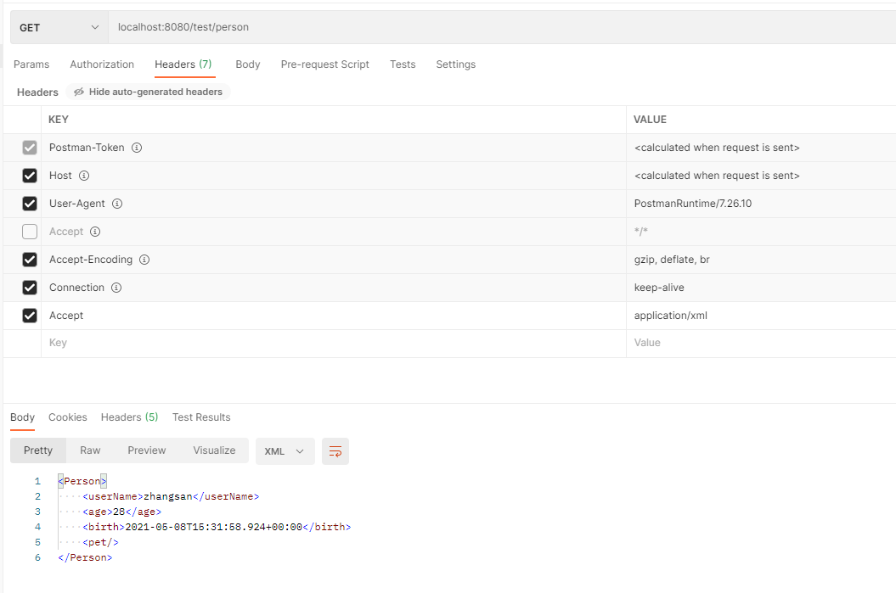
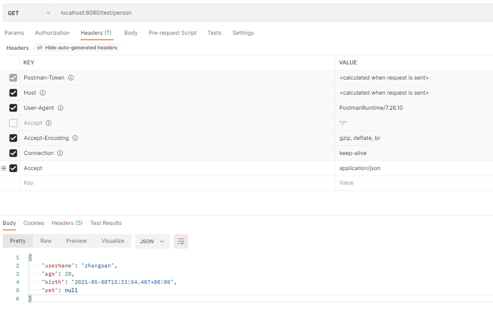
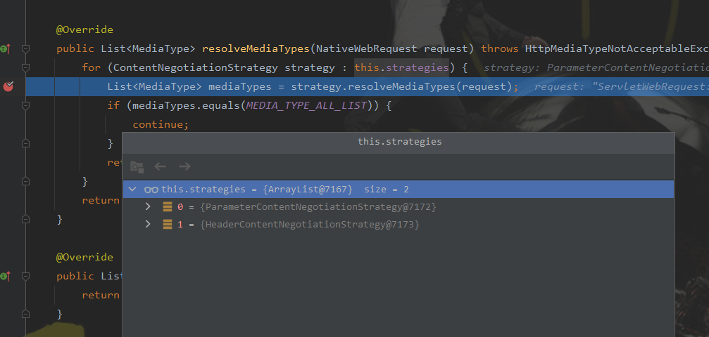
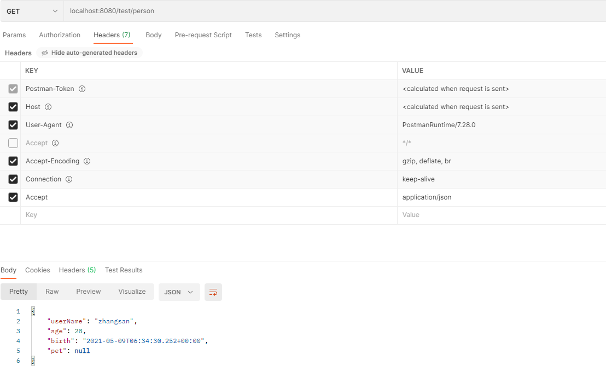
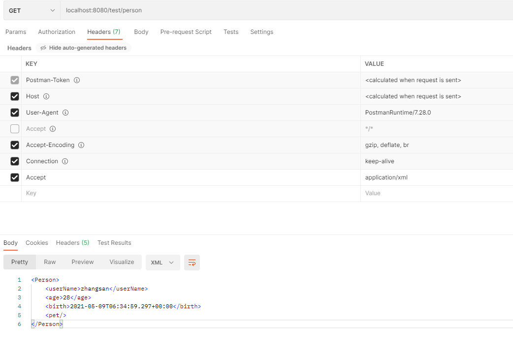
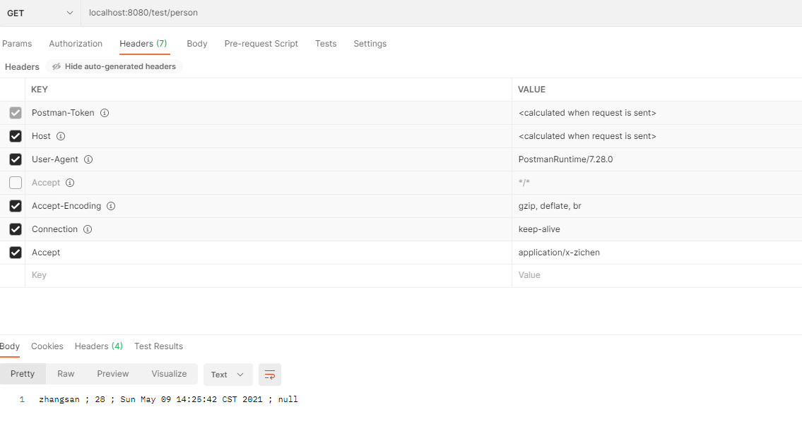
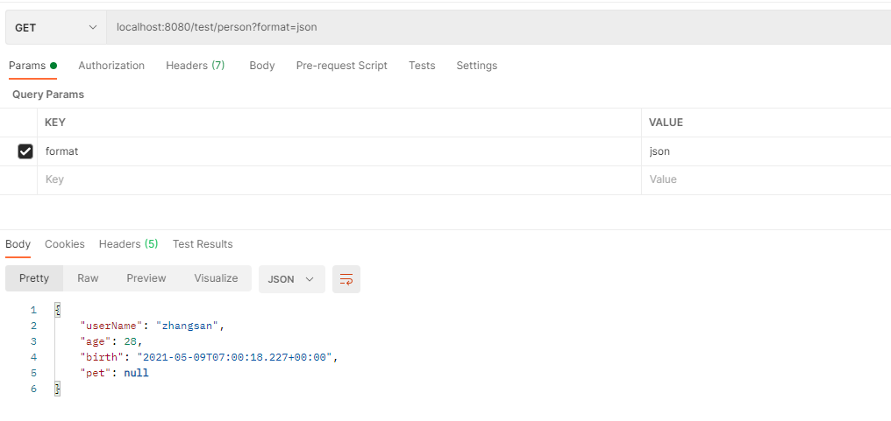
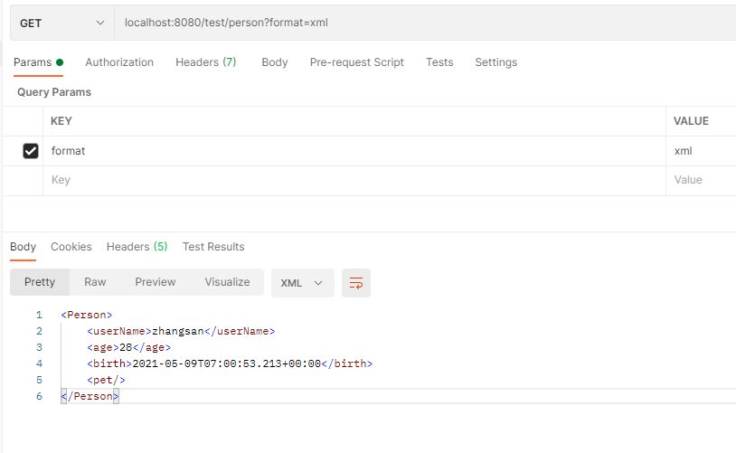
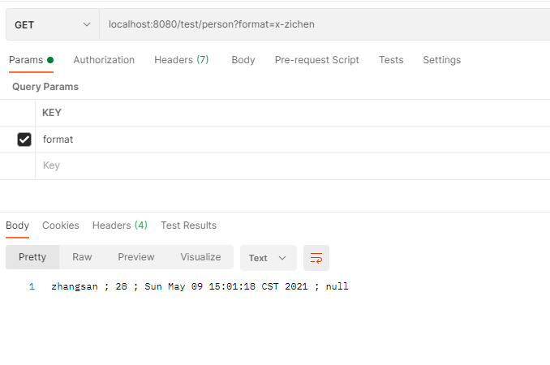

# SpringBoot2核心技术-核心功能
## 1. 数据响应

- SpringBoot2核心技术-核心功能_02.md

### 2.3. 内容协商
> SpringBoot响应xml数据

- 引入SpringBoot支持xml的依赖
```xml
<dependency>
    <groupId>com.fasterxml.jackson.dataformat</groupId>
    <artifactId>jackson-dataformat-xml</artifactId>
</dependency>
```
- 只需要引入SpringBoot支持xml的依赖，不需要改动任何代码
**返回结果**
```xml
<Person>
    <userName>zhangsan</userName>
    <age>28</age>
    <birth>2021-05-08T15:20:12.517+00:00</birth>
    <pet/>
</Person>
```
- 没有引入SpringBoot支持xml依赖之前
**返回结果**
```json
{"userName":"zhangsan","age":28,"birth":"2021-05-08T15:22:18.400+00:00","pet":null}
```
- 这种情况的原因就是浏览器接收数据，响应优先级的原因
```text
Accept: text/html,application/xhtml+xml,application/xml;q=0.9,image/webp,image/apng,*/*;q=0.8,application/signed-exchange;v=b3;q=0.9
```

> postman分别测试返回json和xml
- 只需要改变请求头中 Accept 字段。Http协议中规定的，告诉服务器，本客户端可以接收的数据类型




**内容协商原理**

```java
class a{
    protected <T> void writeWithMessageConverters(@Nullable T value, MethodParameter returnType,
                                                  ServletServerHttpRequest inputMessage, ServletServerHttpResponse outputMessage)
            throws IOException, HttpMediaTypeNotAcceptableException, HttpMessageNotWritableException {
        // 主备一个浏览其可以接受的数据类型
        MediaType selectedMediaType = null;
        // 获取被处理过 数据类型  比如拦截器等处理
        MediaType contentType = outputMessage.getHeaders().getContentType();
        // 判断浏览器可以接收的数据类型是否为空，并且是否是具体的媒体类型
        // contentType.isConcrete() 判断数据类型是不是有 通配符 * or *+
        // 如果 contentType是 */* or */*+  则返回false
        boolean isContentTypePreset = contentType != null && contentType.isConcrete();
        if (isContentTypePreset) {
            /**
             * 第一种情况，获取到浏览器具体的数据类型
             */
            if (logger.isDebugEnabled()) {
                logger.debug("Found 'Content-Type:" + contentType + "' in response");
            }
            // 如果数据类型是具体的，比如 application/json or application/xml等
            // 此时就会进这里面来执行，服务器也会响应浏览器具体的数据类型
            // 不会执行 else 的内容
            selectedMediaType = contentType;
            // 这种情况的内容协商也就结束
        }
        else {
            /**
             * 第二种情况，没有获取到浏览器具体的响应数据类型
             */
            // 获取请求数据
            HttpServletRequest request = inputMessage.getServletRequest();
            // 准备一个浏览器可以接收的数据类型 List<MediaType>
            List<MediaType> acceptableTypes;
            try {
                // 从请求数据中的Accept中获取浏览器支持的数据类型有哪些
                // Accept = text/html,application/xhtml+xml,application/xml;q=0.9,image/avif,image/webp,image/apng,*/*;q=0.8,application/signed-exchange;v=b3;q=0.9
                acceptableTypes = getAcceptableMediaTypes(request);
                // getAcceptableMediaTypes(request); 核心方法 request.getHeaderValues(HttpHeaders.ACCEPT);
            }
            catch (HttpMediaTypeNotAcceptableException ex) {
                int series = outputMessage.getServletResponse().getStatus() / 100;
                if (body == null || series == 4 || series == 5) {
                    if (logger.isDebugEnabled()) {
                        logger.debug("Ignoring error response content (if any). " + ex);
                    }
                    return;
                }
                throw ex;
            }
            // 获取服务器可以提供的数据类型
            // 遍历服务器中所有的消息转换器，判断那种消息转换器可以处理当前的返回值
            // 核心方法：converter.canWrite(targetType)
            // producibleTypes = ["application/json", "application/*+json", "application/json", "application/*+json", "application/xml;charset=UTF-8",
            //                    "test/xml;charset=UTF-8", "application/*+xml;charset=UTF-8", "application/xml;charset=UTF-8",
            //                    "test/xml;charset=UTF-8", "application/*+xml;charset=UTF-8"]
            List<MediaType> producibleTypes = getProducibleMediaTypes(request, valueType, targetType);

            if (body != null && producibleTypes.isEmpty()) { // 判断返回值有没有
                throw new HttpMessageNotWritableException(
                        "No converter found for return value of type: " + valueType);
            }
            // 准备一个空的list，存放要响应页面的数据类型
            List<MediaType> mediaTypesToUse = new ArrayList<>();
            // 遍历浏览器可以接收的数据类型   acceptableTypes.size() = 8
            for (MediaType requestedType : acceptableTypes) {
                // 遍历服务器可以提供的数据类型   producibleTypes.size() = 10
                for (MediaType producibleType : producibleTypes) {
                    // 判断浏览器可以接收的数据类型 是否兼容 服务器提供的数据类型
                    if (requestedType.isCompatibleWith(producibleType)) {
                        // 在选择最具体的数据类型，全部放到准备好的响应页面的数据类型得list中
                        mediaTypesToUse.add(getMostSpecificMediaType(requestedType, producibleType));
                    }
                }
            }
            
            // 如果没有匹配到响应页面的数据类型，则会报错   No match for acceptableTypesMessageConverter, supported
            if (mediaTypesToUse.isEmpty()) {
                if (body != null) {
                    throw new HttpMediaTypeNotAcceptableException(producibleTypes);
                }
                if (logger.isDebugEnabled()) {
                    logger.debug("No match for " + acceptableTypes + ", supported: " + producibleTypes);
                }
                return;
            }
            
            // 
            MediaType.sortBySpecificityAndQuality(mediaTypesToUse);

            for (MediaType mediaType : mediaTypesToUse) {
                if (mediaType.isConcrete()) {// 判断是否是具体的数据类型，，而非 */*  or  */*+
                    // 返回具体的数据类型
                    selectedMediaType = mediaType;
                    break;
                }
                else if (mediaType.isPresentIn(ALL_APPLICATION_MEDIA_TYPES)) {
                    selectedMediaType = MediaType.APPLICATION_OCTET_STREAM;
                    break;
                }
            }

            if (logger.isDebugEnabled()) {
                logger.debug("Using '" + selectedMediaType + "', given " +
                        acceptableTypes + " and supported " + producibleTypes);
            }
        }

        if (selectedMediaType != null) {
            // 移除 Accept 中的权重   "q"
            selectedMediaType = selectedMediaType.removeQualityValue();
            for (HttpMessageConverter<?> converter : this.messageConverters) {
                // 找到 通用的Http消息转换器
                GenericHttpMessageConverter genericConverter = (converter instanceof GenericHttpMessageConverter ?
                        (GenericHttpMessageConverter<?>) converter : null);
                if (genericConverter != null ?
                        // 该 通用的Http消息转换器 能否适配当前返回值类型(Person)
                        ((GenericHttpMessageConverter) converter).canWrite(targetType, valueType, selectedMediaType) :
                        converter.canWrite(valueType, selectedMediaType)) {
                    // 到这里，说明已经找到 适配当前返回值类型的消息转换器   genericConverter = MappingJackson2XmlHttpMessageConverter@1947
                    body = getAdvice().beforeBodyWrite(body, returnType, selectedMediaType,
                            (Class<? extends HttpMessageConverter<?>>) converter.getClass(),
                            inputMessage, outputMessage);
                    if (body != null) {
                        Object theBody = body;
                        LogFormatUtils.traceDebug(logger, traceOn ->
                                "Writing [" + LogFormatUtils.formatValue(theBody, !traceOn) + "]");
                        addContentDispositionHeader(inputMessage, outputMessage);
                        if (genericConverter != null) {
                            // 向页面写数据  outputMessage 已经拼装好格式
                            // <Person><userName>zhangsan</userName><age>28</age><birth>2021-05-08T15:59:03.556+00:00</birth><pet/></Person>
                            genericConverter.write(body, targetType, selectedMediaType, outputMessage);
                        }
                        else {
                            ((HttpMessageConverter) converter).write(body, selectedMediaType, outputMessage);
                        }
                    }
                    else {
                        if (logger.isDebugEnabled()) {
                            logger.debug("Nothing to write: null body");
                        }
                    }
                    return;
                }
            }
        }
    }
}
```
### 2.4. 开启浏览器参数方式的内容协商功能
> 为了方便内容协商，开启基于请求参数的内容协商功能

- 只需要在配置文件配置上以下内容
```yaml
spring:
  mvc:
    contentnegotiation:
      favor-parameter: true
```
- 然后访问的时候，携带参数 localhost:8080/.../...?format=json

**原理**
- 在获取浏览器可以接收的数据类型之后，
- 如果不开启基于参数的内容协商，默认会以基于请求头的方式协商
    - HeaderContentNegotiationStrategy@7173
- 如果不开启基于参数的内容协商，除了默认会以基于请求头的方式协商之外，还会增加一个基于参数方式的协商
    - ParameterContentNegotiationStrategy@7172



> 自定义MessageConverter

- 实现多个协议数据兼容。 json、xml、x-zichen
  - 1. @ResponseBody 响应数据出去，调用RequestResponseBodyMethodProcessor处理
  - 2. Processor 处理方法返回值。通过MessageConverter处理
  - 3. 所有MessageConverter合起来可以支持各种媒体类型数据的操作（读、写）
  - 4. 内容协商找到最终的 MessageConverter

- 根据不同的请求，响应不同的数据类型(以请求头的方式)
  *描述*
    - 1. 浏览器发请求直接返回xml   [application/xml]   jacksonXmlConverter
    - 2. ajax发请求直接返回json   [application/json]   jacksonJsonConverter
    - 3. 自定义请求，返回自定义协议的数据   [application/x-zichen]   xxxxConverter
  *实现步骤*
    - 1. 添加自定义的MessageConverter 进系统底层
    - 2. 系统底层就会统计出所有有MessageConverter能操作哪些类型
    - 3. 客户端内容协商 [zichen ---> zichen]

- 系统默认的Converter在 WebMvcAutoConfiguration.java中
- 实现自定义MessageConverter
```java
/**
 * @name: ZichenMessageConverter
 * @description: 自定义消息转换器
 * @author: zichen
 * @date: 2021/5/9  14:07
 */
public class ZiChenMessageConverter implements HttpMessageConverter<Person> {

    @Override
    public boolean canRead(Class<?> clazz, MediaType mediaType) {
        return false;
    }

    @Override
    public boolean canWrite(Class<?> clazz, MediaType mediaType) {
        return clazz.isAssignableFrom(Person.class);
    }

    @Override
    public List<MediaType> getSupportedMediaTypes() {
        return MediaType.parseMediaTypes("application/x-zichen");
    }

    @Override
    public Person read(Class<? extends Person> clazz, HttpInputMessage inputMessage) throws IOException, HttpMessageNotReadableException {
        return null;
    }

    @Override
    public void write(Person person, MediaType contentType, HttpOutputMessage outputMessage) throws IOException, HttpMessageNotWritableException {
        String data = person.getUserName() + " ; " + person.getAge() + " ; " + person.getBirth() + " ; " + person.getPet();
        OutputStream body = outputMessage.getBody();
        body.write(data.getBytes(StandardCharsets.UTF_8));
    }
}
```
- 将自定义MessageConverter添加到容器中
```java
@Configuration(proxyBeanMethods = false)
@Slf4j
public class WebConfig /*implements WebMvcConfigurer*/ {
  @Bean
  public WebMvcConfigurer webMvcConfigurer() {
    return new WebMvcConfigurer() {
      // 覆盖默认的MessageConverter
            /*@Override
            public void configureMessageConverters(List<HttpMessageConverter<?>> converters) {

            }*/

      // 扩展MessageConverter
      @Override
      public void extendMessageConverters(List<HttpMessageConverter<?>> converters) {
        converters.add(new ZiChenMessageConverter());
      }
    };
  }
}
```

- 基于请求头内容协商测试-01-application/json


- 基于请求头内容协商测试-02-application/xml


- 基于请求头内容协商测试-03-application/x-zichen



- 基于参数的内容协商
```java
@Configuration(proxyBeanMethods = false)
@Slf4j
public class WebConfig /*implements WebMvcConfigurer*/ {
  // 1. 自己写一个@Bean  // WebMvcConfigurer  容器定制配置
  // 2. 实现WebMvcConfigurer
  @Bean
  public WebMvcConfigurer webMvcConfigurer() {
    return new WebMvcConfigurer() {
      /**
       * 配置内容协商功能（基于参数的内容协商）
       * @param configurer
       */
      @Override
      public void configureContentNegotiation(ContentNegotiationConfigurer configurer) {
        //Map<String, MediaType> mediaTypes
        Map<String, MediaType> mediaTypes = new HashMap<>();
        mediaTypes.put("josn", MediaType.APPLICATION_JSON);
        mediaTypes.put("xml", MediaType.APPLICATION_XML);
        mediaTypes.put("x-zichen", MediaType.parseMediaType("application/x-zichen"));
        // 指定支持解析哪些参数对应的哪些媒体类型
        ParameterContentNegotiationStrategy parameterStrategy = new ParameterContentNegotiationStrategy(mediaTypes);
        configurer.strategies(Arrays.asList(parameterStrategy));
      }
    };
  }
}
```
- 基于参数内容协商测试-01-application/json


- 基于参数内容协商测试-02-application/xml


- 基于参数内容协商测试-03-application/x-zichen


 

- 问题：同时都配置了，基于请求头和基于参数的内容协商，底层会覆盖请求头的协商，返回参数协商的
- 这是由于我们自定义的时候，只放了基于参数的
- 在放一个基于请求头的就可以了
```java
@Configuration(proxyBeanMethods = false)
@Slf4j
public class WebConfig /*implements WebMvcConfigurer*/ {
  // 1. 自己写一个@Bean  // WebMvcConfigurer  容器定制配置
  // 2. 实现WebMvcConfigurer
  @Bean
  public WebMvcConfigurer webMvcConfigurer() {
    return new WebMvcConfigurer() {
      /**
       * 配置内容协商功能（基于参数的内容协商）
       * @param configurer
       */
      @Override
      public void configureContentNegotiation(ContentNegotiationConfigurer configurer) {
        //Map<String, MediaType> mediaTypes
        Map<String, MediaType> mediaTypes = new HashMap<>();
        mediaTypes.put("josn", MediaType.APPLICATION_JSON);
        mediaTypes.put("xml", MediaType.APPLICATION_XML);
        mediaTypes.put("x-zichen", MediaType.parseMediaType("application/x-zichen"));
        // 指定支持解析哪些参数对应的哪些媒体类型
        ParameterContentNegotiationStrategy parameterStrategy = new ParameterContentNegotiationStrategy(mediaTypes);
        // 修改参数名
        // parameterStrategy.setParameterName("format");
        HeaderContentNegotiationStrategy headerStrategy = new HeaderContentNegotiationStrategy();
        configurer.strategies(Arrays.asList(parameterStrategy, headerStrategy));
      }
    };
  }
}
```

- 有可能我们添加的自定义功能，会覆盖很多功能，导致功能失效，此时只能debug查看原码，却什么填什么

[视图解析器Thymeleaf](https://www.bilibili.com/video/BV19K4y1L7MT?p=43&spm_id_from=pageDriver)

### 2.5. 视图解析与模板引擎

- 视图解析：1） 转发；2）重定向；3）自定义视图
  
- SpringBoot默认是不支持JSP的，需要引入第三方的模板引擎
  
- 使用Thymeleaf
- Thymeleaf 语法见官网

[Thymeleaf](https://www.thymeleaf.org/doc/tutorials/3.0/usingthymeleaf.html#standard-expression-syntax)

- 引入Template Engine
```xml
<dependency>
    <groupId>org.springframework.boot</groupId>
    <artifactId>spring-boot-starter-thymeleaf</artifactId>
</dependency>
```
- 引入依赖之后，可以查看 ThymeleafAutoConfiguration.java -> ThymeleafProperties.java
```java
//制定HTML位置，和文件后缀
public static final String DEFAULT_PREFIX = "classpath:/templates/";
public static final String DEFAULT_SUFFIX = ".html";
```
- Controller
```java
@Controller
public class ViewTestController {

    @GetMapping("/goto/home")
    public String gotoHome(Map<String, Object> map, Model model) {
        model.addAttribute("age", 18);
        map.put("name", "zichen");
        map.put("baidu", "http://www.baidu.com");
        return "home";
    }
}
```
- 编写HTML
```html
<!DOCTYPE html>

<html lang="en" xmlns:th="http://www.thymeleaf.org">

<head>
    <meta content="charset=UTF-8" />
    <title>Thymeleaf</title>
</head>
<body>
    <!-- 从域中获取属性的值，使用$ -->
    <p th:text="${name}">Thymeleaf zc</p>
    <p th:text="${age}">Thymeleaf zc</p>
    <a href="www.baidu.com" th:href="${baidu}">www.baidu.com</a>
    <!-- 国际化之类的采用 #  -->
</body>
</html>
```
访问：http://localhost:8080/goto/home


>

>


### 2.6. 模板引擎

- 见 boot-01-web-01-admin/resources/后台管理模板.md

>

>


### 2.7. 拦截器

- 见 boot-01-web-01-admin/resources/拦截器.md

>

>


### 2.8. 跨域
>

>


### 2.9. 异常处理

- 见 boot-01-web-01-admin/resources/异常处理.md
>

>


### 2.10. 原生servlet组件（原生组件注入）

- 见 boot-01-web-01-admin/resources/原生组件注入_servlet_filter_listener.md
>

>


### 2.11. 嵌入式Web容器
>

>


### 2.12. 定制化原理
>

>


## 3. 数据访问


## 4. 单元测试


## 5. 指标监控


## 6. 原理解析


